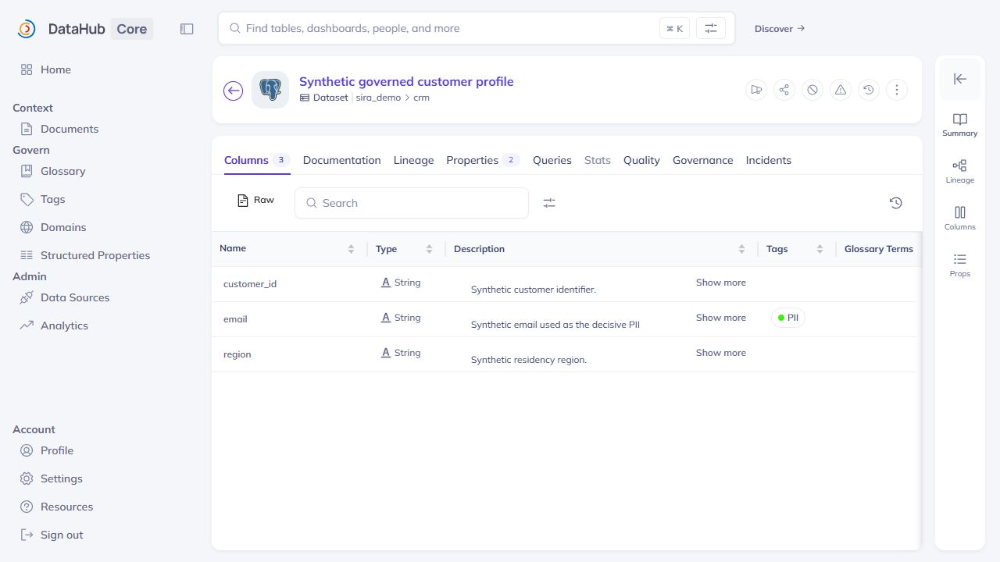
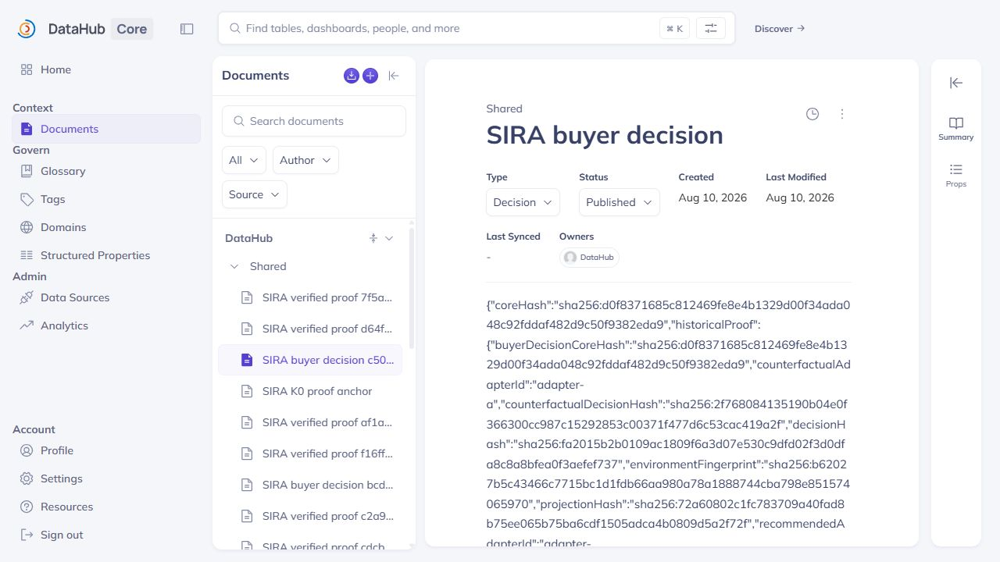
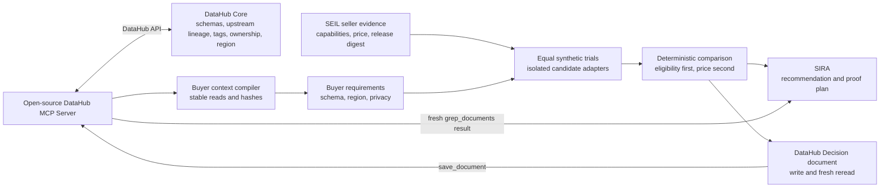

# SIRA + SEIL

**Buy software that fits the company you actually run.**

SIRA works for the buyer. SEIL turns seller knowledge into comparable product evidence. For data and AI purchases, DataHub supplies the buyer-side metadata SIRA needs: schemas, upstream dependencies, owners, classifications, and operating constraints.

SIRA answers: **Which option fits this company, and what must it prove before we buy it?**

## The DataHub story

The demo starts with a normal software-buying question: choose a customer-support AI for the company's current data stack.

DataHub shows that a customer email field is classified as PII and that processing is limited to an allowed region. SIRA turns those facts into product requirements. The privacy-safe option passes; the cheaper option is blocked because it returns the synthetic email without redaction.



Then the proof changes one DataHub fact at a time:

| DataHub state               | Result                                                |
| --------------------------- | ----------------------------------------------------- |
| Customer email is PII       | The privacy-safe option qualifies.                    |
| Only the PII tag is removed | The cheaper option becomes eligible and wins.         |
| An unrelated tag changes    | The decision does not change.                         |
| The PII tag is restored     | The original requirements, result, and hashes return. |

SIRA writes a hash-bound projection of the restored decision to a DataHub Decision document and accepts it only after a fresh MCP session finds the expected hashes.



In this asserted demo, DataHub is causal to the result: without it, SIRA can compare generic product claims but cannot decide what fits this buyer's data environment.

## Architecture



The privacy boundary is deliberate: candidate adapters receive requirement IDs, allowed regions, and synthetic test data. They do not receive DataHub credentials, dataset rows, URNs, ownership records, or the buyer's dependency graph.

### DataHub surfaces used

| DataHub capability       | How it affects the product                                                            |
| ------------------------ | ------------------------------------------------------------------------------------- |
| Schema fields            | Establish whether the candidate supports the required input.                          |
| Upstream dataset lineage | Identifies the governed source behind the workload.                                   |
| Tags                     | Turns the PII classification into a hard privacy gate.                                |
| Ownership                | Preserves who owns the source context used in the decision.                           |
| Structured properties    | Supplies the buyer's allowed processing region.                                       |
| Documents                | Stores the hash-bound decision projection for later review.                           |
| MCP Server               | Reads, changes, restores, writes, and freshly rereads the metadata used by the proof. |

DataHub documents these capabilities in its official guides for the [MCP Server](https://docs.datahub.com/docs/features/feature-guides/mcp), [lineage](https://docs.datahub.com/docs/features/feature-guides/lineage), [structured properties](https://docs.datahub.com/docs/features/feature-guides/properties/overview), [tags](https://docs.datahub.com/docs/api/tutorials/tags), [ownership](https://docs.datahub.com/docs/api/tutorials/owners), and [Documents API](https://docs.datahub.com/docs/api/tutorials/documents).

## What is real, and what is synthetic

| Implemented as real local operations                    | Synthetic for the demo                           |
| ------------------------------------------------------- | ------------------------------------------------ |
| Self-hosted DataHub Core and open-source MCP Server     | Company and metadata contents                    |
| Metadata reads, mutation, restoration, and fresh reread | Products, prices, and seller releases            |
| Requirement compilation and deterministic comparison    | Trial inputs and customer data                   |
| Network-isolated candidate trials                       | Two repository-curated SEIL evidence projections |
| Decision-document writeback                             | Any commercial purchase or production deployment |

The deterministic decision graph—not a language model—owns eligibility and selection. Missing context, restoration drift, a hash mismatch, or a failed reread blocks the result.

## Run locally

Requirements: Windows with PowerShell, Docker Desktop with Compose, Node.js 22+, pnpm 11, Python 3.12+, `uv`, and about 8 GB of free memory for DataHub.

No DataHub Cloud account is required. The runner starts self-hosted DataHub Core 1.7.0 and the pinned open-source DataHub MCP Server 0.6.0. The local token stays in the standard DataHub profile outside this repository.

Create and verify the DataHub decision artifact:

```powershell
.\scripts\proof.cmd up
.\scripts\proof.cmd doctor -Contract
.\scripts\proof.cmd demo -Assert -Artifacts .artifacts/proof
```

Start the product database and API:

```powershell
docker compose up --build -d --wait postgres postgres-bootstrap migrate postgres-permissions
.\scripts\run_api.ps1
```

In another terminal, start the web app:

```powershell
$env:NEXT_PUBLIC_WEB_DATA_MODE="api"
$env:SIRA_API_BASE_URL="http://127.0.0.1:8000"
corepack pnpm install --frozen-lockfile
corepack pnpm dev:web
```

Open <http://localhost:3000/sira> and choose **Choose a customer-support AI for our actual data stack**.

## Verify the DataHub path

```powershell
corepack pnpm check:web
corepack pnpm build:web
.\.venv\Scripts\python.exe -m pytest -q `
  tests/unit/test_datahub_mcp.py `
  tests/unit/test_proof_decision_evidence.py `
  tests/unit/test_proof_exchange.py `
  tests/unit/test_proof_manifest_v0.py `
  tests/unit/test_workspace_service.py
```

See [`docs/HACKATHON_RELEASE.md`](docs/HACKATHON_RELEASE.md) for the implementation map, recovery steps, and claim boundaries. The presenter path is in [`docs/DEMO_RUNBOOK.md`](docs/DEMO_RUNBOOK.md). Reusable screenshots are in [`docs/screenshots/submission`](docs/screenshots/submission/README.md).

Apache-2.0 licensed. See [`LICENSE`](LICENSE) and [`SOURCE_PROVENANCE.md`](SOURCE_PROVENANCE.md).
