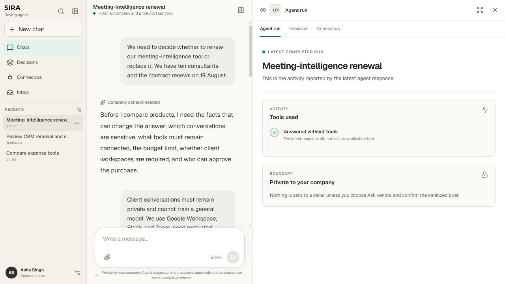
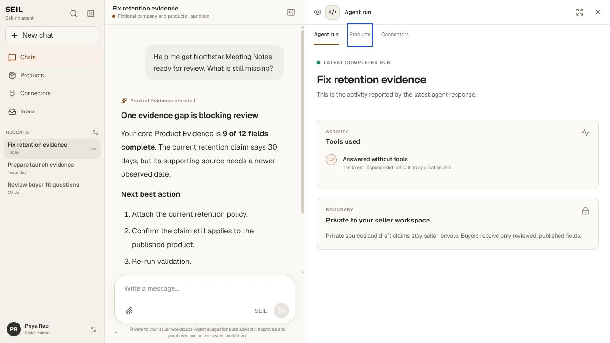

# Seilnsara

> **SIRA represents the buyer. SEIL represents the seller. Together they find the right fit and complete the deal.**

Seilnsara is a two-sided agentic marketplace for B2B software.

- **SIRA** learns what a company needs, protects its private context, finds relevant products, and decides for the buyer.
- **SEIL** learns a product's positioning, capabilities, evidence, pricing, and limitations. It makes the strongest honest case—or returns `PASS` when the product is wrong for that buyer.
- **Together**, the agents exchange permitted requirements, evidence, questions, and offers. Once the buyer approves a match, Prava gives the exact transaction bounded payment authority.

## Why two agents?

The buyer understands the company. The seller understands the product. Today, both sides waste time reconstructing the missing half through search, forms, sales calls, and generic demos.

Buyer agents still have to infer the product. Seller agents still have to guess the buyer. Seilnsara gives each side an agent with a clear loyalty—and a shared path from understanding to transaction.

## Product flow

1. The buyer tells SIRA what the company is trying to solve.
2. SIRA creates a requirement brief containing only what the buyer permits it to share.
3. Relevant SEILs respond with product evidence, limitations, questions, pricing, and terms.
4. SIRA compares the responses and recommends the best-supported fit for that company.
5. The buyer approves the exact offer, and Prava enables the approved transaction.

No paid ranking. No seller access to private buyer context. SEIL gets a voice; SIRA keeps the buyer's vote.

## Demo status

The repository includes a deterministic, fictional `consultco_v1` demo that shows company-aware evaluation, seller `PASS`, comparison, approval, and the purchase-authority flow.

It is not evidence of a production deployment or a real-money purchase. Live Prava completion, live Senso retrieval, real seller-maintained product knowledge, and outcome learning must be demonstrated separately before they are claimed.

## Run locally

### Requirements

- Node.js 22+
- Python 3.12 or 3.13
- `uv` with Python 3.11 available for the pinned DataHub CLI and MCP server
- Docker Desktop with Compose

### Start the complete local stack

```powershell
if (-not (Test-Path .env)) { Copy-Item .env.example .env }
docker compose up --build -d --wait api
corepack prepare pnpm@11.9.0 --activate
corepack pnpm install --frozen-lockfile
corepack pnpm dev:web
```

Open:

- Web app: <http://localhost:3000>
- API: <http://127.0.0.1:8000>
- API documentation: <http://127.0.0.1:8000/docs>

The default local experience uses clearly labelled fictional data. Provider-backed execution requires the corresponding credentials and services configured in `.env`.

### Verify the repository

```powershell
powershell.exe -NoProfile -ExecutionPolicy Bypass -File .\scripts\check.ps1
```

This runs formatting, linting, type checks, tests, contract checks, coverage checks, and credential scanning. PostgreSQL and provider-dependent checks report their exact blockers when their required services are unavailable.

### DataHub K0 feasibility covenant

K0 is a self-hosted proof surface; it does not require a DataHub Cloud account or hackathon-issued credentials. It pins DataHub Core `1.7.0` and the open-source DataHub MCP server `0.6.0`. The local setup creates its own DataHub session token and keeps it outside the repository in the standard DataHub profile.

```powershell
.\scripts\proof.cmd up
.\scripts\proof.cmd doctor -Contract
```

The contract must prove, with live rereads, a two-hop lineage read, invalid-credential rejection, field-tag and structured-property mutation/recovery, a Decision document write/update/reread, two distinct isolated adapter artifacts, atomic routing, induced failure with no state change, and rollback. Redacted evidence is written under `.artifacts/k0/`.

```powershell
.\scripts\proof.cmd reset
.\scripts\proof.cmd down
```

## Product

### SIRA — buyer workspace



### SEIL — seller workspace



Read the concise [product one-pager](docs/business/ONE_PAGER.md).

## How the marketplace works



## Product knowledge flywheel



## Technology

Next.js and React power the two workspaces. FastAPI and PostgreSQL hold the product and transaction state. OpenAI supports structured agent reasoning, Senso supplies evidence retrieval, Prava provides payment authority, and Temporal coordinates durable execution.

The model may propose and explain. Deterministic application code owns eligibility, ranking, approval, and payment boundaries.

## Current scope

The initial product is for B2B software decisions:

- **Buyers:** operations, IT, finance, and functional leaders choosing software.
- **Sellers:** software companies that want their product represented accurately to qualified buyers.
- **Business model:** buyer-paid assisted purchasing first; seller workspaces and integrations later, never pay-to-rank.
