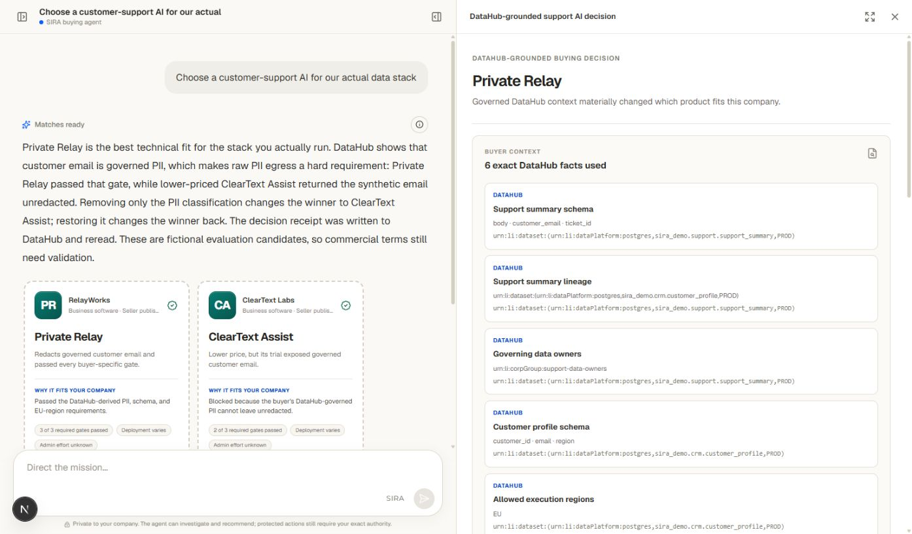
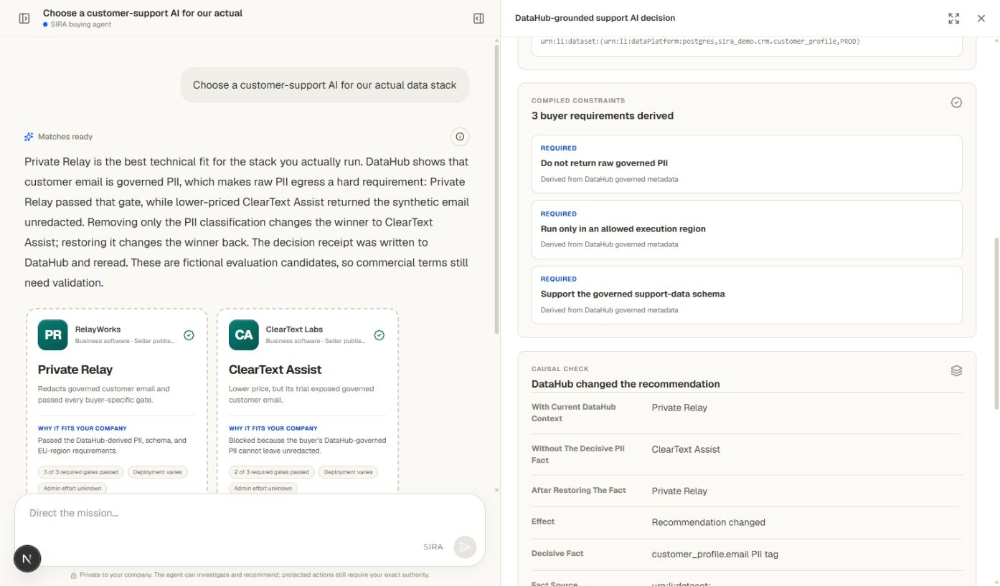

# SIRA + SEIL

SIRA + SEIL help companies buy software that fits the way they actually work, not just the vendor's feature page. SIRA works for the buyer; SEIL turns seller knowledge into comparable product listings. For data and AI purchases, DataHub shows SIRA what the buyer's real environment requires.

The hackathon demonstration focuses on one data/AI buying decision: choosing a customer-support AI that will touch governed customer data.

`DataHub context -> buyer requirements -> SEIL evidence -> deterministic fit decision -> counterfactual -> decision receipt`



*SIRA keeps the buying workflow in the existing chat and inspector: the same buyer context that explains the recommendation also determines product eligibility.*

## Why DataHub is essential

DataHub is SIRA's governed technical-context layer, not a decorative connector.

- SIRA reads schema fields, lineage, classifications, ownership, and structured region properties through the open-source DataHub MCP server.
- Those facts compile into explicit product-fit requirements.
- A PII classification makes the cheaper candidate ineligible and changes the recommendation.
- Removing only that classification flips the result; restoring it restores the original result. An unrelated governed change is a negative control and does not change the decision.
- SIRA writes a hash-bound decision receipt projection to a DataHub Decision document and treats it as verified only after a fresh MCP session finds the expected hashes.

The buyer's raw graph never crosses to the seller. The demo uses two repository-curated, digest-bound SEIL evidence projections with seller-private fields removed. The existing deterministic Decision Graph owns selection; the language model does not.


*The governed field is visible in DataHub Core; SIRA reads it through the open-source DataHub MCP server.*

## Demonstrated decision

All companies, products, prices, and data are synthetic.

| Current DataHub state | SIRA result | Reason |
|---|---|---|
| `customer_profiles.email` is tagged PII | **Privacy-safe option** | Raw PII egress is forbidden, so the cheaper option fails that requirement. |
| Only the PII tag is removed | **Cheaper option** | Both options pass the remaining requirements, so price becomes decisive. |
| The PII tag is restored | **Privacy-safe option** | The original requirements and decision are reproduced. |



*The counterfactual is paired with a negative control and restoration, so DataHub is causal to the result rather than decorative context.*

This is a technical-fit recommendation and buyer-specific proof result, not a completed purchase or a claim that the fictional sellers form a production marketplace.

## Run locally

Requirements:

- Windows with PowerShell
- Docker Desktop with Compose
- Node.js 22+, pnpm 11, Python 3.12+, and `uv`
- About 8 GB of free memory for the local DataHub quickstart

No DataHub Cloud account or hackathon credential is required. The proof runner starts self-hosted DataHub Core 1.7.0 with local authentication and launches the pinned open-source DataHub MCP server 0.6.0. Its local token remains in the standard DataHub profile outside this repository.

First create a verified DataHub decision artifact:

```powershell
.\scripts\proof.cmd up
.\scripts\proof.cmd doctor -Contract
.\scripts\proof.cmd demo -Assert -Artifacts .artifacts/proof
```

Start PostgreSQL and apply the existing schema:

```powershell
docker compose up --build -d --wait postgres postgres-bootstrap migrate postgres-permissions
```

Start the API on the Windows host so it can read the verified artifact and invoke the PowerShell runner:

```powershell
.\scripts\run_api.ps1
```

Start the web app in another terminal:

```powershell
$env:NEXT_PUBLIC_WEB_DATA_MODE="api"
$env:SIRA_API_BASE_URL="http://127.0.0.1:8000"
corepack pnpm install --frozen-lockfile
corepack pnpm dev:web
```

Open <http://localhost:3000/sira> and choose **Choose a customer-support AI for our actual data stack**. Local development works without Firebase; production authentication remains mandatory.

The normal product stays on `/sira`: chat and product cards in the centre, navigation on the left, and the cited DataHub decision in the right-hand inspector. `/proof` redirects to `/sira`; the old proof component remains only as an internal diagnostic harness.

## What the asserted proof checks

- Stable DataHub MCP reads bind the exact schema, lineage, ownership, region, and PII observations used by the compiler.
- Seller-private fields are excluded from the buyer projection.
- Both immutable reference releases receive identical synthetic cases in network-isolated containers.
- The existing deterministic Decision Graph selects the eligible release.
- The only decisive mutation is the governed PII classification; an unrelated metadata mutation leaves the decision unchanged.
- The PII tag and the original decision are restored after the counterfactual.
- The buyer decision receipt projection is bound to the restored, PII-present recommendation and is reread from DataHub before success is shown.

The repository also contains a deeper local activation, rollback, and historical receipt harness. Those mechanics are not the primary product surface and are not presented as an arbitrary production-deployment system.

## Repository verification

```powershell
powershell.exe -NoProfile -ExecutionPolicy Bypass -File .\scripts\check.ps1
pnpm build:web
```

The API contract is generated from `contracts/openapi/openapi.json`; the typed client lives in `packages/api-client`. PostgreSQL remains the canonical durable store for product workflows. Tenant-owned records use forced row-level security, receipt cores are insert-only, and provider credentials have no persistence column.

See [`docs/HACKATHON_RELEASE.md`](docs/HACKATHON_RELEASE.md) for trust boundaries, recovery, and release certification. Reusable submission screenshots and captions are in [`docs/screenshots/submission`](docs/screenshots/submission/README.md). This project is Apache-2.0 licensed; see [`LICENSE`](LICENSE).
