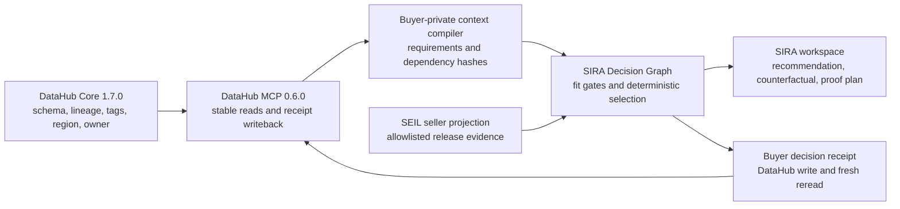

# Hackathon release and recovery

## Product and trust boundary



DataHub answers what the buyer's data estate contains, depends on, and permits. SIRA and
SEIL answer which external product fits those constraints and what evidence supports the
decision. Vendors receive a sanitized requirement manifest and synthetic cases, never the
buyer's raw DataHub graph or credentials.

The causal acceptance test holds candidate releases, synthetic inputs, policy, compiler,
and application code fixed. Removing only the PII classification changes the requirement
set and winner from Private Relay to ClearText Assist; restoring it reproduces the original
Private Relay decision. An unrelated governed mutation is a negative control.

## Reproducible release

From a clean checkout on Windows with Docker Desktop, Node, pnpm, Python, and `uv`:

```powershell
corepack pnpm install --frozen-lockfile
uv sync --all-extras --frozen
.\scripts\proof.cmd up
.\scripts\proof.cmd doctor -Contract
.\scripts\proof.cmd demo -Assert -Artifacts .artifacts/release/run-1
```

The warm budget covers the existing exchange, local effect harness, and injected-writeback
compensation. Acquisition, cached checkout, health, and reset are recorded separately in
`timings.json`. The asserted run fails when the 180-second warm budget is exceeded.

The final release requires three asserted runs from one clean commit:

```powershell
.\scripts\proof.cmd demo -Assert -Artifacts .artifacts/release/run-1
.\scripts\proof.cmd demo -Assert -Artifacts .artifacts/release/run-2
.\scripts\proof.cmd demo -Assert -Artifacts .artifacts/release/run-3
.\.venv\Scripts\python.exe scripts\verify_release_runs.py `
  --runs .artifacts/release/run-1 .artifacts/release/run-2 .artifacts/release/run-3 `
  --output .artifacts/submission
```

Run the API on the Windows host for the evaluator journey. The Linux API image intentionally
does not contain PowerShell and cannot start the local proof runner.

## Recovery runbook

1. Run `.\scripts\proof.cmd reset`.
2. Run `.\scripts\proof.cmd doctor -Contract`.
3. Confirm the PII tag is present, the control tag is absent, and the causal sequence ends on
   adapter B.
4. Confirm the buyer decision receipt names the restored PII-present decision hash and its
   DataHub reread matched.
5. If DataHub is unhealthy, run `down`, then `up`, then `reset`.
6. Never claim success from a partial artifact. Missing context, a hash mismatch, or a failed
   reread must hide the previous recommendation and receipt.

## Limitations

- Companies, catalog entries, prices, requests, and data are synthetic; no real purchase or
  customer PII is involved.
- The two reference seller releases are repository-curated. The publication/projection
  boundary is real and integration-tested, but the demo is not a live vendor marketplace.
- The primary product result is a buyer-specific technical-fit recommendation and proof plan.
  A deeper local activation/router/rollback harness exists but is not presented as arbitrary
  production deployment.
- DataHub MCP document APIs used for receipt projection are experimental in version 0.6.0.
- Local DataHub credentials live in the standard user profile and are never bundled.
- Live DataHub integration remains a release job because hosted CI cannot assume the memory
  required by the local DataHub quickstart.
