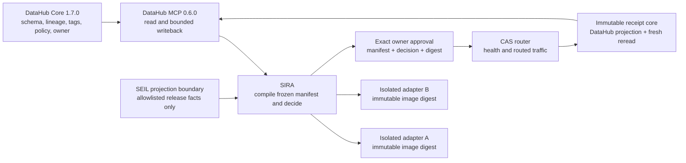

# Hackathon release and recovery

## Trust boundary



DataHub is causal: changing one governed PII tag changes the manifest and winner while
candidate code, inputs, policy, and compiler remain fixed. DataHub is also authoritative:
the current DataHub owner must approve the exact frozen subject. A JSON fixture cannot
replace either operation in the asserted proof.

## Reproducible release

From a clean checkout on Windows with Docker Desktop, Node, pnpm, Python, and `uv`:

```powershell
corepack pnpm install --frozen-lockfile
uv sync --all-extras --frozen
.\scripts\proof.cmd up
.\scripts\proof.cmd demo -Assert -Artifacts .artifacts/release/run-1
```

The warm budget covers the three evaluator-visible evidence stages: exchange, verified
deployment, and injected-writeback compensation. Acquisition, cached checkout, health,
and reset are recorded separately in `timings.json`. The asserted run fails at 180 seconds.

## Recovery runbook

1. Run `.\scripts\proof.cmd reset`.
2. Run `.\scripts\proof.cmd doctor -Contract`.
3. Confirm the PII tag is present, the control tag is absent, and adapter B is active.
4. If DataHub is unhealthy, run `.\scripts\proof.cmd down`, then `up`, then `reset`.
5. Never claim success from a partial artifact. A valid bundle requires every value in
   `gates.json` to be `true`, receipt reread to match, and recovery to be `RESTORED`.

## Limitations

- The release demonstrates a bounded local deployment, not arbitrary production changes.
- Trial inputs and catalog entries are synthetic; no real customer PII or purchase occurs.
- DataHub MCP document APIs used for receipt projection are experimental in version 0.6.0.
- Local DataHub credentials live in the standard user profile and are never bundled.
- CI verifies deterministic contracts, typing, tests, images, and credential hygiene. The
  live seven-gate run remains a release job because hosted CI cannot assume an 8 GB DataHub
  quickstart or satisfy the evaluator-visible warm-runtime condition.
