# SIRA Product Requirements Document

**Status:** Draft for founder review  
**Version:** 1.0  
**Prepared:** 2026-08-02  
**Product horizon:** Full product. Delivery phases are sequencing devices, not scope cuts.  
**Primary category for the first validated workflow:** Meeting intelligence for client-service teams (within B2B software procurement)  
**Product surfaces:** SIRA is the buyer workspace; SEIL is the seller-controlled product-truth protocol and seller workspace
**Canonical stack:** Next.js/React + FastAPI/Python + PostgreSQL + OpenAI Agents SDK + Senso + Prava

---

## 1. Executive Summary

SIRA is a company-aware decision and execution product for buying, renewing, operating, and improving business software. SEIL is the seller-controlled product-truth protocol and service that supplies SIRA with reusable, evidence-backed Product Evidence.

- **SIRA** represents the buyer. It understands the requested job, the people who will use the product, the decision-maker, the payer, company policies, culture, current tools, contracts, prior outcomes, and authority limits. It discovers options, makes an auditable decision, obtains the required approval, completes the transaction, verifies fulfillment, and learns from the result.
- **SEIL** represents a product and its seller at the trust boundary. It turns scattered product material into a reusable, versioned **SEIL Pack** containing typed claims, evidence, pricing, limitations, explicit anti-fit rules, compatible jobs, positioning, commercial terms, and fulfillment instructions. In the initial product it is primarily a protocol, publication service, and lightweight vendor claim/correction workflow—not a second conversational character buyers must understand.
- **Stackfile** is the company's living dependency graph. Like `package.json` for a software project, it records which business jobs the company must accomplish, which products serve those jobs, what each product depends on, what depends on it, who owns and uses it, what it costs, when it renews, and what breaks if it changes.
- **Prava** is the payment-authorization and credential boundary. The SIRA application cannot turn a recommendation into a purchase until the exact merchant, quote, amount, currency, approval plan, and expected fulfillment are locked and approved. Prava then provides the documented cardholder authorization surface and constrained merchant/amount payment credential; the application separately verifies merchant order and fulfillment.
- **Senso** is the evidence and context layer. It stores and retrieves versioned source material with folder-scoped access. Senso content is never ranked directly and is not automatically treated as true; it is compiled into typed facts carrying provenance and verification status.
- **SIRA Decision Graph** is the proprietary decision system. It joins the company/Stack graph, Product Evidence graph, and verified Decision/Outcome graph to recall options, enforce hard gates, build complete action plans, rank them deterministically, test robustness, and record a replayable ledger.

In simple terms: a company says what outcome it needs. SIRA understands the whole company, not only the latest prompt. It evaluates supported actions—including reuse, configuration, renewal, cancellation, consolidation, replacement, and purchase—against Product Evidence and the current Stackfile. It explains what is eligible, blocked, or uncertain, gets the right human approval, carries out the chosen action when authorized, verifies the result, and learns from measured outcomes. Buyers experience one SIRA workspace; they do not watch SIRA and SEIL chat.

### 1.1 Product thesis

Business buying fails when four truths are separated:

1. What the end user needs.
2. What the decision-maker will accept.
3. What the payer is authorized to fund.
4. What the company can securely deploy and successfully adopt.

SIRA unifies those truths privately. The SIRA Decision Graph turns them into a governed action plan. SEIL makes seller truth reusable. Stackfile makes downstream impact visible. Prava turns an approved decision into constrained action.

### 1.2 The visible product promise

> Tell SIRA the outcome you need. It will recommend the best supported action among the options it can evaluate, show its coverage and why it fits your company, obtain the right approval, and help you renew, resize, configure, consolidate, replace, cancel, buy, or do nothing—then verify what actually happened.

### 1.3 The judge-facing proof

The demonstration must show a counterfactual, not merely a polished recommendation:

1. An incumbent meeting-intelligence contract is approaching its cancellation deadline; with only a generic replacement request, the cheapest product appears best.
2. With private company context, observed incumbent outcome, contract timing, and Stackfile impact, that product is eliminated.
3. A different SEIL Pack independently returns an explicit seller-authored anti-fit.
4. SIRA compares renew, resize, configure, keep, cancel, and replacement actions and chooses a deployable replacement plan using a visible Decision Ledger and coverage statement.
5. The authorized person approves the exact purchase.
6. Prava enables the merchant transaction.
7. A real order and usable entitlement are verified.
8. The replacement entitlement and staged incumbent-retirement dependency plan appear in Stackfile.

### 1.4 Product value hierarchy and compounding loop

The primary product is **company-aware buyer execution through SIRA**. The SIRA Decision Graph is its decision core. SEIL is the reusable supply and trust mechanism, not an equal buyer-facing application in the first release. Stack Optimizer is the retention and expansion loop that reuses the same governed context after the first decision. These are layers of one product, not separate products.

The compounding loop is:

`buyer request -> governed decision -> authorized lifecycle action -> verified fulfillment -> measured outcome -> richer Buyer Passport and Stackfile -> better next decision`

`REUSE_EXISTING`, `CONFIGURE_EXISTING`, `NO_ACTION`, `CANCEL`, and `CONSOLIDATE` can be successful outcomes even when no new payment occurs. The platform optimizes for buyer value, not transaction count or active subscriptions.

---

## 2. Truth, Assumption, and Decision Policy

This document deliberately separates verified external facts from internal product decisions.

| Label | Meaning | Required handling |
|---|---|---|
| **Verified external fact** | Confirmed against an official source on the date above | Cite the source and revalidate before implementation if it may change |
| **Product decision** | A design choice made for SIRA + SEIL | Implement unless explicitly superseded |
| **Assumption** | A reasonable default that has not been proven with users or a provider | Instrument or test it before depending on it |
| **Unknown** | Information not yet available | Fail closed; never fabricate a value |

### 2.1 Verified external facts as of 2026-08-02

- Devfolio requires meaningful work during the event, real Prava usage, and an agent completing or enabling a transaction. Judging includes whether the product works, solves a clear problem, takes meaningful agent action, handles payments clearly, and could become a real product.
- The Devfolio overview says `$70,000 in cash + credits`; the current prizes page totals `$74,300`. The official pages are inconsistent as of the verification date, so the exact total must be revalidated before any submission or pitch and is not a product requirement.
- The RFH library explicitly describes its ideas as starting points, not specifications. B2B procurement and agent-native marketplaces are listed directions, but this product is not constrained to either description.
- Prava's documented hosted REST flow creates a payment session, sends the cardholder to a hosted page, polls for one-time merchant- and amount-scoped credentials, performs merchant checkout, reports the result, and then reaches `completed` or `failed`.
- Prava's current MCP documentation exposes payment-session, shopping, and mandate-management tools. In the documented MCP flow, Prava handles payment credentials without returning them to the model. In the hosted REST flow selected for this owned web application, an isolated application-backend activity temporarily retrieves and consumes the one-time credential.
- Senso documents knowledge-base folders, document versions, raw/file ingestion, and API keys scoped to folders with `viewer` or `editor` roles. Scoped query and browse results are limited to granted folders and descendants.
- The OpenAI Agents SDK currently provides function tools, structured outputs, input/output/tool guardrails, sessions, human-in-the-loop patterns, and tracing. Tool guardrails do not by themselves govern every custom execution path, so side-effect authorization remains an application boundary. Runs handling private buyer context MUST use `RunConfig.trace_include_sensitive_data=False` or have SDK tracing disabled.

### 2.2 Important non-claims

The product MUST NOT claim any of the following without additional proof:

- That Senso independently verifies the truth of ingested content. It supplies organized, versioned, retrievable evidence; SIRA owns verification status.
- That every online merchant can be completed through the same checkout adapter. Merchant compatibility must be tested and represented explicitly.
- That a payment authorization is a completed purchase. Completion requires merchant order plus promised fulfillment.
- That seller-authored data is unbiased. It is attributed, versioned, tested for contradictions, and evaluated by the buyer's rules.
- That an LLM score is an objective procurement decision. Eligibility, ranking, budget enforcement, and approval are deterministic or human-controlled.
- That learning means unrestricted sharing between buyers and sellers. Only consented, minimum, aggregated signals may cross tenant boundaries.

---

## 3. Problem Statement

### 3.1 Buyer problem

Companies repeatedly buy software from incomplete context. Search tools and generic agents optimize for the latest request, visible features, public reviews, or price. They rarely know:

- who will use the product and how they work;
- who decides, who pays, and who bears implementation risk;
- security, privacy, legal, regional, and procurement policies;
- the existing stack, integrations, redundancies, contracts, and renewal dates;
- prior purchase failures and actual adoption outcomes;
- company culture, change tolerance, administrative capacity, and strategic direction.

The result is avoidable spend, policy violations, duplicate tools, failed rollout, integration work, shadow software, and renewals that happen because nobody re-evaluated the original decision.

### 3.2 Seller problem

Sellers repeatedly rebuild product knowledge inside sales calls, forms, support tickets, and agent conversations. Product truth is scattered across websites, pricing pages, security documents, release notes, CRM notes, and employee memory. Positioning becomes improvised and buyers cannot distinguish current evidence from persuasion.

Sellers need a reusable asset that can answer:

- What does this product do, for whom, and for which job?
- What are its requirements, dependencies, limits, and failure conditions?
- Which claims are current and what evidence supports each one?
- When should the product pass rather than waste buyer and seller time?
- How should the product be positioned for an eligible buyer without changing objective ranking?
- How is it quoted, purchased, provisioned, renewed, cancelled, and supported?

### 3.3 Company-operations problem

Even a good individual purchase can make the overall company worse. Companies lack a package-manager-like view of their operating stack. They cannot easily answer:

- Which job does every tool serve?
- Which tools overlap?
- What system, integration, team, contract, or workflow depends on each tool?
- Which tools are unused, risky, expensive, or about to renew?
- What would break, improve, or become redundant if a product were added, removed, or replaced?

Stackfile turns purchasing from an isolated choice into continuous stack management.

---

## 4. Product Principles

1. **Outcome before product.** Begin with the job to be done (JTBD), desired outcome, and constraints rather than a requested brand.
2. **Action plan before product card.** Rank complete company actions—including reuse and no-buy—not isolated catalog listings.
3. **Company-aware, not prompt-aware.** A request is only one input to a persistent Buyer Passport and Stackfile.
4. **Truth before persuasion.** Facts, evidence, uncertainty, and anti-fit are evaluated before positioning is generated.
5. **Private by default.** Buyer context stays inside the buyer boundary. Sellers see only an explicit, sanitized requirement brief.
6. **Deterministic authority.** Models may interpret and explain; they do not set budgets, invent permissions, approve spend, or silently change ranking rules.
7. **Every material claim has provenance.** A decision can be reconstructed from source versions, product-pack versions, rules, quotes, approvals, and transaction states.
8. **A purchase is an operational change.** Every buy, switch, renewal, or cancellation updates Stackfile and creates follow-up outcomes.
9. **Honest passing creates trust.** A product saying "not for you" is valuable behavior, not a failed sale.
10. **Learning is bounded.** Outcomes improve future decisions without leaking private company data or creating undisclosed pay-to-win ranking.
11. **Completion means usable outcome.** Payment success alone is insufficient; the order, entitlement, booking, license, or service activation must be verified.
12. **Human control scales with risk.** More money, uncertainty, sensitivity, irreversibility, or dependency impact requires stronger approval.
13. **No silent failure.** Missing, stale, contradictory, or unsupported evidence is surfaced as uncertainty and may block action.

---

## 5. Product Vocabulary

| Term | Definition |
|---|---|
| **SIRA** | The buyer-facing decision and execution product, including its agent, structured workspace, and governed tools |
| **SEIL** | Seller-controlled product-truth protocol and service used to compile, publish, qualify, and update Product Evidence |
| **Buyer Passport** | Internal canonical term for versioned private company context; labelled **Company Profile** in buyer UI |
| **Product Evidence Package** | Generic typed product claim/evidence envelope that may be seller-sealed, platform-compiled, or external-unsealed; publisher authority and claim verification are separate |
| **SEIL Pack** | A seller-authorized, immutable, published Product Evidence Package; labelled **Product Evidence** in buyer UI with publisher and verification state always visible |
| **SIRA Decision Graph** | Versioned pipeline and graph of company state, product evidence, decisions, and outcomes used to build and rank executable Solution Plans |
| **Stackfile** | Versioned company JTBD and product dependency graph, analogous to a package manifest plus lockfile |
| **JTBD node** | A business job or outcome the company needs, with owners, users, success metrics, and constraints |
| **Requirement Brief** | Minimum seller-visible context derived from the request and Buyer Passport using an allowlist |
| **SEIL_PASS** | Seller-declared anti-fit from an immutable published Pack rule; it can change only through a new seller-approved condition/Pack/offer, not a buyer waiver |
| **SIRA_INELIGIBLE** | Buyer/company hard constraint eliminates a candidate; only explicitly exceptionable rules may be overridden by their authorized risk owner |
| **Decision Ledger** | Human-readable list of requirements, evidence, eliminations, preference scores, trade-offs, and uncertainty |
| **Decision Record** | Immutable machine record of all versioned inputs and the resulting decision |
| **Solution Plan** | One buyer action (`REUSE_EXISTING`, `CONFIGURE_EXISTING`, `NO_ACTION`, `BUY`, `RENEW`, `RESIZE`, `REPLACE`, `CONSOLIDATE`, or `CANCEL`) containing zero or more Pack/offer/current-instance components and their dependency closure |
| **NO_ELIGIBLE_SUPPORTED_ACTION** | Decision-level result used when no evaluated action is both eligible and sufficiently evidenced; it creates no Purchase Intent |
| **Purchase Intent** | One merchant-specific locked offer/quote, amount, currency, required approval plan, expected fulfillment, and decision version |
| **Purchase Intent Group** | A Solution Plan containing multiple merchant-specific Purchase Intents with declared sequence and partial-failure policy |
| **Outcome Record** | Observed adoption, value, incidents, cost, satisfaction, and fulfillment after a transaction |
| **Dependency impact** | The predicted and observed effect of adding, removing, replacing, or changing a product in Stackfile |
| **Verified fact** | A fact whose verification method succeeded; not merely text retrieved from a source |

Buyer-facing language and the current public API MUST remain procurement-native even when canonical database names or explicit legacy aliases retain earlier terms:

| Canonical/internal term | Buyer-facing label |
|---|---|
| Buyer Passport | Company Profile |
| SEIL Pack | Product Evidence |
| Candidate | Option or Solution option |
| Legacy `SHORTLIST` | Keep for comparison / `KEEP_FOR_COMPARISON` |
| Legacy `PASS` | Eliminate / `ELIMINATE` |
| Legacy `REQUEST_OFFER` | Ask vendor / `ASK_VENDOR` |
| Legacy dye test | Test the decision rules |
| `SEIL_PASS` | Vendor says not supported / `VENDOR_NOT_SUPPORTED` |
| `SIRA_INELIGIBLE` | Blocked by company requirement / `BLOCKED_BY_COMPANY_REQUIREMENT` |
| Purchase Brief | Decision rules |
| Solution Plan | Action plan |
| Stackfile | Company stack |
| Stackfile patch | What changes in your stack |
| Counterfactual | What changed the recommendation |
| Evidence frontier | What information could change this decision |
| Rank stability | Stable / Could change if… / Not yet determined |
| Purchase Intent | Approval details |

---

## 6. Users, Roles, and Jobs to Be Done

### 6.1 Buyer-side roles

| Role | Primary job | Needs from SIRA |
|---|---|---|
| Requester | Obtain an outcome without becoming a procurement expert | Express intent naturally; see progress and result |
| End user | Get a tool that fits actual workflow | Workflow requirements, accessibility, adoption fit, feedback |
| Decision-maker | Choose the right trade-off | Evidence, alternatives, impact, confidence, counterfactuals |
| Payer/budget owner | Control spend and value | Budget, total cost, terms, approval, receipt, renewal visibility |
| Procurement | Enforce process and negotiate terms | Vendor records, quotes, competition, audit trail, policy |
| Security/privacy/legal | Prevent unacceptable risk | Evidence, data flows, policy mapping, expiry, exceptions |
| IT/operations | Deploy and support the product | Dependencies, integrations, identity, administration, migration |
| Executive | Align purchases with strategy | Portfolio cost, risk, adoption, redundancy, business outcomes |
| Auditor | Reconstruct who knew, decided, approved, paid, and received what | Immutable records and evidence lineage |

### 6.2 Seller-side roles

| Role | Primary job | Needs from SEIL |
|---|---|---|
| Product marketer | Position truthfully for distinct buyer contexts | Approved positioning angles tied to evidence |
| Product manager | Keep capabilities and limitations current | Versioned product model and change-impact alerts |
| Sales engineer | Answer technical fit questions once | Reusable integrations, constraints, architecture, anti-fit |
| Security/legal | Publish controlled evidence | Permissioned documents, expiry, redaction, claim approval |
| Revenue/sales | Spend time on qualified buyers | Eligibility, honest pass, structured objections and gaps |
| Finance/operations | Quote and fulfill consistently | Offer catalog, negotiation limits, checkout, entitlement state |
| Seller admin | Control who may author, review, publish, or revoke packs | Roles, approvals, audit log, publishing workflow |

### 6.3 Core jobs to be done

1. **Buy:** "When my company needs an outcome, help me choose the best supported action among the options actually evaluated, disclose market coverage, and acquire only what is needed without missing private constraints."
2. **Sell:** "When a qualified buyer has a need, present our product accurately and persuasively without recreating product knowledge or selling into a bad fit."
3. **Optimize:** "When the company changes, tell me where the stack has gaps, redundancy, risk, waste, or expiring decisions and help me act."
4. **Renew:** "Before a contract renews, compare the promised outcome with actual usage and current alternatives, then renew, renegotiate, switch, or cancel with authority."
5. **Govern:** "When an automated action occurs, prove that the agent used approved evidence, followed policy, obtained authority, and produced the promised result."

---

## 7. Product Scope

The full product contains six connected systems. They may be delivered in phases, but none is excluded from the product definition. Delivery and interface priority are intentionally asymmetric: SIRA proves buyer value first; SEIL begins as a seller-data protocol and claim/correction service, then grows into a seller workspace only after buyer demand exists.

### 7.1 SIRA Buyer Product and Agent

SIRA MUST:

- accept natural-language outcomes, structured requests, procurement events, and Stackfile alerts;
- identify requester, users, decision-maker, payer, implementer, and approver;
- retrieve only the buyer facts needed for the decision;
- distinguish hard constraints, weighted preferences, assumptions, and unknowns;
- discover Pack candidates from the SEIL Registry and approved external discovery adapters;
- construct and compare complete Solution Plans using transparent deterministic rules;
- analyze Stackfile dependency impact before approval;
- request clarification only when the missing answer can change eligibility, authority, or irreversible action;
- generate evidence-grounded explanations without adding unsupported reasons;
- obtain policy-correct approvals;
- execute approved purchases, renewals, switches, or cancellations through constrained tools;
- verify fulfillment and update Stackfile;
- schedule and collect post-purchase outcome checks;
- recommend optimization actions while preserving human authority.

SIRA MUST NOT:

- reveal Buyer Passport content outside its tenant unless a field is allowlisted and required;
- rank based on seller payments, generated persuasion, or unlabelled sponsorship;
- approve its own purchase;
- modify seller-controlled Product Evidence or its evidence records;
- claim completion before transaction and fulfillment reconciliation;
- convert weak inference into a hard company policy.

### 7.2 SEIL Product-Truth Service

SEIL MUST work as a publication and qualification service without requiring a live seller agent or a full seller application. The first seller-facing surface is a secure claim, correct, evidence, approve, and publish flow for Product Evidence, with Pack-health, validation-gap, stale-evidence, and reusable-answer/export views. Qualified-request, offer, and buyer-demand analytics workspaces follow later.

SEIL MUST:

- ingest seller-approved product, commercial, security, support, and fulfillment sources;
- compile a typed SEIL Pack and show unresolved or contradictory claims;
- require claim-level ownership, evidence, verification status, freshness, and expiry;
- express fit and anti-fit in machine-evaluable rules;
- maintain JTBD mappings and dependency/compatibility information;
- create buyer-specific positioning only from approved angles and sanitized context;
- produce structured offers and quote revisions within seller-authorized bounds;
- explain a `SEIL_PASS` with a seller-approved reason;
- publish new immutable Pack versions and deprecate old versions without rewriting historical decisions;
- publish a material-change event to the Marketplace when a governed fact changes; the platform privately resolves and notifies affected buyers without revealing the impacted buyer list to the seller unless a separate contract explicitly permits it;
- receive aggregated outcome and gap signals only when disclosure policy permits.

SEIL MUST NOT:

- receive raw Buyer Passports, hidden budgets, employee records, internal strategy, competing bids, or prior private failures;
- fabricate capabilities, evidence, integrations, customer results, or terms;
- change SIRA's eligibility or ranking calculation;
- suppress anti-fit rules to improve conversion;
- alter an approved quote without invalidating the Purchase Intent.

### 7.3 SEIL Registry and Marketplace

The Registry stores all published SEIL Packs and offers. The Marketplace adds discovery, seller qualification, structured offers, transaction routing, verified-transaction reviews, and outcome signals.

Required marketplace capabilities:

- seller identity and business verification;
- product and offer onboarding;
- reviewer approval before Pack publication;
- category taxonomy and JTBD vocabulary;
- evidence and claim expiry;
- product version and offer version history;
- availability by geography, currency, company size, and buyer type;
- visible sponsored placement that never changes fit scoring;
- structured buyer requirements and seller responses;
- quote comparison and bounded negotiation;
- checkout and fulfillment adapters;
- dispute, refund, cancellation, and support routing;
- verified transaction and verified outcome labels;
- verified-transaction reviews tied to an eligible fulfilled order, with reviewer-role disclosure, moderation, conflict-of-interest reporting, privacy controls, seller response, appeal, and removal without rewriting the original audit record;
- neutral ranking governance and auditability;
- portability/export of a seller's Pack.

### 7.4 Stackfile

Stackfile is both a reusable asset and an operating capability. It MUST support:

- JTBD, capabilities, catalog products, deployed product instances, implementation projects, contracts, teams, stakeholders, integrations, data stores, policies, and outcomes as typed nodes;
- dependency and relationship edges with direction, evidence, confidence, and validity dates;
- four explicit layers: observed inventory, reconciled current lock, desired policy manifest, and proposed patches;
- semantic versioning of the schema and immutable company snapshots;
- graph queries for blast radius, redundancy, gaps, critical paths, renewal exposure, and migration order;
- proposals that show predicted cost, risk, outcome, and affected dependencies;
- updates after purchases, cancellations, integrations, org changes, and measured outcomes;
- import/export as human-readable YAML plus a canonical hash-addressed JSON lockfile;
- reconciliation against discovered systems and contracts;
- approval before external actions.

Stackfile powers SIRA. A separate **Stack Optimizer** experience may proactively scan and propose improvements, but it uses the same SIRA policy, decision, and approval engine rather than becoming an unconstrained third agent.

### 7.5 Transaction and Authority System

The transaction system owns Purchase Intents, approvals, Prava integration, merchant checkout, fulfillment, receipts, refunds, and reconciliation. Prava is a core boundary, not an ornamental checkout.

### 7.6 Outcome and Learning System

The learning system captures whether an authorized lifecycle action delivered the promised outcome and feeds the result back into:

- the private Buyer Passport;
- the company's Stackfile;
- proposals for future decision weights and explicit preferences; they have zero ranking effect until an authorized owner accepts them;
- seller-visible aggregated product gaps;
- platform-level quality and fraud models.

Raw buyer context and individual outcomes MUST NOT be shared with sellers unless the buyer explicitly authorizes the exact disclosure.

---

## 8. System Overview

```mermaid
flowchart LR
    U["Requester / approver"] --> W["Next.js product UI"]
    W --> API["FastAPI control plane"]
    API --> SIRA["SIRA agent harness"]
    SIRA --> CTX["Buyer context adapter"]
    CTX --> SENSOB["Senso buyer-private folders"]
    SIRA --> MATCH["Deterministic decision engine"]
    MATCH --> STACK["Stackfile graph"]
    MATCH --> REG["SEIL Registry"]
    REG --> SEIL["SEIL pack compiler / positioning"]
    SEIL --> SENSOS["Senso seller-evidence folders"]
    MATCH --> DEC["Decision Record + locked Purchase Intent"]
    DEC --> APPROVAL["Policy approval engine"]
    APPROVAL --> PRAVA["Prava authority + payment"]
    PRAVA --> MERCHANT["Merchant checkout / fulfillment"]
    MERCHANT --> OUTCOME["Order, entitlement, receipt, outcomes"]
    OUTCOME --> STACK
    OUTCOME --> CTX
    OUTCOME --> LEARN["Consent-filtered learning"]
    LEARN --> REG
```



### 8.1 Trust boundaries

1. **Buyer-private boundary:** Buyer Passport, Stackfile, policies, contracts, employees, hidden budgets, and outcomes.
2. **Seller boundary:** seller sources, Pack drafts, commercial rules, approved positioning, and fulfillment credentials.
3. **Marketplace boundary:** public/authorized Pack facts, sanitized briefs, quotes, and aggregated signals.
4. **Model boundary:** typed minimum inputs only; no secrets, raw payment credentials, or unrestricted data access.
5. **Payment boundary:** Prava session/mandate plus server-side merchant checkout.
6. **Audit boundary:** immutable identifiers, hashes, states, and redacted summaries; sensitive payloads excluded by default.

---

## 9. SIRA Context Requirements

SIRA's advantage comes from the quality and governance of context, not from collecting the maximum possible amount of data. Every fact must have a decision purpose, owner, source, sensitivity, confidence, effective period, and deletion policy.

### 9.1 Required context domains

| Domain | Examples | Why SIRA needs it | Typical authorized source |
|---|---|---|---|
| Company profile | size, region, entities, business model, growth stage | availability, tax, support, deployment, risk | admin input, company profile |
| Strategy and goals | current objectives, deadlines, target outcomes | align purchases to outcomes | approved strategy summaries, OKRs |
| Requester intent | desired outcome, urgency, category, current workaround | define the purchase problem | natural-language request, form |
| End-user context | roles, count, workflow, accessibility, skill, devices | adoption and capability fit | user interview, team admin, approved usage data |
| Decision-maker context | success criteria, change tolerance, rollout deadline | decision fit and approval routing | explicit requirements, approval policy |
| Payer context | budget source, ceilings, currency, payment method, tax needs | affordability and authority | finance policy, approved budget system |
| Company culture | self-serve vs centralized, experimentation tolerance, admin capacity | predict operational adoption | explicit survey and confirmed outcomes, never hidden personality inference |
| Current stack | products, owners, seats, integrations, data flows, systems of record | dependency, overlap, migration, compatibility | Stackfile, SSO discovery, CMDB, expense records |
| Contracts | price, term, renewal, cancellation, commitments, data terms | total cost, lock-in, renewal action | contract repository, finance, admin input |
| Security/privacy | data classification, residency, retention, training use, identity requirements | eligibility and risk | approved policies and security review |
| Legal/compliance | jurisdiction, sector rules, DPA, accessibility, audit requirements | hard constraints and review routing | legal policy, compliance system |
| Procurement rules | competition threshold, approved vendors, required reviewers | process compliance | procurement policy |
| Prior decisions | chosen/rejected products and stated reasons | avoid repeating work and preserve rationale | Decision Records |
| Outcome history | adoption, usage, incidents, realized value, support burden | improve future fit | authorized telemetry, surveys, incident/cost systems |
| Authority | who may request, approve, pay, create mandates, or make exceptions | prevent unauthorized action | identity provider, role assignments, policy engine |
| Risk posture | reversible vs irreversible, data sensitivity, business criticality | determine evidence and approval depth | company policy and explicit risk tier |

### 9.2 Buyer Passport fact contract

Every compiled fact follows this shape:

```json
{
  "fact_id": "bf_01J...",
  "organization_id": "org_01J...",
  "subject_type": "policy",
  "subject_id": "policy_ai_data_use",
  "field": "trains_on_customer_data",
  "operator": "eq",
  "value": false,
  "kind": "hard_constraint",
  "stakeholder_role": "security",
  "source": {
    "provider": "senso",
    "content_id": "cnt_...",
    "version_id": "ver_...",
    "chunk_index": 3,
    "retrieved_at": "2026-08-02T10:00:00Z"
  },
  "verification": {
    "status": "human_approved",
    "method": "policy_owner_confirmation",
    "verified_by": "usr_...",
    "verified_at": "2026-08-02T10:05:00Z"
  },
  "valid_from": "2026-08-01T00:00:00Z",
  "valid_until": null,
  "sensitivity": "confidential",
  "confidence": "confirmed"
}
```

### 9.3 Context rules

1. A retrieved passage is **evidence**, not yet a canonical fact.
2. The context compiler proposes typed facts and retains exact provenance.
3. Hard constraints require explicit human approval or an approved policy source.
4. Inference is labelled `inferred`, includes the method, and cannot become a hard constraint automatically.
5. Conflicting active facts block decisions that depend on them.
6. Expired facts are ignored for action unless re-confirmed.
7. Negative outcomes affect future ranking only after the causal interpretation is confirmed. Low adoption alone does not prove which product property caused it.
8. Company culture is captured through explicit preferences and observed outcomes, not surveillance or personality speculation.
9. A decision retrieves the minimum relevant facts by requirement IDs; it does not send the full passport to the model.
10. Users can inspect, correct, expire, or delete editable facts subject to audit-retention obligations.

### 9.4 Context acquisition plan

| Source class | Acquisition | Canonical destination | Confidence default |
|---|---|---|---|
| Explicit user answer | typed UI/API | PostgreSQL fact + audit event | confirmed for that user; may still need owner authority |
| Approved policy or contract | ingest to Senso, extract, owner approves | PostgreSQL fact referencing Senso version | human approved |
| Product/stack discovery | connector snapshot | Stackfile candidate node | observed, pending reconciliation |
| Usage telemetry | connector aggregation | Outcome Record | measured within stated window |
| Model inference | structured extraction | proposed fact only | inferred |
| Seller statement | SEIL Pack claim | seller-side claim | seller asserted |
| Platform check | integration/payment/entitlement verification | platform event | platform verified |

Senso only knows sources supplied through an authorized ingestion path. It may ingest approved files, raw text, or URLs—including a configured help-center crawl—but it does not automatically gain access to private company systems. SIRA requires an organization administrator to authorize every source and connector. Connectors must use least-privilege credentials, incremental sync, revocation, field allowlists, and visible last-sync state.

---

## 10. SEIL Pack Specification

A Product Evidence Package may use the shared schema before seller involvement, but it becomes a **SEIL Pack** only after authorized seller review and immutable publication. A SEIL Pack is the seller's reusable product asset. It is not a prompt, brochure, vector collection, free-form sales profile, legal offer, or customer contract. Platform-compiled/external packages stay provisional and advisory. Binding commercial/legal terms exist only in the separately identified offer, quote, and executed contract.

### 10.1 Required Pack sections

| Section | Required content |
|---|---|
| Identity | seller, product, edition, category, version, status, publisher authority, geography |
| Jobs and segments | supported JTBDs, buyer types, team sizes, use cases, exclusions |
| Capabilities | structured feature facts, quality limits, availability |
| Requirements | prerequisites, minimum configuration, dependencies, migration needs |
| Compatibility | integrations, platforms, formats, APIs, identity and data interfaces |
| Security/privacy | data use, retention, residency, model training, subprocessors, certifications with evidence |
| Deployment | time, roles, steps, admin burden, services, reversible/irreversible changes |
| Commercial | links to versioned catalog offers; stable billing units, minimums, cost components, and negotiation bounds; volatile availability, tax, FX, discount, and final amount belong to a live quote |
| Contract | links to versioned term templates; possible term, renewal, cancellation, refund, SLA, support, and legal artifacts; binding terms belong to the executed contract |
| Fit rules | required buyer conditions and positive fit statements |
| Anti-fit rules | explicit conditions that produce `SEIL_PASS`, with seller-approved reason |
| Positioning | approved angles, proof points, objections, prohibited claims |
| Evidence | claim-level source, version, status, reviewer, freshness and expiry |
| Fulfillment | checkout adapter, provisioning steps, expected entitlement, verification method |
| Merchant chain | approved seller, product, offer, contracting entity, merchant-of-checkout/reseller, region, validity dates, and supporting authority evidence |
| Operations | owner, reviewers, change log, deprecation, incident contact |
| Learning policy | which aggregated outcome signals the seller may receive and how they may update the Pack |

### 10.2 Product Evidence envelope and Pack payload

The service-level Product Evidence envelope carries `artifact_type` and `publisher_authority`. The canonical SEIL Pack payload remains the strict object defined by `contracts/jsonschema/seil-pack.schema.json`; envelope metadata must not be injected into that payload until a versioned schema migration explicitly permits it.

```json
{
  "schema_version": "1.0.0",
  "artifact_type": "SEIL_PACK",
  "pack_id": "seil_accord_team",
  "version": 12,
  "status": "published",
  "publisher_authority": "SELLER_SEALED",
  "seller_id": "seller_accord",
  "product_id": "product_accord",
  "offer_ids": ["offer_accord_team_monthly"],
  "category_ids": ["meeting_intelligence"],
  "jtbd_ids": ["capture_and_share_meeting_decisions"],
  "facts": [],
  "fit_rules": [],
  "anti_fit_rules": [],
  "dependency_rules": [],
  "positioning_angles": [],
  "claims": [],
  "fulfillment_spec": {},
  "published_at": "2026-08-02T00:00:00Z",
  "supersedes_version": 11,
  "content_hash": "sha256:..."
}
```

The JSON above is a conceptual service envelope, not a second canonical Pack schema. `SELLER_SEALED` means an authorized seller reviewer approved the referenced Pack version. `PLATFORM_COMPILED` and `EXTERNAL_UNSEALED` use `artifact_type=PRODUCT_EVIDENCE_PACKAGE` and `status=provisional`; they are not SEIL Packs or seller publications. They cannot produce `SEIL_PASS`, represent seller consent/terms, or authorize autonomous purchase. Product Evidence UI shows package authority separately from each claim's verification state.

### 10.3 Claim contract

```json
{
  "claim_id": "claim_...",
  "field": "trains_on_customer_data",
  "value": false,
  "display_text": "Customer conversations are not used for model training.",
  "assertion_source": "seller",
  "evidence_visibility": "buyer_after_access_check",
  "verification_method": "source_document_review",
  "verification_scope": "claim_only",
  "evidence": [{
    "provider": "senso",
    "content_id": "cnt_...",
    "kb_node_id": "node_...",
    "resolved_document_version": "adapter_verified_version_...",
    "fragment_hash": "sha256:..."
  }],
  "owner_role": "privacy_owner",
  "reviewed_by": "usr_...",
  "verified_at": "2026-08-01T00:00:00Z",
  "expires_at": "2026-11-01T00:00:00Z"
}
```

Claim metadata is orthogonal; one status must not blur who asserted a fact, whether evidence is visible, or what was verified:

- `assertion_source`: `seller`, `manufacturer`, `reseller`, `independent_auditor`, `buyer_private`, or `platform_observation`;
- `evidence_visibility`: `public`, `buyer_after_access_check`, `restricted_review_only`, or `private_buyer_only`;
- `verification_method`: the exact check performed, such as `source_document_review`, `api_probe`, `merchant_order_probe`, `entitlement_probe`, or `independent_audit_review`;
- `verification_scope`: the exact field, product version, offer, region, buyer, or transaction covered by that check;
- `verification_state`: `unverified`, `verified`, `disputed`, `expired`, or `revoked`;
- `verified_at`, `expires_at`, verifier identity/role, and evidence references.

A buyer-private observation never becomes a global Pack badge. Every visible **verified** label MUST state what was checked, how, for which scope, by whom or which trusted subsystem, and when. Verification of payment, entitlement, or a document does not imply that unrelated product quality or outcome claims are verified.

### 10.4 Fit and anti-fit rule grammar

Rules use a constrained expression language. No model-generated executable code is permitted.

```json
{
  "rule_id": "af_...",
  "kind": "anti_fit",
  "all": [
    {"field": "buyer.seat_count", "op": "gt", "value": 50},
    {"field": "offer.plan", "op": "eq", "value": "starter"}
  ],
  "reason_code": "SEAT_LIMIT",
  "display_reason": "The Starter plan supports at most 50 seats.",
  "evidence_claim_ids": ["claim_seat_limit"],
  "severity": "hard"
}
```

Supported operations at v1: `eq`, `neq`, `in`, `not_in`, `contains`, `contains_all`, `gte`, `lte`, `gt`, `lt`, `exists`, and controlled date comparisons. Every referenced field must exist in the shared taxonomy. Unknown fields produce `UNRESOLVED`, never `true`.

### 10.5 Pack lifecycle

```text
ExternalUnsealed -> PlatformCompiled
ExternalUnsealed | PlatformCompiled -> ClaimPending -> ClaimDenied | SellerDraft
SellerDraft -> ValidationFailed | InReview
ValidationFailed | ChangesRequested -> SellerDraft
InReview -> Approved | Rejected | ChangesRequested
Approved -> Published -> Superseded -> Archived
Published -> Suspended | Disputed
Suspended -> InReview | Archived
Disputed -> InReview | Suspended | Published
```

`ExternalUnsealed`, `PlatformCompiled`, `ClaimPending`, `ClaimDenied`, `SellerDraft`, `ValidationFailed`, `InReview`, `Rejected`, `ChangesRequested`, and `Approved` describe a Product Evidence Package or its review work. Only the `Approved -> Published` transition performed by an authorized seller reviewer creates an immutable `SELLER_SEALED` SEIL Pack. Claim denial does not delete the provisional package; it preserves the decision, reason, evidence, and a safe path for a different authorized claimant.

Publication requirements:

1. All required sections validate against the current schema.
2. Every hard fit/anti-fit rule points to at least one non-expired claim.
3. Price, availability, security, and fulfillment claims have freshness windows.
4. A seller reviewer distinct from the original author approves high-risk sections.
5. Prohibited positioning claims are tested.
6. Pack content is hashed; historical versions are immutable.
7. Material updates trigger impact analysis for open decisions, quotes, purchases, and renewals.

### 10.6 Qualification, solution shaping, and positioning behavior

Published Pack rules are platform-executable without a live seller agent. The Marketplace evaluates fit, anti-fit, required dependencies, and catalog-offer constraints from the immutable Pack. Seller outage or refusal cannot suppress a published anti-fit rule; a timeout produces the best result supported by the published artifact or fails closed when a live fact is required.

Before ranking, a live SEIL may return structured, evidence-backed inputs that materially improve the eligible solution: plan/edition choice, configuration, implementation plan, dependency resolution, migration services, support package, trial terms, availability, and a commercial revision within pre-authorized bounds. These fields affect ranking only after schema, evidence, Pack-rule, authority, and quote validation. A seller anti-fit cannot be waived by the buyer; eligibility requires a new seller-approved condition, Pack version, or offer.

Persuasive positioning happens only after objective eligibility and ranking are computed. SEIL receives the sanitized Requirement Brief plus its own approved Pack. It may select an approved angle, explain differentiators, and acknowledge trade-offs. Its text is labelled **Seller positioning** and cannot add score, change evidence, hide a failed rule, or convert a pass into eligibility.

### 10.7 Material changes and default freshness policy

Stable product-truth edits create a new Pack version. Offer, quote, and contract versions are separate. A price, availability, tax, FX, discount, quote-expiry, or negotiated-term update creates a new offer/quote version and does not rewrite unchanged product truth. A Pack change is **material** and invalidates affected open decisions/quotes when it changes any of:

- identity of seller, merchant, product, edition, plan, or region;
- billing model, permitted units/minimums, or linkage to commercial/contract templates; a live price or negotiated term is versioned on the offer/quote instead;
- availability, capacity, prerequisite, supported workflow, integration, or dependency;
- security, privacy, data-use, compliance, accessibility, or legal claim;
- fit/anti-fit rule, evidence status, known incompatibility, or deployment requirement;
- checkout, provisioning, entitlement, support, or fulfillment behavior.

Editorial spelling, formatting, and non-claim copy changes are non-material but remain versioned.

Default maximum ages, overridden only by stricter category/buyer policy:

| Fact class | Default maximum age |
|---|---:|
| Live quote | explicit quote expiry; never inferred |
| Availability/capacity | 24 hours for autonomous purchase |
| Price/catalog offer | 24 hours unless live-quoted |
| Checkout/fulfillment probe | 24 hours |
| Integration compatibility | 30 days |
| Security/privacy/compliance claim | 90 days or document expiry, whichever is earlier |
| Product capability | 90 days unless seller supplies a shorter SLA |
| Positioning copy | inherits the shortest age of cited claims |

If a material claim is disputed, the claim becomes `disputed`; new autonomous selection is blocked when it is required for eligibility. The seller may submit corrected evidence. Platform review resolves, upholds, or revokes the claim and triggers impact analysis.

---

## 11. Stackfile Specification

### 11.1 Why Stackfile belongs in this product

Stackfile deepens SIRA's decision rather than distracting from commerce. A buyer should not ask only, "Which product is best?" The correct question is, "Which change produces the best company outcome after dependencies, migration, overlap, risk, adoption, and total cost?"

Stackfile is first a data contract and graph used by SIRA. The Stack Optimizer is a proactive product surface on top of that contract.

### 11.2 Human-readable manifest

The manifest expresses **desired policy state**. It is not also the discovered inventory or the deployed-state lock. The four layers are:

| Layer | Meaning | Mutation authority |
|---|---|---|
| Observed inventory | Raw connector, invoice, SSO, contract, admin, and usage observations, including conflicts | Connector/appends only; never directly fulfils a JTBD |
| Reconciled current lock | The reviewed current operational state and exact deployed instances | Reconciliation workflow plus authorized owner |
| Desired policy manifest | What the organization intends to own, operate, forbid, replace, or achieve | Authorized stack/policy owner |
| Proposed patch | A simulated change with prerequisites, migration, rollback, cost, and expected outcome | Any authorized requester may propose; approval is required to execute |

Failed payment, provisioning, deployment, or migration never mutates the reconciled current lock. A successful purchase may add a staged product instance, but only an `active` instance may be counted as fulfilling a JTBD.

```yaml
schemaVersion: sira.ai/v1
organization: consultco
snapshot: 42
jobs:
  - id: capture_meeting_decisions
    outcome: "Consultants can find client decisions within 2 minutes"
    owners: [operations]
    users: [consultants]
    metrics:
      - name: decision_retrieval_time_seconds
        target: 120
    constraints: [policy_no_customer_training]
products:
  - id: accord
    instanceId: accord_consultco_prod
    lifecycle: active
    version: accord_team_v12
    offer: accord_team_monthly_v4
    serves: [capture_meeting_decisions]
    owners: [operations]
    users: [consultants]
    paidBy: finance
    cost:
      amount: "89.00"
      currency: USD
      interval: monthly
    renewalAt: 2026-09-02
    dependencies: [google_workspace, slack, zoom]
    entitlementId: ent_...
edges:
  - from: accord
    type: integrates_with
    to: slack
    criticality: medium
  - from: capture_meeting_decisions
    type: fulfilled_by
    to: accord
    criticality: high
```

### 11.3 Canonical graph node types

- `organization`
- `business_goal`
- `jtbd`
- `workflow`
- `capability`
- `team`
- `role`
- `person_ref` (minimal identity reference, never full HR profile)
- `product`
- `product_version`
- `product_instance`
- `implementation_project`
- `offer`
- `contract`
- `entitlement`
- `integration`
- `data_asset`
- `policy`
- `budget`
- `vendor`
- `decision`
- `outcome`
- `risk`

### 11.4 Canonical edge types

| Edge | Meaning |
|---|---|
| `fulfills` / `fulfilled_by` | product or workflow serves a JTBD |
| `provides` | product version or active instance provides a capability |
| `requires_capability` | JTBD, workflow, product, or project needs a capability |
| `deployed_for` | product instance is deployed for a team, workflow, or JTBD |
| `requires` | source cannot operate without target |
| `integrates_with` | technical or workflow integration exists |
| `sends_data_to` | directed data flow |
| `replaces` | source is approved successor to target |
| `overlaps_with` | capabilities or JTBD overlap |
| `blocks` | source condition prevents target action |
| `constrained_by` | policy, budget, region, contract, or authority applies |
| `owned_by` | accountable owner |
| `used_by` | user group |
| `paid_by` | payer or budget owner |
| `provisioned_by` | entitlement or service provider |
| `governed_by` | approval, security, or legal policy |
| `measured_by` | outcome metric |
| `renewed_by` | renewal workflow or mandate |

Every edge includes `source`, `evidence_ref`, `confidence`, `valid_from`, `valid_until`, `criticality`, and `last_verified_at`.

Catalog product identity, product release/version, published Pack version, catalog offer version, live quote version, contract version, entitlement, and deployed product-instance version are distinct references and MUST NOT be collapsed into one `product_version` field.

### 11.5 Product-instance lifecycle

`proposed -> contracted -> provisioned -> deploying -> active -> degraded -> retiring -> cancelled`

- `proposed` exists only in a patch.
- `contracted` confirms a binding merchant order/contract but no usable access.
- `provisioned` confirms entitlement creation.
- `deploying` covers configuration, migration, identity, assignment, and rollout.
- `active` means the deployment validation passed and the instance may fulfil JTBD/capability edges.
- `degraded` remains in current state but carries an incident, assurance, adoption, or service failure.
- `retiring` has an approved migration/exit plan; dependencies remain until cutover.
- `cancelled` is historical and cannot fulfil current jobs.

Transitions are append-only and guarded. Purchase completion can create `contracted`/`provisioned`; it does not automatically create `active`. Rollback removes an unactivated proposed/staged patch or creates a compensating retirement/migration patch for an active instance.

### 11.6 Stackfile graph analysis

SIRA and Stack Optimizer MUST support:

- **Gap analysis:** a required JTBD has no eligible product or workflow.
- **Redundancy analysis:** multiple products serve substantially the same JTBD without a documented reason.
- **Dependency blast radius:** list all nodes and outcomes affected by removal or outage.
- **Replacement plan:** ordered migration steps and temporary coexistence requirements.
- **Renewal analysis:** compare current outcomes and alternatives before the cancellation deadline.
- **Cost analysis:** direct price plus implementation, migration, administration, integration, and exit cost.
- **Risk analysis:** stale claims, unsupported integrations, concentration, critical single points, policy conflicts.
- **Adoption analysis:** entitlements versus active use, target outcome, and support burden.
- **Change impact:** re-evaluate open decisions when a policy, product Pack, contract, or dependency changes.
- **Scenario comparison:** simulate add, remove, replace, consolidate, or renew without mutating current state.

Optimization suggestions are proposals, not autonomous actions. Each proposal includes evidence, predicted benefit, affected nodes, uncertainty, reversible steps, required approvals, and a rollback plan.

### 11.7 Manifest and lockfile

- `stackfile.yaml` is the human-readable desired policy manifest and may contain stable aliases.
- `stackfile.lock.json` is the reconciled current lock: canonical, fully resolved, versioned, and hash-addressed state containing exact product instance, Pack, offer, contract, entitlement, evidence, and dependency versions.
- Imported manifests are validated and previewed before merge.
- Concurrent updates use optimistic version checks.
- Every approved mutation creates a new immutable snapshot and a semantic diff.

### 11.8 Portfolio optimizer contract

OR-Tools CP-SAT is used only for deterministic multi-action Stack Optimizer/Solution Plan proposals after facts, eligibility, costs, and graph impacts are normalized. It does not interpret text or waive policy.

For each versioned feasible action/component `a`, the model creates Boolean selection variable `x_a`. Integer-scaled inputs include JTBD/capability coverage, outcome value, landed cost, implementation effort, dependency risk, concentration risk, reversibility, and change burden. Floating-point model output never enters the solver directly.

Hard constraints include:

- every required JTBD/capability meets its minimum coverage or the result is infeasible;
- selected actions stay within approved budget/currency horizon;
- required product/capability dependencies and implementation sequence are selected;
- mutually exclusive products/offers/actions cannot coexist;
- prohibited vendors, data use, regions, contract overlaps, and non-overridable policies are excluded;
- capacity, seats, licenses, migration windows, notice dates, and resource limits are respected;
- an active critical dependency cannot be removed until an approved replacement/coexistence path covers it.

The solver uses hierarchical objectives, not one opaque blended score:

1. satisfy all hard constraints;
2. maximize integer policy-approved weighted JTBD/outcome coverage;
3. minimize the highest Stack/dependency/security/migration risk tier;
4. minimize base-case landed TCO over the declared horizon;
5. maximize decision-material evidence coverage, then freshness, according to the same category rules as Section 12.6;
6. minimize unnecessary organizational change and number of new products only when represented as an approved preference criterion;
7. choose the lexicographically smallest ordered stable action-ID vector as the final tie-breaker.

Every coefficient, bound, objective priority, solver version, seed, worker count, time limit, input hash, and result hash is recorded. The solver comparator is exactly Section 12.6: no risk penalty or other hidden secondary key is permitted. Within the configured first-build bound, feasible-plan generation is exhaustive. Above that bound, deterministic candidate-generation coverage is disclosed and a timed-out/incomplete search is provisional and cannot auto-execute. Production deterministic mode uses one solver worker and fixed parameters. `OPTIMAL` may be recommended; `FEASIBLE_TIMEOUT` is shown as provisional and needs human review; `INFEASIBLE` returns the violated/diagnostic constraint IDs and proposed relaxations to their owners; `UNKNOWN` produces no executable plan. Solver output is revalidated by the ordinary policy/graph engine before presentation or action.

Reference fixtures cover: current-stack/no-buy optimum, required two-product bundle, redundant-tool consolidation, budget infeasibility, mutually exclusive offers, dependency order, policy conflict, neutral-prior tie, deterministic stable-ID tie, timeout, and replay from the recorded snapshot.

---

## 12. SIRA Decision Graph (Decision Engine)

The SIRA Decision Graph is a deterministic policy and multi-criteria decision system, not an LLM similarity score. It joins three versioned graphs:

- the **Company Stack Graph**: Company Profile facts, stakeholders, policies, authority, current tools, contracts, dependencies, and desired outcomes;
- the **Product Evidence Graph**: Pack claims, source evidence, verification scope, publisher authority, offers, seller anti-fit, dependencies, and fulfillment;
- the **Decision and Outcome Graph**: evaluated options, gates, score components, approvals, actions, fulfillment, and observed outcomes.

Its authoritative pipeline is:

`brief compilation -> option recall and deduplication -> evidence assessment -> hard gates -> Solution Plan construction -> preference/stack/TCO dimensions -> deterministic ordering -> robustness and counterfactual analysis -> Decision Ledger`

Models may help interpret inputs into typed schemas and explain results; they never perform the authoritative calculation. Retrieval relevance may broaden recall but has zero direct effect on eligibility or rank.

### 12.1 Decision stages

1. Validate that the actor may submit the request and resolve the category. Request authority is separate from context-view, recommendation-selection, exception, approval, and execution authority.
2. Resolve JTBD, users, payer, decision-maker, approver, desired outcome, and deadline.
3. Retrieve relevant Buyer Passport and Stackfile facts.
4. Produce a sanitized Requirement Brief.
5. Recall and deduplicate candidate Pack versions and indicative catalog offers; record the exact discovery configuration, category coverage breadth, exclusions, and freshness.
6. Apply local SIRA availability, evidence, and buyer hard-constraint filters.
7. Evaluate immutable published seller anti-fit rules against the sanitized brief. A live SEIL may add a validated plan, implementation, support, condition, or offer response but cannot suppress a published rule.
8. Validate structured seller responses and resolve required dependencies.
9. Calculate Stackfile dependency, migration, reuse, and consolidation impact.
10. Construct first-class `REUSE_EXISTING`, `CONFIGURE_EXISTING`, `NO_ACTION`, `BUY`, `RENEW`, `RESIZE`, `REPLACE`, `CONSOLIDATE`, and `CANCEL` Solution Plans, including current-instance references and multi-component dependency closure.
11. Resolve decision-relevant missing evidence, structured conditions, and permitted exceptions for the feasible shortlist; every resolution creates new versioned inputs.
12. Calculate preliminary plan-level preference, Stackfile risk, total cost, evidence, and uncertainty using indicative offers.
13. Produce the preliminary shortlist, counterfactual, coverage statement, and Decision Ledger.
14. Request live quotes for every plan that can still win under the category's published shortlist rule, including any plan whose unknown/indicative commercial value could change ordering.
15. Incorporate exact quotes, negotiated terms, Procurement Plan results, and approved exceptions; rerun eligibility, conditions, TCO, Stack impact, and the complete Section 12.6 ordering.
16. If any material input or selected plan changes, create a new immutable Decision Record and invalidate obsolete approvals/sessions.
17. Generate clearly labelled seller positioning only after the final objective ordering.
18. Lock the exact Solution Plan, Pack/offer/quote versions, Decision hash, Procurement Plan gates, fulfillment set, and group exposure.

### 12.2 Result states

- `ELIGIBLE`
- `ELIGIBLE_WITH_EXCEPTION`
- `CONDITIONAL`
- `SEIL_PASS`
- `SIRA_INELIGIBLE`
- `UNAVAILABLE`
- `STALE_EVIDENCE`
- `INSUFFICIENT_EVIDENCE`
- `CONFLICTING_EVIDENCE`
- `AUTHORITY_REQUIRED`
- `ADVISORY_ONLY`

Detailed reason codes remain separate from these canonical states.

Every gate family is evaluated so the ledger retains all applicable reasons. When more than one blocking state applies, the primary status is selected by this fixed precedence:

`UNAVAILABLE -> CONFLICTING_EVIDENCE -> STALE_EVIDENCE -> INSUFFICIENT_EVIDENCE -> SIRA_INELIGIBLE -> SEIL_PASS -> AUTHORITY_REQUIRED -> ADVISORY_ONLY -> CONDITIONAL -> ELIGIBLE_WITH_EXCEPTION -> ELIGIBLE`.

This precedence affects the headline label only; it never suppresses secondary reasons. Availability is checked before evidence in both the PRD and build contract. A policy predicate with missing required evidence resolves to evidence-insufficient, not to a fabricated pass or failure.

`CONDITIONAL` means the published Pack/live structured response has an unresolved fit condition. Each condition records condition ID, owner side/role, required fact or action, evidence, deadline/expiry, and resolution type: `BUYER_INPUT`, `NEW_SELLER_OFFER`, `NEW_PACK_VERSION`, `PROCUREMENT_GATE`, or `DEPENDENCY_PLAN`. It is not executable and receives no final rank until resolution creates new versioned inputs and reevaluation produces `ELIGIBLE`, `ELIGIBLE_WITH_EXCEPTION`, `SEIL_PASS`, or another blocking state.

`ADVISORY_ONLY` means a platform-compiled or external-unsealed Product Evidence Package is useful for research but lacks seller publication authority. It may appear in a separately labelled research comparison with uncertainty and an evidence/authority resolution path, but it cannot enter the executable ordering, produce `SEIL_PASS`, create a Purchase Intent, or authorize autonomous action. It may enter the resolution frontier when seller sealing, merchant/offer normalization, or evidence work could make it executable.

### 12.3 Scoring rules

1. Failed hard constraints eliminate a candidate unless an authorized human grants a documented exception.
2. Eligibility precedes preference scoring.
3. Preference weights come from an approved policy profile or explicit decision settings, never from seller text.
4. Scores remain decomposable into criterion-level values and evidence.
5. Price is normalized using comparable total cost over the defined evaluation horizon.
6. Missing optional evidence contributes zero for that preference and reduces evidence confidence, while remaining explicitly `UNKNOWN` rather than being represented as a verified failure. The only exception is the explicit category outcome-history prior in rule 10; a prior is an assumption, never evidence.
7. Changed weights create a new Decision Record.
8. Sponsorship and seller commission are excluded from the score and disclosed separately.
9. Positioning is generated after ranking and stored separately.
10. Every enabled outcome-history criterion declares a published exact rational `neutral_prior`; the locked v1 meeting-intelligence fixture uses `1/2`. A plan with no product-specific outcome history receives that value for criterion satisfaction in both preference bounds, contributes zero evidence coverage for that criterion, is labelled **category prior—not observed outcome**, and cannot satisfy a hard gate with the prior. The same category prior applies to every no-history option. Its value, applicability, policy version, and hash appear in the ledger. Historical transaction volume is never a hidden fit proxy, and evidence confidence is scored separately from popularity.
11. Section 12.6 is the sole authoritative ordering contract. No other confidence, reputation, Pack-version, sales-volume, or model-derived tie-breaker is allowed.

### 12.4 Decision Ledger shape

```json
{
  "decision_id": "dec_...",
  "evaluation_run_id": "eval_...",
  "request_id": "req_...",
  "company_profile_version": 9,
  "stack_snapshot": 42,
  "policy_version": 5,
  "evaluated_universe": {
    "category_schema_version": 3,
    "registry_candidates_considered": 4,
    "known_external_candidates_not_normalized": 2,
    "coverage_statement": "Best supported action among four executable Packs; broader market coverage is incomplete"
  },
  "component_evaluations": [{
    "product_evidence_id": "seil_accord_team",
    "pack_version": 12,
    "status": "ELIGIBLE",
    "hard_constraints": [{"id": "H1", "result": "pass", "evidence": ["claim_..."]}],
    "preference_scores": [{"id": "P1", "weight": 3, "value": 1, "contribution": 3}],
    "dependency_impact": {"risk": "low", "affected_nodes": ["slack", "google_workspace"]},
    "total_cost": {"amount": "89.00", "currency": "USD", "horizon_days": 30},
    "uncertainties": []
  }],
  "solution_plan_results": [{
    "solution_plan_id": "sol_...",
    "action_type": "REPLACE",
    "status": "ELIGIBLE",
    "component_ids": ["seil_accord_team"],
    "preference_score_exact": {"numerator": 86, "denominator": 1},
    "preference_score_bounds": {
      "conservative": {"numerator": 86, "denominator": 1},
      "optimistic": {"numerator": 92, "denominator": 1}
    },
    "stack_risk": {"base": "low", "lower": "low", "upper": "medium"},
    "total_cost": {
      "low": {"amount": "89.00", "currency": "USD"},
      "base": {"amount": "89.00", "currency": "USD"},
      "high": {"amount": "109.00", "currency": "USD"}
    },
    "decision_material_coverage": {
      "conservative": {"numerator": 7, "denominator": 8},
      "optimistic": {"numerator": 8, "denominator": 8}
    },
    "maximum_evidence_age_ratio": {
      "lower": {"numerator": 12, "denominator": 90},
      "upper": {"numerator": 20, "denominator": 90}
    },
    "ordering_id_vector": ["REPLACE", "seil_accord_team", "sol_..."],
    "ordering_frontier_member": true,
    "resolution_frontier_member": false,
    "quote_required": true,
    "quote_policy_reason": "SELECTED_PLAN",
    "permitted_resolution": null
  }],
  "rank_stability": {"status": "STABLE", "evidence_frontier": []},
  "selected_solution_plan_id": "sol_...",
  "evaluation_payload_hash": "sha256:...",
  "decision_hash": "sha256:...",
  "created_at": "2026-08-02T00:00:00Z"
}
```

### 12.5 Counterfactual requirements

Every user-facing decision MUST answer:

- What would win using only the request?
- What private company fact changed the result?
- Which option was blocked by a company rule or seller anti-fit, and why?
- What seller-approved condition/new offer or buyer-owned exception could make a rejected option eligible, if any?
- What dependencies and migration work does the selected Solution Plan introduce?
- What remains uncertain?

Counterfactuals are computed by deterministic reruns, not supplied by a model or caller. Every rerun freezes the discovered universe, Pack/offer/quote versions, taxonomy, normalization, Company Profile version, Stackfile snapshot, policy, pipeline, and engine version; only the named context removal or recovery patch changes.

1. Re-evaluate with request-only context to produce the generic result.
2. Remove each decision-material private fact in turn and rerun.
3. If no individual fact changes the selected plan, enumerate combinations in ascending cardinality, with fact IDs sorted lexicographically, up to the configured v1 limit of three.
4. Return the smallest winner-changing set. If multiple sets have equal cardinality, choose the lexicographically smallest ordered fact-ID vector and retain the other verified sets as alternatives.
5. If no combination within the limit changes the winner, return `NO_SMALL_COUNTERFACTUAL_FOUND` with the tested limit; never imply that no larger counterfactual exists.
6. For recovery guidance, enumerate permitted buyer-owned exceptions, seller conditions/offers, and evidence changes by fewest operations, then lower added risk/cost, then stable operation ID. Rerun every proposed patch.
7. Persist the before/after input hashes, pre-counterfactual `evaluation_payload_hash` values, changed gates, changed selected plan, enumeration limit, and tie-break result.

The model may explain a verified counterfactual in plain language. It may not invent decisive facts or claim that a hypothetical changes the result without a successful rerun. A counterfactual record never contains the enclosing Decision Record hash: the final `decision_hash` covers the base evaluation hash plus ordered counterfactual-record hashes, preventing a self-reference cycle.

### 12.6 Exact preference and ranking calculation

The engine emits separate ledgers rather than blending trust, cost, risk, and fit into one unexplained number.

The ranked unit is a complete `SolutionPlan`, not an individual catalog product. A one-product purchase is a one-component plan; reuse/configure/no-action plans reference current Stackfile instances; bundle/consolidation/replacement plans contain all required components and removals.

A plan is hard-eligible only when every required component is eligible, every required dependency/gate can be satisfied, and the combined graph patch passes policy. Component facts aggregate using the category field's declared operator: `ALL`, `ANY`, `MIN`, `MAX`, `SUM`, `UNION`, `PRIMARY_COMPONENT`, or `QUANTITY_WEIGHTED`. Security/legal hard fields default to `ALL`/weakest-link; capability coverage uses `UNION` plus required coverage; costs use `SUM` minus explicit avoided current costs; Stack risk uses the highest patch risk tier unless a stricter category rule applies. The operator is versioned and shown in the ledger.

For each eligible Solution Plan and each applicable preference `i`:

- `weight_i` is an integer from 1-5 approved by the decision owner or category policy;
- `satisfaction_i` is `0`, `0.25`, `0.5`, `0.75`, or `1` using the versioned category normalization rule;
- missing or expired evidence sets conservative `satisfaction_i = 0` and emits `UNKNOWN`, so missing data never helps a seller;
- `contribution_i = weight_i * satisfaction_i`;
- `preference_score = 100 * sum(contribution_i) / sum(weight_i)`.

Boolean preferences normalize to `0` or `1`. Numeric preferences use a category-schema piecewise function stored with the criterion; for example, a deployment target of one day can map `<=1 -> 1`, `2 -> 0.5`, and `>2 -> 0`. A changed function creates a new engine/category version and Decision Record.

The comparator uses exact rational arithmetic. APIs persist each authoritative score as `numerator` and positive `denominator`; UI strings use decimal-half-even rounding to two places. Rounded display values never enter ordering or decision hashes.

The engine calculates uncertainty without disguising it as confidence:

- `conservative_preference_score`: every unknown satisfaction is zero;
- `optimistic_preference_score`: every unknown satisfaction takes the maximum value still supportable by its typed value bounds and category rule;
- `uncertainty_width = optimistic_preference_score - conservative_preference_score`;
- `rank_stability = STABLE` only when no competing plan's optimistic authoritative ordering can beat the selected plan's conservative authoritative ordering; otherwise it is `UNSTABLE` or `UNDETERMINED`.

The conservative score is the only preference score used for final rank. The optimistic score is used only to decide whether missing evidence can change the winner and what evidence to request next. Bounds belong to complete Solution Plans after component aggregation, not to individual Pack candidates.

Rank-stability analysis evaluates every declared uncertainty interval in the authoritative ordering, not preference alone. A plan's conservative envelope uses its lower preference bound, worst still-supportable Stack risk, upper TCO bound, lower decision-material evidence coverage, and oldest still-valid evidence; its optimistic envelope uses the corresponding best still-supportable values.

`CONDITIONAL`, `STALE_EVIDENCE`, and `INSUFFICIENT_EVIDENCE` plans never receive a final rank. They enter the robustness frontier only when a typed, currently permitted resolution can make them eligible; the API sets `resolution_frontier_member=true` and names that resolution. A failed non-overridable gate never enters the frontier. If a bound or resolution cannot be computed from the category contract, robustness is `UNDETERMINED` and autonomous execution is blocked. These envelopes test robustness and do not replace the final Section 12.6 ordering on resolved base values.

Non-preference intervals use exact rules:

- **Stack risk:** each component and risk dimension stores a lower/base/upper tier encoded as `low=0`, `medium=1`, `high=2`, `critical=3`. Plan lower/base/upper is `MAX` of the corresponding required component/dimension ordinals. Each tier must be derived through the versioned category `risk_rule_set`: every rule has a stable rule ID, `dimension_id`, action/component scope, normalized input paths, a total predicate over closed domains, emitted tier, and explicit missing-input bound. Base evaluates observed/base values; lower and upper evaluate declared input intervals and permitted resolutions. Within one component and `dimension_id`, each bound is the `MAX` emitted ordinal across every simultaneously triggered rule; rule order and priority never affect the result. No triggered rule yields `low` only when the rule set declares complete input coverage; otherwise emit `BOUND_UNAVAILABLE`. The ledger persists triggered rule IDs and input hashes. Model output cannot assign a risk tier.
- **TCO:** Section 12.8 produces Decimal low/base/high in one comparison currency. Robustness uses high for the conservative envelope and low for the optimistic envelope; final rank uses base.
- **Decision-material evidence coverage:** let `D` be the applicable non-hard, decision-material criteria after plan aggregation. Each criterion has integer `coverage_weight` 1–5 in the category schema. `covered_j=1` only when the plan-level value has acceptable current evidence for every component/value required by its aggregation rule; otherwise it is zero. Duplicate claims or one source reused across criteria never add denominator items. `coverage = sum(coverage_weight_j * covered_j) / sum(coverage_weight_j)`, or exactly `1/1` when `D` is empty. Conservative coverage uses evidence acceptable now; optimistic coverage additionally includes only criteria with a typed permitted evidence resolution.
- **Evidence freshness:** freeze `evaluated_at`. Each material evidence assessment stores an observed-time lower/upper bound and SLA seconds. Age ratio bounds are exact rational seconds: lower `(evaluated_at - observed_at_upper)/SLA` and upper `(evaluated_at - observed_at_lower)/SLA`. Plan maximum-age bounds are `MAX` across material evidence.

A missing risk bound, TCO bound, coverage rule/weight, evidence-time bound, or interval aggregator emits `BOUND_UNAVAILABLE` and makes rank stability `UNDETERMINED`.

Solution Plans are ordered lexicographically:

1. `ELIGIBLE` before `ELIGIBLE_WITH_EXCEPTION`;
2. higher conservative preference score;
3. lower Stackfile risk tier (`low`, `medium`, `high`, `critical`);
4. lower base-case total cost for the declared horizon;
5. higher decision-material evidence coverage;
6. lower maximum evidence age relative to its category SLA;
7. lexicographically smallest ordered stable action/component-ID vector, then stable Solution Plan ID, as the final deterministic tie-breaker.

The detailed ledger shows every ordering and aggregation field, the conservative/optimistic bounds, and whether rank is stable. Primary option rows translate stability into plain language and keep raw calculations in the evidence drawer. The interface never collapses these dimensions into one opaque fit percentage. Sellers cannot set weights, aggregation, or normalization. Section 11.8 uses the same objective priority—preference/outcome coverage, Stack risk, cost, evidence/freshness, then stable action vector—when generating portfolio plans; Section 12.6 remains the final authoritative ranking of every generated plan.

Three concepts remain separate:

- `ordering_frontier_member`: an eligible plan can mathematically finish first within declared intervals;
- `resolution_frontier_member`: a currently conditional/evidence-blocked plan has an exact permitted resolution after which it can mathematically finish first;
- `quote_required`: policy requires a live quote because the plan is in either frontier, is preliminary top-three, is selected, or is owner-pinned; `quote_policy_reason` records which rule applied.

Every quote-required plan is quoted or explicitly marked unavailable/unquoted before final ranking. A plan requiring payment cannot become autonomously executable from indicative pricing alone.

### 12.7 Evidence, confidence, and exception semantics

- Required hard facts need 100% evidence coverage and the category-defined minimum verification class.
- Evidence confidence is not averaged. The ledger shows the weakest material fact and all `UNKNOWN` or `DISPUTED` inputs.
- Every decision-material claim receives a typed evidence assessment covering source class, verification method, scope match, reconstructability, freshness, dispute/revocation state, and the exact criterion it supports.
- The UI and API expose separate decision dimensions: hard-evidence completeness, optional decision-evidence coverage, weakest verification class, oldest material evidence relative to SLA, unresolved/conflicting fact count, Stack risk, TCO range, universe coverage, and rank stability.
- Required-hard coverage is an eligibility gate and is therefore always 100% for an eligible plan; it never enters the ordering key. Decision-material coverage is the explicitly named late deterministic tie-breaker after preference, Stack risk, and TCO. Neither is displayed as a second hidden fit score.
- A seller assertion may satisfy a hard rule only when the buyer/category policy explicitly permits its `assertion_source`, `verification_method`, `verification_scope`, visibility, and freshness class.
- A disputed or expired material hard claim blocks autonomous selection.
- A disputed optional claim contributes zero until resolved.
- Hard constraints are either `non_overridable` or `exception_allowed`.
- An exception creates `ELIGIBLE_WITH_EXCEPTION`, identifies the exact failed rule, requires approval from the rule owner and risk owner, has an expiry, and never changes the underlying company policy.
- Legal prohibitions, absent authority, payment uncertainty, and tenant-isolation failures are non-overridable.

### 12.8 Total-cost calculation

For a declared horizon, the engine calculates low/base/high amounts in the quote currency:

```text
TCO = committed license/subscription price
    + expected usage charges
    + implementation and migration fees
    + required integration/add-on fees
    + buyer-borne platform, transaction, and service fees
    + internal labor hours * buyer-approved role rates
    + training and administration cost
    + contract exit/migration cost
    - explicit contractual credits
```

Tax, foreign exchange, and usage uncertainty are shown separately unless included in the live merchant quote. Every buyer-borne SIRA fee uses a versioned published schedule, appears as its own line item, and is included in low/base/high TCO, the locked Purchase Intent, approval amount, and receipt. Unknown cost components remain `unknown`; they are never treated as zero. Cross-currency comparison uses a timestamped approved FX source and displays the original amount.

### 12.9 Stakeholder authority and conflicts

| Decision field | Authoritative role | Conflict behavior |
|---|---|---|
| User workflow/accessibility | designated user owner | unresolved disagreement becomes a requirement conflict |
| Desired business outcome | decision-maker/outcome owner | decision cannot lock without one named owner |
| Budget/cost center/payment terms | payer/budget owner | over-budget candidates are ineligible unless budget exception is allowed |
| Security/privacy policy | assigned policy owner | non-overridable policy vetoes action; exception follows policy if allowed |
| Legal/compliance | legal/control owner | non-overridable where law/policy says so |
| Stack dependencies/deployment | stack owner/IT | critical unresolved dependency blocks removal or purchase |
| Final purchase authority | approval policy stages | every required stage must approve the exact intent hash |

A denial at a required stage is terminal for that approval case. An appeal or changed requirement creates a new case and Decision Record. A person holding multiple roles may satisfy multiple stages only if separation-of-duties policy allows it.

### 12.10 Category taxonomy contract

Each category schema version defines:

```json
{
  "field_id": "product.trains_on_customer_data",
  "value_type": "boolean",
  "cardinality": "one",
  "value_domain": {"allowed_values": [true, false]},
  "allowed_operators": ["eq", "neq"],
  "unit": null,
  "sensitivity": "public_product_fact",
  "minimum_verification_method": "source_document_review",
  "freshness_sla_days": 90,
  "materiality": "decision_critical",
  "coverage_weight": 3,
  "normalization_rule": {"id": "bool_match_v1"},
  "unknown_bound_rule": "ENUMERATE_ALLOWED_DOMAIN"
}
```

Every preference-capable field defines a finite allowed-value set or numeric lower/upper domain, a total normalization rule over that domain, and an `unknown_bound_rule`. Boolean/enum bounds enumerate allowed values; numeric bounds evaluate every piecewise breakpoint plus domain endpoints. Plan-level bounds propagate through versioned `ALL`, `ANY`, `MIN`, `MAX`, `SUM`, `UNION`, `PRIMARY_COMPONENT`, and `QUANTITY_WEIGHTED` interval rules. A custom or non-monotone aggregation must supply an exact bound evaluator or return `BOUND_UNAVAILABLE`, which makes robustness `UNDETERMINED` and blocks autonomous execution.

Unknown fields cannot enter rules. Taxonomy aliases may improve discovery but must resolve to one canonical field before evaluation. Schema migration creates new Pack drafts and Buyer Passport proposals; it never mutates historical decisions.

### 12.11 Candidate universe and coverage disclosure

For the chosen category/region/date, discovery records the Registry snapshot, category schema, taxonomy aliases, lexical and semantic recall configuration, external discovery adapters, exclusions, and freshness. Counts remain separate: raw records found, Pack candidates, canonical products/editions, duplicate/alias merges, generated Solution Plans, finally evaluated Solution Plans, and excluded records by reason. Recall may use model-assisted query expansion, but every recalled item must resolve to a canonical product, edition, region, merchant authority, and Pack version before evaluation. Duplicate listings, reseller references, aliases, and offers are merged or explicitly linked so duplication cannot increase rank, apparent coverage, or display frequency.

The engine evaluates every structurally matching executable published Pack when the set is within the configured bound. Above that bound, a deterministic seller-neutral coarse filter reduces the set; its rule and excluded count are disclosed and audited for concentration. Sponsorship, seller payments, sales volume, popularity, retrieval similarity, and duplicate presence never affect coarse filtering or final ordering. Each category maintains a versioned known-answer recall set and reports recall failures separately from ranking failures.

Discovery always adds feasible current-stack actions—`REUSE_EXISTING`, `CONFIGURE_EXISTING`, and `NO_ACTION`—even when no seller Pack proposes them. A contract/renewal event also adds `RENEW`, `RESIZE`, and `CANCEL`; plan builders add `REPLACE` and `CONSOLIDATE` using dependency closure.

The default category launch target is at least three executable products from distinct seller/merchant groups, but fewer may be shown with a prominent low-coverage warning. The Decision Ledger says **best supported action among the evaluated universe**, never “best on the market.” If every action is ineligible or evidence-insufficient, `NO_ELIGIBLE_SUPPORTED_ACTION` is a valid decision outcome and no Purchase Intent is created.

### 12.12 Locked first category and reference buyer fixture

The first executable category is `meeting_intelligence_client_services_v1`: software that captures, structures, retrieves, and shares meeting decisions for consulting, agency, legal, accounting, research, and other client-service teams. This category is a strong first proof because the end user, payer, client/privacy owner, security owner, and administrator can have meaningfully different intent; deployment and entitlement are digitally verifiable; and a wrong choice creates obvious trust/adoption cost.

Required category fields include:

| Group | Fields |
|---|---|
| Capture/workflow | meeting platforms, bot/native/manual capture, audio/video/transcript modes, real-time/post-meeting, mobile/room support, guest experience, consent notification, supported languages |
| Output/JTBD | searchable transcript, decisions, action items, owners/dates, source timestamps/citations, templates, sharing, export, retrieval API |
| Privacy/data | customer-training use, retention/deletion, data residency, encryption, subprocessors, model providers, human review, customer-controlled export, recording/consent controls |
| Identity/admin | SSO, SCIM, RBAC, audit log, domain/workspace control, guest/external sharing, admin hours, policy templates |
| Integrations | calendar, Zoom/Meet/Teams, Slack/Teams chat, CRM/project/document systems, API/webhooks, required add-ons |
| Quality/evidence | category test-fixture accuracy, speaker attribution, source citation, failure disclosure, supported environment, measurement date/version |
| Commercial/ops | seat/usage model, free trial/conversion, minimums, implementation, support/SLA, region/currency, merchant chain, cancellation/export, entitlement type |

Reference buyer fixture `consultco_v1` is a ten-user client-service team with:

- JTBD: consultants can find an agreed client decision, owner, and source moment within 120 seconds;
- restricted client conversations; no use of customer content for general model training;
- buyer-approved residency and retention policy, explicit recording/guest-notification behavior, and source-linked answers;
- Google Workspace, Slack, Zoom, and a CRM already in Stackfile;
- an incumbent meeting-intelligence instance linked to `fixture_eligible_runner_up`, with ten assigned seats, current price/term, cancellation deadline, renewal date, recent usage, and observed outcome/adoption records;
- low administrative capacity and a preference for native identity/integration support;
- ten seats, USD billing, a twelve-month comparable-cost horizon, and a timestamped renewal/replacement budget envelope;
- requester allowed to submit, operations owner controlling outcome weights, security/privacy owner controlling data gates, budget owner controlling spend, legal owner controlling DPA/terms, and a separate Prava cardholder authenticating payment;
- Procurement Plan gates for current privacy/security evidence, DPA/terms, merchant chain, billing entity/cost center, budget approval, and deployment owner;
- outcome checkpoints at activation, day 14, and day 30 measuring seat activation, meeting coverage, retrieval time, manual recap time, incidents, and admin/support burden.

Four executable **fictional reference fixtures** provide deterministic development/eval data and MUST NOT be presented as real market claims:

1. `fixture_low_price_policy_fail`: cheapest indicative offer, but a confirmed training/residency policy produces `SIRA_INELIGIBLE`.
2. `fixture_honest_anti_fit`: otherwise attractive, but its published seller rule rejects the client-data/workspace condition and produces `SEIL_PASS`.
3. `fixture_eligible_runner_up`: the incumbent Pack; a renew/resize plan satisfies hard gates but loses after current outcome, renewal cost, administration burden, and supported alternatives are considered.
4. `fixture_selected_fit`: satisfies hard gates, integrates with the current stack, has lower deployment risk, and wins as a `REPLACE` plan for the frozen fixture.

The reference approval fixture requires operations selection, security/privacy approval, legal gate completion, budget-owner approval, and separate cardholder authentication of the exact intent. These fixtures make implementation deterministic; seller-authorized real Packs, a real buyer policy, and the Prava-supported merchant/processor remain external validation gates and replace—not silently modify—the fixtures through new versions.

---

## 13. End-to-End Product Workflows

### 13.0 Progressive activation

The product does not require enterprise-grade completeness before first value. Activation levels are cumulative and visibly affect confidence:

| Level | Minimum input | Enabled value |
|---|---|---|
| Guided first decision | requester, outcome, users, payer/budget range, explicit hard constraints, lightweight current-tool list, one accountable approver | governed research, no-buy/reuse check, comparison, Decision Ledger; no autonomous execution |
| Transaction-ready | verified legal/billing identity, approval policy, payment/cardholder setup, exact merchant/quote, required procurement gates | authorized Prava purchase and entitlement verification |
| Connected operations | SSO/expense/contract/usage/security connectors and reconciled Stackfile | higher-confidence dependency, renewal, seat, and optimization workflows |
| Enterprise control | SSO/SCIM, multiple policy owners, separation of duties, formal retention/residency, break-glass, continuous assurance | scaled cross-functional operations |

The first governed decision MUST be possible from a manually confirmed Buyer Passport and lightweight Stackfile. Missing connectors lower confidence or block only the decisions that require their facts; they do not create invented context. Product analytics measure time from organization creation to first useful Decision Ledger and to first safely executable action.

### 13.1 Company onboarding

1. Create organization, region, and identity domain; legal/billing entities are required only before a transaction that uses them.
2. Assign the first accountable administrator; a second recovery owner is required before enterprise activation or unattended automation.
3. Define company data classification, retention, model-use, and cross-tenant learning policy.
4. Connect or upload approved context sources.
5. Create the Senso organization and knowledge-base folder layout with dedicated keys; apply folder grants before any application key is activated.
6. Compile proposed Buyer Passport facts.
7. Route hard constraints to their policy owners for approval.
8. Import/discover current tools, contracts, owners, and entitlements.
9. Reconcile observations into the first Stackfile snapshot.
10. Configure approval policies, spend thresholds, exceptions, and Prava connection.
11. Run access-denial and payment sandbox checks.
12. Publish onboarding health showing coverage, conflicts, stale facts, and missing owners.

### 13.2 Seller and product onboarding

1. Verify seller organization, domain, legal/business identity, merchant identity, and authorized administrators.
2. Create one SEIL service identity for the seller organization.
3. Create product, edition, plan/SKU, region, and offer records.
4. Upload or connect seller-approved evidence into a seller-isolated Senso location.
5. Compile claims, fit, anti-fit, dependencies, positioning, and fulfillment draft.
6. Resolve validation errors and contradictory claims.
7. Complete security/legal/commercial review by assigned seller owners.
8. Test quote, checkout, provisioning, cancellation, and entitlement verification adapters.
9. Publish an immutable Pack version.
10. Continuously monitor evidence and commercial freshness; material changes create new versions.

### 13.3 Buy a new product

```text
Request -> Intent draft -> Relevant company context -> Requirements confirmation
-> Candidate discovery -> Eligibility + anti-fit -> Stackfile simulation
-> Decision Ledger -> Selected Solution Plan -> Live quote(s) -> Procurement Plan
-> Locked Purchase Intent(s) -> Policy approval -> Prava authorization -> Merchant checkout
-> Prava outcome report -> Entitlement verification -> Stackfile update
-> Receipt -> Outcome checkpoints
```

Detailed requirements:

1. SIRA identifies the desired outcome and stakeholder set.
2. Missing hard facts are requested from the correct owner, not guessed.
3. The seller-visible brief excludes company identity and hidden budget unless disclosure is necessary and explicitly authorized.
4. SIRA evaluates a minimum viable option set or explains category coverage limits.
5. An option that fails a buyer rule is internally `SIRA_INELIGIBLE`; a seller anti-fit is internally `SEIL_PASS`. Buyer UI uses the plain-language labels and never conflates them.
6. SIRA shows the current Stackfile and proposed graph patch.
7. The decision-maker selects a `SolutionPlan` or records an authorized override reason. A current-stack solution, no action, or no eligible product may end with zero Purchase Intents.
8. A live quote is requested only after eligibility.
9. All required Procurement Plan gates complete before payment approval; approval locks the exact decision, gate results, and commercial inputs.
10. SIRA creates the Prava session only when the approver is ready because current sessions expire after 15 minutes.
11. Merchant checkout and fulfillment run through backend-only adapters.
12. A fulfilled purchase adds a staged product instance. The reconciled current lock counts it toward a JTBD only after deployment validation moves it to `active`.

### 13.4 Procurement Plan and non-payment gates

Every executable Solution Plan has a versioned `ProcurementPlan`. It is a dependency graph of prerequisites rather than a checklist that can be bypassed by payment approval.

```json
{
  "procurement_plan_id": "pp_...",
  "solution_plan_id": "sol_...",
  "buyer_legal_entity_id": "entity_buyer_...",
  "seller_contracting_entity_id": "entity_seller_...",
  "billing_identity_id": "billing_...",
  "cost_center_id": "cc_...",
  "tax_jurisdiction": "US-CA",
  "purchase_order_requirement": "required_before_charge",
  "required_gates": [
    {"id": "security", "depends_on": [], "owner_role": "security_reviewer"},
    {"id": "dpa", "depends_on": ["security"], "owner_role": "legal_reviewer"},
    {"id": "contract", "depends_on": ["dpa"], "owner_role": "contract_signer"},
    {"id": "po", "depends_on": ["contract"], "owner_role": "procurement"},
    {"id": "budget", "depends_on": ["po"], "owner_role": "budget_owner"}
  ],
  "gate_result_hash": "sha256:..."
}
```

Possible gates include security/privacy review, DPA, legal terms, contract signature, accessibility, vendor onboarding/KYB, sanctions/tax checks, legal entity, invoice destination, cost-center allocation, purchase order, deployment readiness, and budget approval. Each gate records owner, evidence, status, expiry, dependencies, and exact scoped artifact. An unmet required gate blocks Purchase Intent approval even when the cardholder is ready.

### 13.5 Structured offer and negotiation

Negotiation is policy-bounded structured revision, not free-form agent bargaining.

The buyer policy may state target terms and a hidden maximum. The seller policy may state discount limits, trial options, term lengths, volume tiers, and escalation rules. The marketplace exchanges only requests such as:

```json
{
  "quote_id": "q_...",
  "requested_changes": {
    "seat_count": 40,
    "term_months": 12,
    "billing_frequency": "annual",
    "requested_discount_percent": 10,
    "security_review_required": true
  }
}
```

Rules:

- Hidden buyer ceilings and competing offers never leave SIRA.
- Seller floors and internal approval rules never leave SEIL.
- Every revision has an expiry and immutable predecessor.
- Models may draft a rationale but only allowed structured fields can change.
- Any material quote change invalidates prior buyer approval and payment session.
- The negotiation log is visible to authorized buyer and seller roles.

### 13.6 Multi-product and multi-merchant Solution Plans

A `SolutionPlan` may contain zero, one, or many components. Each component references the exact Pack, product plan, offer/quote, required service/add-on, dependency, expected entitlement, and staged Stackfile patch.

- Zero new-product components represents `REUSE_EXISTING`, `CONFIGURE_EXISTING`, `NO_ACTION`, or `CANCEL` and requires no purchase Prava session. `RENEW` and `RESIZE` reference the existing product instance plus a current contract/quote; recurring payment authority follows Section 14.
- One merchant-specific Purchase Intent is created for each merchant/contracting checkout boundary.
- A `PurchaseIntentGroup` records component order, prerequisites, whether later components may proceed after an earlier failure, and the compensation/rollback policy.
- Each merchant uses an independent Prava session because the documented REST purchase context is merchant-specific. The product MUST NOT claim cross-merchant payment atomicity.
- The default is dependency order: foundational products/services first, verify their entitlement, then dependent intents. Parallel execution is allowed only for independent components.
- Partial success produces an explicit group state and stops unsafe dependents. Compensation may cancel an unprovisioned order, revoke an entitlement, request a provider-supported refund, retain an approved partial solution, or route to manual reconciliation.
- A group reaches `FULFILLED` only when every required component satisfies its fulfillment specification; it reaches `OUTCOME_PENDING` until the combined deployment is active and measured.

Before the first irreversible side effect, approvers authorize the canonical Purchase Intent Group hash as well as every intent they are responsible for. The group record binds:

- ordered intent/component IDs and individual intent hashes;
- minimum, expected, and maximum total/merchant exposure by currency;
- maximum possible stranded spend if execution stops at each branch;
- dependencies, parallel-safe sets, stop/continue policy, and group expiry;
- pre-authorized compensation per branch, including maximum refund/cancellation/termination scope;
- whether a useful partial solution may be retained and who may approve that choice;
- expected combined fulfillment, deployment, and outcome.

Changing order, component, exposure, quote, compensation, substitute, or retained-partial policy invalidates unused group authority. After partial execution, an unplanned substitute, cancellation, refund, or decision to retain a partial solution requires fresh authority from the relevant budget/risk/contract owner unless the exact branch was pre-authorized. The platform never uses a broad “make it work” approval.

### 13.7 Offer types and cost reconciliation

| Offer type | Required behavior | Prava behavior |
|---|---|---|
| `NO_CHARGE` | Record terms and fulfillment; never invent a zero-value payment | No Prava session unless the merchant requires a documented card authorization |
| `FREE_TRIAL` | Record trial end, conversion terms, cancellation owner, data-export plan, and reminder | No charge at start unless explicitly required; fresh approval before paid conversion unless an approved mandate covers it |
| `FIXED_ONE_TIME` | Lock landed total and one-time fulfillment | One one-time session |
| `FIXED_RECURRING` | Track interval, renewal, cap, seat quantity, and cancellation deadline | One-time authorization or documented mandate; every later charge is reconciled |
| `METERED` | Lock price function, usage source, estimate band, cap, overage policy, and settlement period | Mandate only within documented limits; over-cap or changed formula requires fresh approval |
| `COMMITTED_SPEND` | Track commitment, drawdown, minimum, expiry, and unused balance | Charges/mandate follow exact approved envelope |
| `PRORATED_CHANGE` | Show old quantity, new quantity, proration formula, credits, and effective date | Fresh charge/credit authority when the settled amount exceeds the existing envelope |

Estimated, authorized, invoiced, charged, credited, and settled amounts are separate values. Actual usage and landed cost reconcile into the contract and Stackfile; a variance outside policy creates a task rather than silently changing the approved budget.

### 13.8 Add, replace, or consolidate

Before action, SIRA simulates at least:

- do nothing;
- add alongside the current product;
- replace the current product;
- consolidate multiple products;
- defer until a contract or dependency boundary.

For replacement, the approved plan must include data export, migration, coexistence, user communication, integration change, rollback window, old-contract cancellation, and outcome checkpoints. SIRA cannot cancel the old product until exit criteria are satisfied unless an authorized person overrides the gate.

### 13.9 Renewal, resize, downgrade, and cancellation

1. A renewal event is created before the contractual cancellation deadline.
2. SIRA retrieves the original promised outcome, actual usage/value, incidents, current price/terms, dependency criticality, and current alternatives.
3. SIRA recommends renew, renegotiate, resize, downgrade, switch, or cancel.
4. The decision follows the same evidence, approval, and Purchase Intent rules as a new purchase.
5. Recurring or deferred Prava mandates may be used only when frequency, merchant, per-charge cap, validity, and authority match.
6. Every mandate is visible, pausable, revocable, and reconciled after each charge.
7. Cancellation requires export/dependency checks and a verified merchant cancellation state.
8. Stackfile records the new contract and product-instance lifecycle state; successful cancellation or consolidation counts as a value-producing lifecycle action when its exit criteria are met.

### 13.10 Refund, failure, and dispute

- A refund request records reason, policy evidence, merchant/provider-specific action, payment state, entitlement state, and compensating Stackfile patch. This PRD does not assume Prava exposes a refund API; refund execution is a merchant/payment-provider adapter workflow unless Prava documents a supported route.
- If payment succeeds but entitlement fails, state becomes `PAID_UNFULFILLED`; the system starts reconciliation and, where required, a refund. It MUST NOT report the successful merchant payment as declined.
- A seller claim dispute freezes the affected claim for new autonomous decisions and notifies impacted buyers.
- Chargebacks and external processor disputes are reconciled into purchase and reputation records.
- Deleting or suspending a seller never rewrites past decisions or receipts.

### 13.11 Post-purchase operations

After fulfillment, SIRA creates an operational plan and accountable tasks for:

- implementation milestones, configuration, migration, validation, rollback, and owner;
- workspace/team/user entitlement assignment, reclamation, partial fulfillment, and license reconciliation;
- identity, integration, data-flow, backup/export, and admin setup;
- onboarding, adoption, training, support burden, and time-to-value checkpoints;
- continuous vendor assurance, expiring security/privacy evidence, material product changes, and incidents;
- SLA/support obligations, credits, escalations, and resolution history;
- actual usage, metered cost, invoices, seats, commitment burn, and budget variance;
- renewal/cancellation readiness, data export, dependency removal, and retirement.

An entitlement can be active while deployment is incomplete. The UI keeps `PAYMENT_COMPLETED`, `PURCHASE_FULFILLED`, `DEPLOYMENT_ACTIVE`, and `OUTCOME_ACHIEVED` as separate states.

### 13.12 Continuous stack optimization

Scheduled or event-driven SIRA workflows detect:

- unowned tools;
- uncovered JTBDs;
- unused or underused entitlements;
- duplicate capability spend;
- price increases and contract deadlines;
- stale security or integration claims;
- broken data flows;
- products approaching end of life;
- organizational changes that invalidate owners or approvers;
- cheaper or safer alternatives with credible migration plans.

Each finding creates a proposal. Read-only analysis may run automatically. Purchase, cancellation, contract, mandate, or production-stack changes require policy-compliant approval.

---

## 14. Prava: Authority, Payment, and Reconciliation

### 14.1 Product role

SIRA enforces company procurement policy, stakeholder authority, category/cost-center rules, and the binding between the decision and purchase. Prava supplies the documented cardholder authorization surface and a merchant- and amount-scoped payment credential. These roles are complementary and MUST NOT be conflated or attributed to the wrong system.

Prava is meaningful because it turns SIRA's locked recommendation into cardholder-approved, merchant- and amount-scoped payment authority. In the selected hosted REST flow, the application backend receives the one-time credential, and SIRA's isolated checkout adapter—not Prava alone—keeps it out of the model, browser, logs, traces, and persistent storage.

### 14.2 Locked application-owned integration

For the Next.js/FastAPI product surface, use Prava hosted REST `full_checkout` through the FastAPI backend.

- The secret key remains backend-only.
- The browser opens the hosted Prava surface for cardholder/passkey approval.
- The backend polls because Prava documentation currently says webhooks are coming soon.
- One Prava REST session contains one merchant purchase context.
- Merchant and callback URLs use HTTPS.
- Amounts are decimal strings, never binary floating point.
- The backend handles the one-time credential inside a dedicated checkout adapter and never sends it to the model, browser, application logs, analytics, or traces.
- Prava MCP is an optional future adapter for SIRA running inside external MCP-capable agent platforms. It is not forced into the owned web product.

### 14.3 Purchase Intent contract

```json
{
  "purchase_intent_id": "pi_...",
  "organization_id": "org_...",
  "decision_id": "dec_...",
  "decision_hash": "sha256:...",
  "solution_plan_id": "sol_...",
  "purchase_intent_group_id": null,
  "procurement_plan_id": "pp_...",
  "procurement_gate_result_hash": "sha256:...",
  "pack_id": "seil_accord_team",
  "pack_version": 12,
  "offer_id": "offer_...",
  "offer_version": 4,
  "quote_id": "quote_...",
  "quote_expires_at": "2026-08-02T10:15:00Z",
  "merchant": {
    "merchant_id": "mer_...",
    "name": "Accord",
    "url": "https://merchant.example",
    "country": "US"
  },
  "approved_merchant_chain_id": "smc_...",
  "amount": "89.00",
  "currency": "USD",
  "line_items": [],
  "expected_fulfillments": [{
    "fulfillment_item_id": "fi_workspace",
    "line_item_id": "li_team_plan",
    "type": "workspace_entitlement",
    "subject_type": "organization",
    "required": true,
    "minimum_quantity": 1,
    "expected_quantity": 1,
    "verification_method": "merchant_api_plus_access_probe"
  }, {
    "fulfillment_item_id": "fi_seats",
    "line_item_id": "li_team_plan",
    "type": "seat_entitlement",
    "subject_type": "user_or_team",
    "required": true,
    "minimum_quantity": 10,
    "expected_quantity": 10,
    "verification_method": "merchant_api"
  }],
  "fulfillment_completion_policy": "all_required_minimums_verified",
  "buyer_legal_entity_id": "entity_buyer_...",
  "seller_contracting_entity_id": "entity_seller_...",
  "billing_identity_id": "billing_...",
  "cost_center_id": "cc_...",
  "purchase_order_ref": null,
  "tax_amount": "0.00",
  "fee_amount": "0.00",
  "contract_version_id": "contract_...",
  "landed_total": "89.00",
  "approval_policy_version": 5,
  "approval_requirement_set_id": "aprs_...",
  "approval_plan_hash": "sha256:...",
  "intent_hash": "sha256:..."
}
```

Approvers are not embedded as one field. A separate append-only Authorization Record lists every approval/rejection/delegation event against the exact intent hash. The Prava cardholder is recorded separately from company approvers because payment authentication and procurement approval are distinct authorities.

Before lock, the platform proves that the seller, product, Pack, offer, seller contracting entity, checkout merchant/reseller, destination region, and validity period form an approved merchant chain. A legitimate reseller is allowed only when that relationship has current authority evidence. A quote redirecting to an unapproved merchant is blocked and cannot reuse approval.

Each expected fulfillment item maps to one line item and declares whether it is required, its subject cardinality, minimum and expected quantity, validation method, and whether partial delivery is useful. Merchant provisioning may create multiple entitlement records per item/subject. `fulfillment_state=VERIFIED` requires every required item to reach its minimum quantity and verification method; optional items and quantities above the minimum are reported separately and do not block purchase fulfillment. A wrong entitlement type, subject, scope, region, or product version cannot compensate for a missing required item. Partial fulfillment remains `PARTIAL` and creates tasks/recovery per line item.

SIRA binds the Decision Record, Solution Plan, Procurement Plan, Pack, offer, quote, merchant chain, and expected entitlement in its own immutable content-hash record. Prava documentation supports binding merchant, amount, order, and line items; this PRD does not claim that Prava cryptographically signs the whole SIRA decision.

### 14.3.1 Canonical content hashing

SEIL Packs, Decision Records, Purchase Intents, Purchase Intent Groups, Procurement Plans, and `stackfile.lock.json` use the same rule:

1. Construct the schema-defined hash payload, including `schema_version` and every decision-relevant field.
2. Exclude only explicitly listed volatile transport fields such as request ID, cache metadata, and display-only rendering hints.
3. Canonicalize JSON with RFC 8785 JSON Canonicalization Scheme.
4. Compute SHA-256 and store it as `sha256:<lowercase-hex>`.
5. Record the authenticated actor, role, action, and timestamp separately in the append-only audit/authorization record.

A content hash proves payload identity, not signer identity. This version of the product does not call the artifacts “signed.” If cryptographic organizational signatures are later required, key identity, rotation, revocation, and historical verification need a separate specification.

### 14.4 One-time payment, fulfillment, and derived purchase states

The product stores two independent canonical state machines. It does not persist one mixed payment/fulfillment enum.

```text
payment_state:
NOT_STARTED
  -> SESSION_CREATED
  -> CARDHOLDER_PENDING
  -> CREDENTIAL_READY
  -> CHECKOUT_PENDING
  -> MERCHANT_APPROVED
  -> REPORTING
  -> PRAVA_COMPLETED

definitive pre-charge terminal:
SESSION_EXPIRED | ABANDONED | MERCHANT_DECLINED | PRAVA_FAILED_PRECHARGE

uncertain/recovery:
CHECKOUT_UNKNOWN | REPORTING_FAILED | MANUAL_RECONCILIATION

fulfillment_state:
NOT_STARTED -> PENDING -> PARTIAL -> VERIFIED
                         \-> FAILED_RETRYABLE -> PENDING
                         \-> FAILED_FINAL
VERIFIED -> REVOKED
```

`purchase_state` is a pure derived view of approval, `payment_state`, `fulfillment_state`, and refund state:

| Condition | Derived `purchase_state` |
|---|---|
| locked intent; approval incomplete | `AWAITING_APPROVAL` |
| approval current; payment `NOT_STARTED` | `APPROVED_NOT_STARTED` |
| payment between session creation and reporting | `PAYMENT_IN_PROGRESS` |
| definitive merchant/provider pre-charge failure | `PAYMENT_NOT_COMPLETED` |
| `CHECKOUT_UNKNOWN`, `REPORTING_FAILED`, or manual state | `PAYMENT_UNCERTAIN` |
| payment `PRAVA_COMPLETED`; fulfillment `NOT_STARTED`, `PENDING`, `PARTIAL`, or `FAILED_RETRYABLE` | `PAID_UNFULFILLED` |
| payment `PRAVA_COMPLETED`; fulfillment `VERIFIED` | `PURCHASE_FULFILLED` |
| refund is pending | `REFUND_PENDING` |
| confirmed full refund | `REFUNDED` |

Deployment and outcome states belong to product instances and Outcome Records. `PURCHASE_FULFILLED` proves the promised entitlement/access, not active deployment or outcome achievement.

State rules:

1. Every canonical transition uses compare-and-set from an allowed state and an idempotent event key; browser return never proves success.
2. A quote, Pack, offer, merchant chain, amount, currency, line item, Procurement Plan gate, or expected-fulfillment change invalidates approval and any unused session.
3. Merchant approval moves only `payment_state`; entitlement work changes only `fulfillment_state`.
4. A successful merchant checkout is reported `APPROVED` to Prava; a confirmed decline is reported `DECLINED`.
5. Current REST session creation and `report-status` do not document idempotency-key guarantees. The application uses row locks, unique constraints, attempt IDs, and transition guards and MUST NOT claim provider-side idempotency.
6. The merchant adapter uses Prava `order_id` plus internal Purchase Intent ID to prevent duplicate controlled-merchant orders.
7. An uncertain external state blocks any new payment attempt and enters merchant/provider reconciliation.
8. Only definitive pre-charge terminal states may close an attempt and permit a fresh session after quote/policy revalidation. Any merchant outcome `APPROVED` or `UNKNOWN` permanently activates the charged/uncertain guard.

### 14.5 Mandates

Prava mandates support later charges within owner-approved caps. SIRA may propose a mandate for subscriptions, renewals, or approved repeat spend.

Every stored mandate reference includes:

- owner and approver;
- merchant scope;
- per-charge amount cap and currency;
- recurrence frequency;
- maximum/remaining charges where enforced;
- valid period;
- allowed product/category and cost center;
- associated Stackfile/contract scope;
- status, pause, cancel, and last reconciliation.

Recurring mandates must be merchant-listed according to current Prava documentation. Mandate charge integration uses the documented REST/CLI capability; MCP currently manages mandates but does not expose charging. SIRA still checks current quote, contract, entitlement, company policy, and dependency state before each charge.

Prava is relied upon only for the mandate limits documented by its current API, including merchant scope and amount envelope. SIRA remains responsible for product/category, cost center, Stackfile/contract state, approval policy, and any stricter company rule. A mandate lifecycle is `PROPOSED -> AWAITING_AUTHORIZATION -> ACTIVE -> PAUSED | EXPIRED | REVOKED`; every charge has its own `PLANNED -> POLICY_CHECKED -> SUBMITTED -> APPROVED | DECLINED | UNCERTAIN -> RECONCILED` state machine.

### 14.6 Authoritative transition tables

#### 14.6.1 One-time purchase orchestration

| Event | Guard | `payment_state` transition | `fulfillment_state` transition | Derived result / external action |
|---|---|---|---|---|
| create session | approvals/gates/quote current; no open or charged/uncertain attempt | `NOT_STARTED -> SESSION_CREATED` | unchanged | create one Prava session; unknown create response is reconciled, never blind-created again |
| open hosted flow | session/user/callback binding current | `SESSION_CREATED -> CARDHOLDER_PENDING` | unchanged | hosted Prava interaction |
| result yields credential | provider session/order and expiry match | `CARDHOLDER_PENDING -> CREDENTIAL_READY` | unchanged | isolated poll/checkout activity continues in memory |
| checkout dispatch | credential merchant/amount match; durable attempt exists | `CREDENTIAL_READY -> CHECKOUT_PENDING` | unchanged | merchant authorization/order with idempotency key |
| merchant approves | confirmed charge/order | `CHECKOUT_PENDING -> MERCHANT_APPROVED` | unchanged | never dispatch checkout again |
| merchant declines | confirmed no charge | `CHECKOUT_PENDING -> MERCHANT_DECLINED` | unchanged | report `DECLINED`; later attempt requires fresh session/policy check |
| checkout outcome unavailable | merchant lookup inconclusive | `CHECKOUT_PENDING -> CHECKOUT_UNKNOWN` | unchanged | derived `PAYMENT_UNCERTAIN`; manual/bounded reconciliation only |
| report approved dispatch | exact transaction/order reference | `MERCHANT_APPROVED -> REPORTING` | unchanged | report `APPROVED`; retry report only |
| Prava final completed | matching provider order/session | `REPORTING -> PRAVA_COMPLETED` | `NOT_STARTED -> PENDING` | derived `PAID_UNFULFILLED`; start idempotent provisioning |
| report/final poll fails | merchant already approved | `REPORTING -> REPORTING_FAILED` | unchanged | derived `PAYMENT_UNCERTAIN`; retry report/poll, never checkout |
| subset verifies | verified records do not satisfy all required minimums | unchanged | `PENDING -> PARTIAL` | line-item tasks; purchase remains `PAID_UNFULFILLED` |
| all required items verify | exact type/subject/scope/minimum/access match | unchanged | `PENDING | PARTIAL | FAILED_RETRYABLE -> VERIFIED` | derived `PURCHASE_FULFILLED`; staged product instance/receipt/deployment tasks |
| fulfillment retryable failure | payment complete; recovery allowed | unchanged | `PENDING | PARTIAL -> FAILED_RETRYABLE` | repair/retry without repeating payment |
| fulfillment final failure | repair exhausted/contract result | unchanged | `PENDING | PARTIAL | FAILED_RETRYABLE -> FAILED_FINAL` | `PAID_UNFULFILLED`; approved substitute, support, or provider-specific refund workflow |
| full refund confirms | matching external reference/amount | unchanged | `VERIFIED | FAILED_FINAL -> REVOKED` when applicable | derived `REFUNDED`; compensating Stackfile/contract patch |

Timeouts are provider/configuration values stored with each attempt, not hidden constants. A timeout moves to a known recovery state; it never proves failure of an uncertain external operation.

#### 14.6.2 Approval cases

| From | Event | To | Rule |
|---|---|---|---|
| `CREATED` | policy resolved | `PENDING_STAGE` | exact policy version stored |
| `PENDING_STAGE` | required approver approves | next `PENDING_STAGE` or `APPROVED` | authenticated approval of exact payload hash |
| `PENDING_STAGE` | required approver rejects | `REJECTED` | terminal for this case |
| `PENDING_STAGE` | approval/quote expires | `EXPIRED` | cannot execute |
| any nonterminal | bound input changes | `SUPERSEDED` | new Decision/Intent required |
| any nonterminal | authorized cancellation | `CANCELLED` | actor must have cancel permission |

Parallel stages require every configured approval. Serial stages cannot approve before predecessors. Delegation is evaluated at the event timestamp.

### 14.7 Fulfillment adapter specification

An adapter MUST implement:

```text
lock_quote(request) -> Quote
checkout(purchase_intent, prava_credential) -> MerchantPaymentResult
get_order(external_order_id) -> MerchantOrder
provision(order) -> Entitlement
verify_entitlement(entitlement_id) -> VerificationResult
cancel(entitlement_id, effective_at) -> CancellationResult
request_provider_refund(order_id, amount, reason) -> RefundResult
```

Each operation declares whether it is naturally idempotent, application-idempotent, or non-repeatable. Non-repeatable operations require a pre-call durable attempt record and post-failure reconciliation.

`request_provider_refund` is implemented only for a merchant/payment-provider route whose contract supports it. The platform does not assume that Prava itself exposes refund execution; otherwise it creates and tracks a human/provider task and reconciles the confirmed result.

### 14.8 Controlled-merchant proof requirement

A demo merchant is valid only if the Prava credential reaches a real sandbox merchant/processor authorization path and the product issues a verifiable entitlement. A local endpoint that merely accepts a token and returns success is not sufficient evidence of a completed transaction. Provider confirmation or a supported merchant fallback is required.

---

## 15. Senso: Evidence and Context Layer

### 15.1 Product role

Senso provides the ingest, compile, query, folder, version, and source-citation layer for approved buyer and seller documents. Typed Buyer Passport facts, SEIL Packs, Stackfile, decisions, authority, payments, and entitlements remain canonical in PostgreSQL.

### 15.2 Tenancy and key strategy

Senso keys are organization-scoped and start unscoped by default. Therefore:

1. A key MUST NOT enter runtime secrets until its folder grants have been applied and verified by a denial test.
2. Use separate keys for buyer query, buyer ingestion, seller query, and seller ingestion.
3. Query keys receive `viewer` access only to the required folder subtree.
4. Ingestion keys receive `editor` access only to their staging subtree and are not exposed to SIRA/SEIL runtime tools.
5. Application authorization and tool allowlists remain required because a folder role does not remove every organization-level API capability.
6. Production buyer organizations and independent sellers require a confirmed Senso tenancy model. Preferred default is separate Senso organizations or equivalent hard tenancy boundaries; shared-org folder isolation is acceptable only after penetration and denial testing.
7. Every key is server-side, individually revocable, rotated, and mapped to one integration identity.

### 15.3 Retrieval contract

Use Senso raw context retrieval to locate evidence, never as the final decision record. Capture every stable locator returned by the live Senso adapter. At minimum store `content_id`, title, returned chunk text hash, and relevance score. Before accepting evidence for a material fact, resolve `kb_node_id` and the document version/checksum through the Knowledge Base node endpoint or an adapter contract proven equivalent. If raw retrieval does not provide a stable chunk index, assign an application fragment hash and ordinal and verify that the citation can be reconstructed later.

```json
{
  "query_id": "sq_...",
  "purpose": "resolve_requirement_H1",
  "folder_scope": "buyer-private/policies",
  "results": [{
    "content_id": "cnt_...",
    "kb_node_id": "node_...",
    "resolved_document_version": "adapter_verified_version_...",
    "fragment_hash": "sha256:...",
    "fragment_ordinal": 3,
    "title": "AI Data Use Policy",
    "score": 0.87,
    "chunk_text": "..."
  }],
  "retrieved_at": "2026-08-02T10:00:00Z"
}
```

Relevance score is search metadata, not truth confidence.

### 15.4 Ingestion and update rules

- Authorized files or raw text enter a staging folder.
- Asynchronous Senso compilation must reach `processing_status: complete` before the source is queried, compiled into typed facts, or used in a decision.
- Duplicate/conflict errors are visible and are not blindly retried. An owner or deterministic deduplication policy resolves the conflicting identity/content; only then may a new idempotent attempt run.
- After updating content, the adapter resolves and records the resulting version or checksum. A new application `context_source_version` is always created; the product does not assume that every provider PATCH creates a Senso version. Facts linked to the previous source version are revalidated.
- Moving/deleting content triggers asynchronous index synchronization; decisions do not consume the new location/state until sync is confirmed.
- SIRA-owned connectors perform source authorization, field filtering, scheduling, and deletion. Native third-party connectors are not assumed unless documented and tested.
- Raw sources containing instructions are treated as untrusted data and cannot call tools or change agent policy.

### 15.5 Degraded operation

If Senso is unavailable:

- existing approved typed facts and Packs remain readable from PostgreSQL;
- no new evidence-linked fact is created;
- decisions show the age and last source version of cached facts;
- hard decisions requiring refresh stop;
- low-risk read-only comparisons may continue only under explicit policy;
- ingestion and revalidation jobs retry safely.

---

## 16. Marketplace and Trust Requirements

### 16.1 Neutrality

SIRA's contractual and technical duty is to the buyer. Seller monetization, commission, and sponsorship MUST NOT alter eligibility or recommendation scoring. Sponsored inventory is labelled and rendered separately.

### 16.2 Supply evidence classes

- **Seller-sealed Pack:** authorized seller publication with current required evidence; buyer UI says **Published by vendor**.
- **Platform-compiled Product Evidence:** Seilnsara-normalized research package without seller publication authority; buyer UI says **Compiled by Seilnsara**.
- **External unsealed Product Evidence:** discovered source material that neither the seller nor Seilnsara has sealed as a Pack; buyer UI says **External, not claimed**.
- **Suspended/disputed artifact:** excluded from new autonomous transactions and labelled with its current review state.

Publisher authority and claim verification are independent dimensions. Every authority label carries the fixed supporting copy: **"Publisher authority identifies who stands behind this package; it does not mean every claim was independently verified."** Platform-compiled and external-unsealed packages may be compared only as `ADVISORY_ONLY`; they cannot enter executable ordering or autonomous action until seller publication authority, merchant/offer terms, evidence, and fulfillment are normalized as required.

### 16.3 Seller response envelope

```json
{
  "request_brief_id": "rb_...",
  "pack_id": "seil_...",
  "pack_version": 12,
  "result": "eligible",
  "condition_codes": [],
  "anti_fit_rule_ids": [],
  "claim_ids": ["claim_..."],
  "structured_solution_input": {
    "recommended_plan_id": "plan_team",
    "configuration_id": "cfg_privacy_default",
    "implementation_plan_id": "impl_standard",
    "support_package_id": "support_standard",
    "trial_offer_id": null,
    "dependency_resolution_ids": ["dep_google_workspace"]
  },
  "positioning": {
    "angle_id": "privacy_low_admin",
    "text": "...",
    "claim_ids": ["claim_..."]
  },
  "offer_ref": "offer_...",
  "expires_at": "2026-08-02T10:15:00Z"
}
```

### 16.4 Fairness and anti-gaming

- Anti-fit rules may reference only approved business-fit fields. Protected traits and proxies are prohibited unless a lawful accessibility or jurisdiction requirement explicitly needs them.
- Repeated strategic `SEIL_PASS` behavior, selective Pack freshness, false availability, unsupported claims, collusion, fake transactions, and outcome manipulation create trust investigations.
- Platform reputation is derived from verified fulfillment, disputes, evidence freshness, outcome quality, and correction behavior. Sellers cannot edit it.
- Ranking changes are versioned, evaluated for concentration and incumbent advantage, and auditable.
- Sellers can challenge evidence or reputation records through a documented appeal workflow.
- Buyers can override recommendations, but the override reason and authority are retained.

### 16.5 Cold start

Supply begins through curated categories with strong Pack quality. External products may be normalized by platform researchers or invited sellers. Category launch requires a minimum number of eligible options or a clear disclosure that coverage is incomplete. The platform should prefer honest incomplete coverage over a false claim of market exhaustiveness.

### 16.6 Verified-transaction reviews

A review is eligible only after a verified fulfilled transaction or verified historical contract/entitlement association. The record distinguishes reviewer role, review scope, product/Pack version, usage window, incentive/conflict disclosure, and whether the reviewer is buyer-private, anonymously aggregated, or public. Moderation removes abuse, personal data, unsupported accusations, and conflicts without allowing sellers to erase valid criticism. Sellers may respond and appeal. Review text never becomes a hard Pack fact, and reputation uses thresholded structured signals rather than raw sentiment or sales volume.

---

## 17. Outcome and Learning System

Learning means improving governed records and rules, not silently training a shared model on private activity.

### 17.1 Outcome model

```json
{
  "outcome_id": "out_...",
  "organization_id": "org_...",
  "decision_id": "dec_...",
  "product_id": "product_...",
  "jtbd_id": "capture_meeting_decisions",
  "measurement_window": {"start": "2026-08-02", "end": "2026-09-01"},
  "metrics": [
    {"name": "active_seat_ratio", "value": 0.9, "source": "product_usage_api"},
    {"name": "decision_retrieval_time_seconds", "value": 95, "source": "user_study"}
  ],
  "fulfillment_status": "met",
  "user_feedback": "positive",
  "support_burden": "low",
  "attribution": {
    "level": "owner_confirmed",
    "notes": ["Operations owner believes the deployment materially reduced administration"],
    "confounders": ["A workflow redesign launched in the same month"]
  },
  "sharing_policy": "aggregate_only",
  "confirmed_by": ["usr_..."]
}
```

### 17.2 Private buyer learning

SIRA records corrections, overrides, adoption, time to value, support burden, incidents, cost variance, realized outcome, refund/cancellation reasons, and Stackfile changes. Explicitly confirmed facts outrank inference. Users can inspect and correct learned preferences.

Outcome attribution levels are `reported`, `observed_correlation`, `owner_confirmed`, and `experimentally_supported`. The label describes support for attribution, not certainty. Only cohort-safe results meeting category policy may affect global reputation; weaker or confounded observations remain private context. No unconfirmed outcome-derived preference or weight affects eligibility or ranking.

### 17.3 Seller learning

SEIL may receive thresholded, aggregated signals such as anti-fit reason frequency, activation failures, support themes, refund reason codes, and outcome distributions. It never receives raw Buyer Passports, hidden budgets, private competitor lists, named employee feedback, or a single customer's sensitive outcome without explicit disclosure.

### 17.4 Marketplace learning

The platform measures evidence reliability, claim disputes, fulfillment reliability, outcome-adjusted reputation, fraud signals, and category gaps. Controls must address survivorship bias, sparse data, seller gaming, incumbent advantage, and causal confounding.

### 17.5 Model improvement

- Training on tenant content is disabled by default.
- Any cross-tenant training program requires explicit opt-in, documented purpose, retention, and deletion behavior.
- Model or prompt updates run against versioned golden cases before release.
- Ranking rules are not learned from seller conversion alone.
- Seller positioning output never becomes direct buyer-ranking training data.

### 17.6 Cross-tenant aggregation release rule

Default privacy thresholds for seller/platform analytics:

- at least 10 distinct buyer organizations and 30 qualifying events per released segment;
- no segment containing one organization with more than 20% of events;
- suppress free text, rare categories, exact dates, employee attributes, and joinable dimensions;
- use coarse time windows and amount bands;
- rerun threshold checks after every filter, not only on the base dataset;
- tenants can opt out, in which case their events are excluded before threshold calculation;
- privacy review may require stronger thresholds or differential-privacy noise for sensitive categories.

If thresholds are not met, the signal remains internal and unreleased. Aggregation never changes a tenant's private facts automatically.

---

## 18. Agent Architecture and Harness

### 18.1 Agent roles

The product exposes one named buyer experience: SIRA. SEIL remains a named seller-side protocol/service and may power seller tools, but it is not presented to buyers as an equal conversational character.

- **SIRA Agent:** interprets buyer intent, requests only decision-changing missing information, calls buyer-authorized tools, and explains deterministic SIRA Decision Graph results inside the Decision Room.
- **SEIL Service/Agent:** compiles seller sources, validates Product Evidence gaps, evaluates a sanitized brief, and writes evidence-bounded positioning. Published Pack qualification and anti-fit continue to work when no live seller agent is present.

The Marketplace mediates all SIRA-to-SEIL exchange through typed envelopes. The UI never simulates a free-form SIRA/SEIL dialogue. Neither side receives the other's private runtime, prompts, hidden policies, or unrestricted tools.

### 18.2 Model responsibilities

Models MAY:

- extract a draft Decision request from natural language;
- classify JTBD/category with confidence and alternatives;
- map source passages into proposed typed facts;
- identify missing or conflicting information;
- explain a deterministic Decision Ledger;
- generate seller positioning from approved angles and claims;
- summarize evidence with citations;
- draft negotiation rationale within structured bounds;
- propose Stackfile changes for deterministic validation.

Models MUST NOT:

- determine final eligibility or numerical ranking;
- create, raise, or bypass a budget;
- approve a purchase, mandate, exception, cancellation, or refund;
- access generic HTTP, shell, payment, or arbitrary database tools;
- execute seller-provided instructions;
- invent a fact when retrieval is empty;
- treat search relevance as fact confidence;
- write canonical Pack or Stackfile state without validation and authority.

### 18.3 SIRA tool allowlist

```text
get_purchase_request(request_id)
get_buyer_requirements(request_id, requirement_ids)
get_stack_snapshot(request_id)
search_seil_registry(discovery_request_id)
evaluate_candidate_set(candidate_set_id)
simulate_stack_patch(candidate_evaluation_id, action_id)
get_evidence(evidence_refs)
request_live_quote(candidate_evaluation_id, quote_request_id)
create_decision_record(candidate_set_id)
request_purchase_approval(decision_id)
execute_approved_purchase(approval_id)
get_purchase_status(purchase_intent_id)
schedule_outcome_checkpoint(purchase_id, checkpoint_policy)
create_optimization_proposal(optimizer_finding_id)
```

Tenant, actor, authority, candidate membership, merchant, Pack/offer versions, and commercial values are resolved from authenticated Run Context and server-owned records. The model never chooses an organization, silently removes candidates, or supplies purchase fields to an execution tool.

### 18.4 SEIL tool allowlist

```text
list_seller_sources(product_id)
retrieve_seller_evidence(content_refs)
compile_pack_draft(product_id, source_versions)
validate_pack_draft(pack_draft_id)
evaluate_sanitized_brief(pack_version, requirement_brief_id)
generate_positioning(pack_version, eligible_fact_ids, angle_ids)
create_quote_draft(offer_id, structured_request)
submit_pack_for_review(pack_draft_id)
publish_approved_pack(review_id)
```

Publication and quote actions enforce seller-side permissions independently of the model runtime.

### 18.5 Guardrail layers

1. **Input schema guardrail:** reject unknown fields, invalid identifiers, oversized content, and unapproved categories.
2. **Identity guardrail:** bind every call to tenant, actor, role, purpose, and request/decision ID.
3. **Context guardrail:** retrieve only fact IDs needed for the current purpose.
4. **Prompt-injection guardrail:** retrieved instructions remain inert whether or not a detector recognizes them. They never alter system instructions, authorization, tenant context, or tool availability. Optional classifiers may label suspicious content for review but are not the security boundary.
5. **Tool input guardrail:** validate references, authorization, state, amount, merchant, Pack version, and call budget before dispatch.
6. **Tool output guardrail:** validate provider responses, strip secrets, reject unexpected fields, and persist raw external payload only in protected stores where required.
7. **Decision guardrail:** compare model explanation claims against the actual ledger and evidence IDs.
8. **Approval guardrail:** pause action until a durable, policy-correct approval exists.
9. **Execution guardrail:** one state transition per transaction lock, with bounded retry and reconciliation.
10. **Output guardrail:** prevent exposure of hidden budgets, identities, competing offers, private sources, or unsupported product claims.

### 18.6 Run limits

Each agent run has configurable limits for model turns, tool calls, elapsed time, retrieval chunks, candidates, and cost. Exceeding a limit returns a partial result and next safe action; it never relaxes policy. Side-effecting tools cannot execute concurrently for the same Purchase Intent.

### 18.7 Tracing

Use OpenAI Agents SDK tracing for workflow shape only with `RunConfig.trace_include_sensitive_data=False`; disabling SDK tracing entirely is also valid on restricted runs. Application traces store only tenant-safe IDs, tool name, timing, result class, policy/rule versions, and redacted error codes. Debug sessions with payload capture require explicit non-production configuration and sanitized fixtures.

---

## 19. Functional Requirements

### 19.1 Buyer context

| ID | Requirement |
|---|---|
| CTX-01 | Users can create, inspect, correct, expire, export, and where permitted delete Buyer Passport facts. |
| CTX-02 | Every fact records source, version, owner, sensitivity, verification, confidence, and effective period. |
| CTX-03 | Hard constraints cannot originate from unconfirmed model inference. |
| CTX-04 | Conflicting facts block dependent actions and identify the owners needed to resolve them. |
| CTX-05 | SIRA retrieves facts by purpose and never loads the complete passport by default. |
| CTX-06 | Context sources expose authorization, sync state, last success, errors, scope, and revocation. |
| CTX-07 | Cross-folder and cross-tenant denial tests run before an evidence integration is enabled. |

### 19.2 Seller Packs

| ID | Requirement |
|---|---|
| SEIL-01 | A seller service can manage multiple products, editions, plans, add-ons, regions, and Pack versions. |
| SEIL-02 | Pack publication requires schema validation, evidence checks, freshness, review, and immutable hashing. |
| SEIL-03 | Product truth, dynamic offer, positioning, fulfillment, and platform reputation remain separate objects. |
| SEIL-04 | Seller anti-fit uses constrained fields and auditable reason codes. |
| SEIL-05 | Positioning can cite only approved, eligible, non-expired claims and never changes rank. |
| SEIL-06 | A material Pack update identifies affected decisions, open quotes, active customers, and renewals. |
| SEIL-07 | Historical Pack versions remain available for audit after supersession or seller offboarding. |
| SEIL-08 | Published Pack qualification executes without a live seller agent; live responses cannot suppress published anti-fit. |
| SEIL-09 | Validated structured plan, implementation, support, dependency, trial, and commercial inputs may affect rank; generated positioning may not. |

### 19.3 Stackfile

| ID | Requirement |
|---|---|
| STK-01 | The platform imports/exports validated `stackfile.yaml` and canonical `stackfile.lock.json`. |
| STK-02 | Every approved stack mutation creates an immutable snapshot and semantic diff. |
| STK-03 | Candidate purchases produce proposed graph patches before approval. |
| STK-04 | Graph analysis supports gaps, overlap, blast radius, replacement order, renewals, cost, risk, and adoption. |
| STK-05 | Unknown/circular dependencies are visible and prevent unsafe removal. |
| STK-06 | Optimizer findings are proposals until policy-compliant approval or mandate. |
| STK-07 | Source observations never overwrite the reconciled current lock or desired manifest without preview and authority. |
| STK-08 | Product instances are staged through contracted, provisioned, deploying, active, degraded, retiring, and cancelled states; only active instances fulfil JTBDs. |

### 19.4 Discovery and decisions

| ID | Requirement |
|---|---|
| DEC-01 | Requests capture JTBD, stakeholder roles, hard requirements, preferences, outcome metric, and deadline. |
| DEC-02 | Requirement Briefs are produced from an explicit disclosure allowlist. |
| DEC-03 | SIRA distinguishes `SIRA_INELIGIBLE`, `SEIL_PASS`, conditional fit, missing evidence, and unavailability. |
| DEC-04 | Every Pack-candidate result and resulting Solution Plan exposes criterion-level evidence and uncertainty. |
| DEC-05 | Stack impact and total cost are included before recommendation. |
| DEC-06 | A generic-request counterfactual identifies which company facts changed the result. |
| DEC-07 | Human overrides require actor, authority, reason, and new Decision Record. |
| DEC-08 | Ranking is independent of seller payments and generated positioning. |
| DEC-09 | Live offer/quote data is separated from Pack truth and has explicit expiry. |
| DEC-10 | External unsealed products are labelled and cannot be autonomously purchased before normalization. |
| DEC-11 | `REUSE_EXISTING`, `CONFIGURE_EXISTING`, `NO_ACTION`, `RENEW`, `RESIZE`, and `CANCEL` are ranked alongside purchase/replacement actions when applicable and may be the selected Solution Plan. |
| DEC-12 | Every decision discloses the evaluated universe, category/Registry coverage, freshness, and whether no eligible supported action exists. |
| DEC-13 | A Solution Plan may contain multiple independently versioned merchant components with dependency order and compensation policy. |
| DEC-14 | Every discovery run stores its recall configuration, canonical identity resolution, included/excluded options, and deduplication decisions; duplicate supply cannot improve rank or apparent coverage. |
| DEC-15 | Every decision-material fact has a typed evidence assessment and criterion link; retrieval similarity never becomes evidence confidence. |
| DEC-16 | The engine computes conservative and optimistic preference bounds, uncertainty width, and rank stability while ranking only on the conservative score. |
| DEC-17 | Counterfactual and recovery explanations are generated from deterministic reruns with persisted before/after hashes, not from model-supplied causal claims. |
| DEC-18 | The plan builder always considers feasible reuse, configure, and no-action alternatives before recommending a purchase. |
| DEC-19 | The UI exposes fit, Stack risk, TCO, evidence, universe coverage, and rank stability as separate dimensions and never shows one opaque fit percentage. |
| DEC-20 | Frozen inputs, normalization rules, evidence assessments, pipeline versions, and engine versions replay to the same canonical decision payload and decision hash; generated record IDs and timestamps are excluded from the canonical hash. |

### 19.5 Approval, payment, and fulfillment

| ID | Requirement |
|---|---|
| PAY-01 | Purchase Intent binds exact Decision Record, Solution Plan, Procurement Plan/gate result, Pack, offer, quote, approved merchant chain, amount, currency, line items, approval plan, and expected fulfillment. |
| PAY-02 | Any material change invalidates approval and unused payment authority. |
| PAY-03 | The model cannot approve or consume authority outside an approved tool. |
| PAY-04 | Prava credentials remain backend-only and are absent from model, browser, logs, traces, and analytics. |
| PAY-05 | The application persists every state before calling a non-repeatable external operation. |
| PAY-06 | Merchant outcome is always reported to Prava and final status is reconciled. |
| PAY-07 | `PURCHASE_FULFILLED` requires Prava completion plus verification of every required fulfillment minimum; deployment and outcome remain separate. |
| PAY-08 | Payment success plus fulfillment failure becomes `PAID_UNFULFILLED`, not a false decline. |
| PAY-09 | Duplicate callbacks, retries, and refreshes do not create a second order, charge, or entitlement. |
| PAY-10 | Receipts link decision, approval, Prava session/order, merchant order, entitlement, amount, and state history. |
| PAY-11 | A multi-merchant Solution Plan creates one Purchase Intent and independent Prava session per merchant; partial success never implies atomic completion. |
| PAY-12 | Security, legal/contract, vendor, tax, PO, billing, deployment, and budget gates block execution until their dependency-ordered Procurement Plan is satisfied. |

### 19.6 Lifecycle and learning

| ID | Requirement |
|---|---|
| LIFE-01 | Contracts produce renewal events before cancellation deadlines. |
| LIFE-02 | Renewal decisions compare promised outcome, actual outcome, cost, dependencies, and alternatives. |
| LIFE-03 | Mandates are visible, scoped, pausable, revocable, and reconciled per charge. |
| LIFE-04 | Cancellation verifies data export, dependency safety, merchant cancellation, and entitlement end. |
| LIFE-05 | Outcome checkpoints collect measurable value, attribution level, confounders, and owner confirmation without overstating causality. |
| LIFE-06 | Cross-tenant learning is opt-in, aggregated, thresholded, and purpose-limited. |
| LIFE-07 | Sellers cannot access raw buyer outcomes or edit platform reputation. |
| LIFE-08 | Post-purchase operations cover deployment, seats, assurance, incidents, SLA/support, usage-cost reconciliation, and retirement readiness. |
| LIFE-09 | No-charge, trial, one-time, recurring, metered, committed, and prorated offers use explicit approval, conversion, cap, and reconciliation rules. |

### 19.7 Review tasks and notifications

| ID | Requirement |
|---|---|
| TASK-01 | Every missing fact, conflict, Pack review, procurement gate, approval, exception, renewal, deployment blocker, and reconciliation issue creates an assignable task with owner role, scoped context, due date, status, and escalation policy. |
| TASK-02 | The assignee can comment, request evidence, delegate where policy permits, approve/reject/resolve, and see the downstream action blocked by the task. |
| TASK-03 | Email/in-app notifications contain only the minimum safe summary and deep-link to authenticated detail; hidden buyer or seller context is never placed in notification bodies. |
| TASK-04 | Task completion is idempotent, audited, and automatically resumes the waiting workflow. Overdue tasks escalate without granting authority. |

---

## 20. User Experience and Information Architecture

The interface is a chat-first procurement workspace, not an agent chat demo. Conversation is the primary context-collection, entry, and coordination surface; important state remains structured and server-owned and renders as inline chat components, an embedded Decision Canvas, or a collapsible contextual pane. Every material fact, decision, authority, and result remains a structured, linkable artifact rather than living only in chat or on a disconnected buyer page.

The default visual direction is **operational cartography**: a cool mineral canvas, ink/navy text, one deep-teal SIRA accent, compact evidence-dense typography, monospaced provenance metadata, and subtle graph/diff lines that make causes and stack changes visible. The product should feel like a trusted decision instrument, not a warm lifestyle marketplace. Avoid beige editorial imitation, decorative gradients, glass effects, anthropomorphic agent avatars, ornamental icons, confetti-led success, and dashboard mosaics of interchangeable cards.

### 20.1 SIRA buyer application

The primary buyer surface is a continuous **SIRA mission workspace**. The root agent plans, investigates, evaluates, ranks, and recommends while producing a stream of inspectable evidence artifacts. Conversation is one projection of canonical mission state. An on-demand inspector opens inside the third workspace pane for artifacts or authority requests; there is no separate Decision Room or Agent Run application. The agent cannot grant itself authority or directly approve, pay, publish seller claims, or activate software. Protected effects remain server-owned.

```text
SIRA workspace (persistent sidebar + chat + collapsible contextual pane)
|-- Chat / new chat: primary intent and material-context collection
|-- Decisions pane
|   |-- Active
|   |-- History
|   `-- Decision Canvas
|       |-- 1 Need
|       |-- 2 Company fit
|       |-- 3 Options
|       |-- 4 Action
|       `-- 5 Result
|-- Catalogue: product cards inline in chat; selected Product Evidence in the pane
|-- Connectors: Business Context, Senso, DataHub, and other scoped sources
|-- Inbox: assigned tasks and approvals
|-- Stack, renewals, deployments, outcomes, Company Profile, and audit: contextual pane states
`-- Profile and settings: modal over the workspace
```

The first-build SIRA chat is the creation surface; the **Decisions pane** is the re-entry and history surface. It has an **Active** list ordered by nearest decision/cancellation deadline and read-only **History** grouped by current versus superseded Decision version. Each row shows desired outcome, incumbent/category, owner, deadline, current stage, blocker/next action, last checkpoint, and version. Starting in chat creates the request and opens Need in the Decision Canvas; resuming opens the server-owned current stage with its attached conversation.

The primary buyer workspace is `/sira`. Compatibility entry URLs `/decisions`, `/decisions/new`, `/sira/decisions`, and `/sira/inbox` redirect there; sidebar actions change contextual-pane state without replacing the workspace route or unmounting chat. Durable Decision Canvas stages remain stable, audit-safe deep links at `/decisions/{request_id}/versions/{decision_version}/{need|company-fit|options|action|result}`. Stage navigation pushes browser history. Browser Back first closes an open drawer/sheet, then returns to the previously visited stage or the SIRA workspace; it never mutates or silently discards persisted data. A dirty unsubmitted form receives a native leave warning. A superseded-version URL stays read-only and links to the current version; it never silently redirects away from audit history.

The first, second, and third things visible in each stage are fixed:

| Stage | First | Second | Third |
|---|---|---|---|
| Need | Desired outcome and deadline | Who uses/owns/pays | Minimal clarifications that can change the decision |
| Company fit | Decisive company rules and current tools | Sources, freshness, and private/shared boundary | Calibration check and unresolved facts |
| Options | Recommended action plus plain-language stability state | Aligned rows showing support status, comparable cost, Stack change, and next action | Evidence, score math, frontier, provenance, and full Decision Ledger in a side drawer |
| Action | Exact selected Action Plan and current substep | Action-specific review -> required authority -> execute or assign -> verify | Stack diff, TCO/term/merchant when applicable, owner, and one server-authorized primary action |
| Result | Current verified state and completion evidence | Action-specific artifact, Company stack result, and receipt only when money moved | Outcome checkpoint and next safe action |

Secondary navigation never competes with the active conversation and Decision Canvas. Catalogue shows backend-supplied Product Evidence as inline chat cards and selected detail in the contextual pane. Connectors shows scoped source setup for Business Context, Senso, DataHub, and other authorized sources. Inbox shows only real assigned blockers and approvals. Stack, renewals, deployments, outcomes, Company Profile, and audit open as contextual pane states; profile and settings open in a modal without unmounting chat. Unimplemented destinations remain hidden, with required facts and tasks surfaced contextually.

### 20.2 SEIL seller surface

The initial seller surface is deliberately narrow:

```text
Product Evidence
|-- Claim or view claim status
|-- Pack health and stale evidence
|-- Correct typed claims
|-- Add or replace evidence
|-- Confirm fit and anti-fit
|-- Review changes
|-- Reusable answer and export
`-- Publish a new version
```

An authorized seller enters through a signed product invitation or the claim-product search, then uses the stable `/seller/product-evidence/{product_id}` route. The route is driven by a seller projection rather than client inference:

| Seller state | Surface and recovery |
|---|---|
| `UNCLAIMED` | public-safe package summary and **Claim this product**; no edit controls |
| `CLAIM_PENDING` | submitted authority proof, review status, and server-authorized update/withdraw action |
| `CLAIM_DENIED` | safe denial reason and **Submit different proof**; provisional package remains intact |
| `SELLER_DRAFT` | autosaved typed editor, Pack-health summary, validation gaps, and stale-evidence queue |
| `VALIDATION_CONFLICT` | field-level conflicts plus an error summary and **Resolve issues** |
| `IN_REVIEW` | frozen read-only revision, reviewer/owner, submitted time, and withdraw only when permitted |
| `CHANGES_REQUESTED` | grouped reviewer comments linked to fields and **Create revised draft** |
| `PUBLISH_READY` | immutable publication preview and **Publish version** only for an authorized seller reviewer |
| `PUBLISHED` | current immutable Pack, authority/verification labels, health, export, and **Create new version** |
| `SUPERSEDED` | read-only historical version with a link to the current Pack |
| `PUBLICATION_FAILED` | last safe checkpoint, failure class, and only the server-authorized retry/escalation action |

Unauthorized seller roles receive a safe access/request screen; product-private draft fields and controls are absent from the response, not rendered disabled.

The initial seller value loop includes hash-bound JSON, HTML, and reusable-answer exports generated only from an immutable published Pack. Every export carries Pack/version, publisher authority, verification summary, generated time, and content hash; generated copy cannot add claims. Seller activity shows the measurement window, published-answer renders, seller-handoff requests, and **observed self-service** count. Count at most one render per tenant/session/question fingerprint within 24 hours, and count it as self-service only when no seller handoff follows in that session. This is an observational workflow metric, not causal labor savings or proven question deflection.

The later seller workspace may add qualified requests, structured offers, fulfillment, aggregated outcomes, team permissions, and audit. It is not required to prove initial buyer value and must not force buyers to understand a second product.

### 20.3 Platform operations

- seller verification;
- Pack and claim review;
- taxonomy management;
- trust investigations and disputes;
- category coverage and ranking audits;
- provider/adapter health;
- privacy and access investigations.

### 20.4 UX rules

1. Lead with the user problem and recommended action, not agent architecture.
2. Show facts, seller positioning, uncertainty, and sponsorship as visually distinct layers.
3. Do not use a single opaque fit percentage.
4. Every `SEIL_PASS` has an attributable seller rule, source, and remediation when possible; every `SIRA_INELIGIBLE` shows the buyer/policy rule only to authorized buyer roles.
5. Before approval, show exact merchant, amount, term, renewal behavior, quote expiry, dependency change, and expected entitlement.
6. Payment screens show Prava state and merchant/fulfillment state separately.
7. Success ends with an actionable entitlement, not confetti alone.
8. Errors state what is known, what is uncertain, what was charged, and the next safe action.
9. All functionality meets WCAG 2.2 AA, keyboard operation, readable focus states, screen-reader labels, and non-color-only status communication.
10. Decision explanations use plain language with expandable evidence and technical details.
11. The Options stage uses aligned comparison rows or a table, not independent marketing cards; every option exposes the same comparable fields.
12. The selected recommendation is prominent but never hides runner-up, eliminated, or evidence-insufficient actions.
13. A persistent stage indicator shows progress without implying that the user cannot revisit earlier inputs; material edits create a clearly explained new version.
14. Evidence, provenance, raw calculations, and audit detail open progressively in a right-side drawer on desktop and a full-screen sheet on small screens.
15. Chat is never the sole place where a requirement, decision, approval, price, error, or receipt appears.
16. Every Product Evidence view displays publisher authority separately from claim verification/freshness: `SELLER_SEALED` = **Published by vendor**, `PLATFORM_COMPILED` = **Compiled by Seilnsara**, and `EXTERNAL_UNSEALED` = **External, not claimed**. The fixed supporting copy is: **“Publisher authority identifies who stands behind this package; it does not mean every claim was independently verified.”**
17. A material edit or new Pack/quote version shows a persistent **Decision updated** banner, decisive before/after diff, invalidated approval/payment authority, and one action to review the new version.
18. “What changes in your stack” uses a compact before/after diff of added, removed, retained, staged, and dependency-changed items. A free-form node graph is not required for the first UI.
19. Long-running work persists server-side. Users may leave and return to the latest checkpoint; unresolved or unknown side effects disable duplicate actions and show timestamp, owner, and safe retry/escalation.
20. Default option rows never lead with numeric scoring. Stability reads **Stable**, **Could change if…**, or **Not yet determined**; exact bounds and math remain available in the ledger drawer.
21. The Decision Ledger drawer has four ordered sections: **Why this action** (default open), **Evidence**, **What could change**, and **Audit & math**. Option-row links deep-link to the relevant section; closing the drawer restores focus to the invoking control.
22. Score bounds, criterion math, evidence-age ratios, and frontier membership are drawer-only. The default Option Matrix shows action, support status, comparable cost, Stack change, and next action.
23. Role-filtered responses omit unauthorized facts, tasks, stages, and controls. The UI never reveals restricted context through disabled buttons, tooltips, counts, placeholders, or client-side hiding.

### 20.5 Primary demonstration screens

1. **Need:** an upcoming meeting-intelligence renewal with incumbent, contract/deadline, desired outcome, users, owner, and payer.
2. **Company fit:** private facts used, disclosure boundary, sources, calibration check, and the decisive fact that changes the result.
3. **Options:** a matrix of complete Action Plans—not product candidates—covering renew, resize, configure, no action, replace, and cancel. It shows one buyer-policy-blocked plan, one vendor-not-supported plan, supported alternatives, coverage, plain-language rank stability, and expandable component/Pack qualification. Score bounds remain drawer-only.
4. **Action:** selected Action Plan, Product Evidence, seller-positioning label, Company-stack change, exact TCO/term/merchant when applicable, required owners, and the action-specific execution timeline. Prava appears only for a charge-bearing purchase step.
5. **Result:** verified action-specific completion artifact, staged/active Company-stack state, receipt only when money moved, and scheduled outcome checkpoint.

These are five stages of one workspace, not five disconnected pages. Error, waiting, consent, expiry, decline, and paid-unfulfilled states appear in the stage where recovery occurs.

#### 20.5.1 Action-neutral completion contract

| Action type | Action-stage sequence | Result proof |
|---|---|---|
| `REUSE_EXISTING` | Review retained capability -> owner confirms -> record decision | immutable decision record, unchanged Company stack, predicted saving, next outcome/review date |
| `CONFIGURE_EXISTING` | Review configuration patch -> obtain required owner approval -> execute or assign -> verify | configuration change record, verification evidence, staged/active Stack update, outcome checkpoint |
| `NO_ACTION` | Record reason and accountable owner -> set next review date | immutable no-action record, unchanged Company stack, next review trigger |
| `RENEW` / `RESIZE` | Review contract/quantity/quote -> obtain approvals -> authorize payment only when an immediate charge is required -> verify contract and entitlement | renewal/amendment confirmation, quantity/term state, receipt when charged, updated contract/Stack record |
| `CANCEL` | Review dependency-safe exit/data plan -> obtain approval -> submit cancellation -> verify effective date/export/revocation | cancellation confirmation, effective date, export/retention artifacts, staged removal, follow-up checkpoint |
| `BUY` / `REPLACE` | Review acquisition/migration plan -> obtain approvals -> authorize payment when charged -> verify fulfillment -> complete deployment/retirement checkpoints | order/receipt when charged, verified entitlement, migration/deployment state, staged then active Stack patch |
| `CONSOLIDATE` | Review dependency-ordered component plan -> approve -> execute each required change -> reconcile partial results | per-component completion/compensation record, final Stack diff, receipts only for charged components |

Zero-charge actions skip Purchase Intent, Prava, and payment states entirely. Completion never means merely “workflow finished”: the Result stage names the action, verified artifact, actor, timestamp, Company-stack consequence, remaining work, and outcome checkpoint.

Selecting an Action Plan is a distinct role-authorized operation, not comparison feedback. The request binds `solution_plan_id`, source Decision version/hash, and an idempotency key. The server rechecks current version, plan executability, stability/exception authority, and the frozen plan hash, then creates an immutable selected Decision version. An exact retry returns the same version; reselection creates another version and supersedes downstream Purchase Intent, approval, or action state. A zero-charge selection moves directly to the action run without inventing payment. The Execution Timeline is server-owned `execution_steps`: every step has a closed type/status, owner role, timestamps, checkpoint/artifact, safe blocker, and at most one authorized action. The client never derives steps or authority from action type.

### 20.6 Interaction, responsive, and accessibility states

- **Loading:** preserve the last known safe state, show which operation is running, and use local skeletons instead of blanking the whole Decision Room.
- **Empty:** explain why the stage is empty, provide one primary next action, and show a safe example where useful; never render only “No items found.”
- **Partial/uncertain:** keep verified information visible, identify the evidence frontier that could change the decision, and prevent unsafe action.
- **Error:** state what is known, what remains uncertain, whether money or authority was used, and the single safest recovery action.
- **Success:** show the verified state transition, artifact or entitlement received, Stackfile impact, owner, and next checkpoint.
- **Desktop (`>=1024px`):** use a compact persistent left rail, one dominant work canvas, and an optional 420-pixel evidence drawer.
- **Tablet (`640–1023px`):** collapse the rail; the evidence drawer becomes an overlay while comparison remains aligned.
- **Mobile (`<=639px`):** use a compact stage switcher and one-option summary. A comparison tray holds up to three options per Decision version; add/remove controls preserve selection across stage navigation, and the comparison view presents attributes vertically with a sticky labelled option switcher. Evidence opens as a full-screen sheet. At 320 CSS pixels there is no page-level horizontal scroll and no desktop table is squeezed below readability.
- **Zoom and contrast modes:** all stages reflow at 200% and 400% browser zoom; text, status, focus, selected state, and errors remain perceivable in Windows forced-colors/high-contrast mode without relying on background color.
- **Accessibility:** use a native table for read-only desktop comparison and ordinary buttons/links for row actions rather than an ARIA grid. Preserve logical heading/focus order; trap and restore focus for drawer/sheet; announce operation, validation, and supersession changes through scoped live regions; provide an error summary; maintain 44-by-44-pixel touch targets; respect reduced motion; and never encode status by color alone. Run automated axe checks for every fixture state and manually test keyboard plus NVDA for the Decision Path, Option Matrix, ledger drawer/full-screen sheet, mobile comparison tray, form error summary, approval rejection, uncertain payment, and partial-fulfillment recovery.

Required decision and execution recoveries:

| State | Placement and blocked action | Owner, copy, and recovery |
|---|---|---|
| `ADVISORY_ONLY` / `RESEARCH_ONLY` | Options; no select/execute control | “Research only—this evidence is not published by the vendor.” Invite the vendor to claim/publish, normalize the required authority/evidence, or choose a supported action. |
| `UNSTABLE` | Options; Action remains unreachable unless the server exposes a policy-authorized exception | “The recommendation could change if…” followed by the named evidence frontier. The assigned evidence owner resolves it or the authorized decision/risk owner records an allowed exception. |
| `UNDETERMINED` | Options; all execution controls absent | “Stability cannot be calculated because a required bound is unavailable.” The named data/category owner repairs the missing bound and reruns evaluation. |
| `AUTHORITY_REQUIRED` | Company fit or Action; approval/execution control absent for the current actor | Name the required role without exposing restricted facts; assign/request the authorized owner, then resume from the server checkpoint. |
| Approval rejected | Action; payment/execution omitted and prior approval remains read-only | Show safe rejection reason, actor role, and time. Close the decision or revise the plan; revision creates a new Decision/Purchase Intent version. |
| Partial fulfillment | Result; never show complete or apply the full Stack patch | Separate paid/ordered facts from each missing component; expose only per-item retry, support, compensation, refund, or escalation actions authorized by the server. |

### 20.7 Role-aware presentation contract

| Role | Visible first-build scope | Permitted controls |
|---|---|---|
| Requester/end user | request fields they supplied, safe progress, assigned clarification, final safe result | create/edit request before lock, answer assigned questions, provide outcome feedback |
| Decision-maker | Decision rules, allowed Company facts, Action Plans, stability, counterfactual, Stack impact | keep/eliminate/ask vendor, select plan, accept permitted decision exception |
| Policy reviewer | only assigned policy domain, supporting evidence, impacted gate, expiry | approve, reject, request evidence, or grant a policy-defined exception |
| Budget owner/procurement | comparable TCO including SIRA fee, quote/terms, cost center, approval history | approve/reject exact amount and terms, request revised quote |
| Cardholder | approved merchant, amount/currency/fee, expiry, line items, Prava and payment state | authorize the exact payment or exit; no decision editing |
| Implementer/IT operations | assigned configuration, dependency, migration, deployment, fulfillment, and Stack verification detail | execute or acknowledge assigned steps, attach verification, report blocker, verify fulfillment/Stack state; no commercial approval |
| Auditor | authorized immutable versions, evidence lineage, actions, approval/payment/fulfillment history | read/export only |
| Seller editor | own claimed Product Evidence drafts, Pack health, gaps, stale evidence, review comments | edit/evidence/submit; cannot approve own high-risk publication |
| Seller reviewer | own frozen revision, validation report, diff, publication authority | request changes, approve, publish, suspend when authorized |

Every projection is filtered server-side by tenant, role, purpose, and object. Anything outside the row's scope is absent from payload, DOM, accessible tree, analytics, and notification text—not merely disabled.

---

## 21. Technical Architecture and Locked Stack

### 21.1 Architectural style

Use a modular monorepo and modular monolith with separate web, API, and durable-worker processes. Domain boundaries remain explicit in code and data, but independent microservices are introduced only when scaling or isolation evidence requires them.

### 21.2 Locked technology

| Layer | Choice | Decision |
|---|---|---|
| Web | Next.js App Router, React, TypeScript | Buyer, seller, and operations surfaces |
| UI | Tailwind CSS, shadcn/ui | Accessible, consistent component foundation |
| API | FastAPI, Python | Typed control plane and integration boundary |
| Validation | Pydantic v2 | Strict contracts and rejected unknown fields |
| Agent runtime | OpenAI Agents SDK for Python, Responses API | Tools, structured output, approvals, guardrails, sessions, tracing |
| Decision/graph | Ordinary Python domain services | Deterministic rules and simulations outside the model |
| Portfolio optimizer | OR-Tools CP-SAT | Deterministic constrained portfolio proposals for gaps/consolidation |
| Primary data | PostgreSQL, SQLAlchemy 2, Alembic | Transactions, versioning, tenancy, audit, graph edges |
| Tenant isolation | PostgreSQL row-level security plus application authorization | Defense in depth |
| Marketplace retrieval | PostgreSQL full-text search plus `pgvector` recall | Structured filters remain authoritative; semantic search only broadens recall |
| B2B identity | WorkOS AuthKit/SSO/Directory Sync behind an identity adapter | Organization login and enterprise lifecycle without putting authorization in the IdP |
| Evidence | Senso through an application adapter | Versioned source retrieval and folder scopes |
| Payments | Prava hosted REST for owned UI; optional Prava MCP adapter for external agent platforms | Authority and constrained checkout |
| Durable workflow | Temporal Python SDK | Polling, connector sync, renewals, fulfillment, reconciliation, long-running human waits |
| Cache/rate limit | Redis | Ephemeral only; never canonical transaction state |
| Object storage | S3-compatible encrypted storage | exports, evidence snapshots where permitted, generated receipts |
| API contract | FastAPI OpenAPI -> generated TypeScript client | Single contract across web/API |
| Frontend data | TanStack Query | retries, polling, cache invalidation, state visibility |
| HTTP clients | `httpx` with timeouts and outbound allowlists | Senso, Prava, merchant, connector adapters |
| Web testing | Vitest, React Testing Library, Playwright | unit/component/end-to-end |
| API testing | pytest, Hypothesis, pytest-asyncio, respx, Testcontainers | rules, state machines, provider failures, database behavior |
| Observability | OpenTelemetry, structured logs, Sentry, privacy-safe product analytics | traces, errors, metrics, funnels |
| CI/CD | GitHub Actions; Vercel web; container platform for API/workers; managed PostgreSQL/Redis/Temporal | reproducible build and deployment |

Versions are locked in package and Python lockfiles at implementation time. The PRD avoids time-sensitive major-version claims.

### 21.3 Repository layout

```text
apps/
  web/                         Next.js application
services/
  api/                         FastAPI HTTP control plane
  worker/                      Temporal workers and scheduled workflows
packages/
  web-ui/                      shared accessible UI
  api-client/                  generated TypeScript client
  taxonomy/                    versioned JTBD/capability schema artifacts
python/
  domain/                      pure domain entities and rules
  decision_engine/             eligibility, ranking, counterfactuals
  stackfile/                   graph validation, simulation, optimization
  agents/                      SIRA/SEIL definitions and guardrails
  integrations/
    senso/
    prava/
    merchants/
    identity/
    connectors/
  workflows/                   Temporal workflows/activities
  persistence/                 SQLAlchemy repositories and outbox
contracts/
  jsonschema/
  openapi/
fixtures/
  buyer/
  seller/
  marketplace/
evals/
  golden/
  adversarial/
infra/
docs/
  PRD.md
```

### 21.4 Dependency direction

```text
domain <- decision_engine <- agents
domain <- stackfile       <- agents
domain <- persistence     <- api/workflows
domain <- integrations    <- api/workflows
api-client <- OpenAPI <- api
web -> api-client only
```

Domain packages cannot import FastAPI, provider SDKs, agent runtime, or UI code. Provider adapters implement domain protocols. This permits deterministic tests and replacement of Senso, Prava, model, identity, or merchant providers without rewriting the product core.

### 21.5 Durable workflow requirements

Temporal workflows coordinate:

- context and evidence ingestion;
- Pack compilation/revalidation;
- request-to-decision jobs;
- human approval waits;
- Prava polling and reporting;
- merchant checkout and entitlement reconciliation;
- renewals and mandates;
- Stackfile discovery/reconciliation;
- outcome checkpoints;
- provider change-impact fanout.

Workflow code must be deterministic; provider calls run as activities. Each activity has explicit timeout, retry class, idempotency behavior, and compensation/reconciliation path.

Prava token, dynamic CVV, expiry, or equivalent credential MUST NOT enter Temporal workflow input, output, activity arguments/results, history, memo, search attributes, logs, or retry metadata. One isolated non-replayable activity polls for the credential, performs merchant checkout in memory, clears it, and returns only redacted merchant outcome/order references. If that activity terminates after dispatch with an unknown outcome, reconciliation queries the merchant before any new payment attempt.

### 21.6 State authority, outbox, and workflow identity

PostgreSQL is canonical for user-visible domain state. Temporal is the durable coordinator, not the business source of truth. Every domain state change and corresponding outbox record commit in one PostgreSQL transaction. A dispatcher publishes the outbox event, and every consumer is idempotent. Temporal workflow IDs are deterministic from aggregate type and aggregate ID; workflow search attributes contain no restricted content. Redis is never consulted to decide identity, authority, approval, payment, entitlement, Pack truth, or current Stackfile state.

### 21.7 Migration, compatibility, and rollback

- Database changes use Alembic `expand -> backfill -> switch -> contract`. A field/table is not destructively removed in the same release that introduces its replacement.
- Risky cutovers use feature flags and, when needed, dual-read/write with consistency comparison. The previous API/schema remains supported for a declared compatibility window.
- Temporal workflow changes use version markers/worker versioning and replay tests against retained histories before rollout.
- Buyer Passport, SEIL Pack, taxonomy, Decision Record, Procurement Plan, and Stackfile schema migrations create new explicit reviewed versions; published history is never mutated in place.
- Prompt templates, model configuration, rule engine, and solver configuration live in registries and can roll back without a code deploy.
- PostgreSQL uses point-in-time recovery, encrypted backups, and scheduled restore exercises that verify RPO/RTO.
- Financial state is never “rolled back” by editing the database. It is corrected through provider reconciliation, cancellation, credit, refund, or another auditable compensating action.
- OpenAPI and event schemas run backward-compatibility checks before release; provider adapters are independently versioned and can be disabled without corrupting canonical records.

---

## 22. Data Model

All tenant-owned tables include `organization_id`, timestamps, actor/audit metadata, and row-level security. Money uses `numeric`/decimal plus ISO currency. Immutable snapshots are append-only.

### 22.1 Core tables and invariants

| Domain | Tables | Key invariants |
|---|---|---|
| Tenancy | `organizations`, `users`, `memberships`, `service_identities`, `roles`, `permissions` | unique membership per org/user; machine identities cannot approve human actions |
| Taxonomy | `categories`, `category_schema_versions`, `capabilities`, `field_definitions`, `taxonomy_aliases`, `rule_engine_versions` | every rule field resolves to one exact schema/version; aliases never enter authoritative evaluation |
| Evidence | `context_sources`, `context_source_versions`, `evidence_documents`, `evidence_fragments`, `evidence_refs`, `fact_assertions` | every material fact has a reconstructable source version/fragment and verification scope |
| Context | `buyer_passport_versions`, `buyer_facts`, `fact_conflicts` | facts reference immutable Passport/source versions; one active confirmed fact per exclusive policy field unless conflict state |
| Stack | `stack_snapshots`, `stack_nodes`, `stack_edges`, `stack_patches`, `product_instance_transitions`, `optimizer_findings`, `optimization_runs` | nodes/edges immutable within snapshot; unique alias per snapshot; patch base version must match; optimization stores solver/objective/input/result versions and hashes |
| Seller | `sellers`, `products`, `product_variants`, `seil_pack_versions`, `claims`, `claim_evidence`, `fit_rules`, `positioning_angles`, `seller_merchant_chains` | published Packs immutable; publisher authority is explicit; platform/external packages cannot emit seller anti-fit or authorize purchase; claim verification dimensions explicit; merchant chain scoped by product/offer/region/validity |
| Commercial | `offers`, `offer_versions`, `quotes`, `negotiation_events`, `fulfillment_specs` | quotes point to exact offer version and expire; amount/currency immutable after issue |
| Buying | `purchase_requests`, `purchase_request_versions`, `requirements`, `requirement_briefs`, `requirement_brief_versions`, `candidate_sets`, `candidate_evaluations`, `solution_plans`, `decision_records`, `criterion_results` | Decision Record references exact request, Passport, Stackfile, category schema, rule engine, solver, Pack, offer, quote, and FX snapshot versions |
| Decision Graph | `evaluation_runs`, `evaluation_pipeline_versions`, `discovery_runs`, `candidate_set_members`, `identity_merges`, `decision_gate_results`, `evidence_assessments`, `solution_plan_components`, `score_components`, `score_bounds`, `robustness_frontiers`, `counterfactual_records` | every evaluation freezes all input/config versions; each merge/gate/assessment/component is attributable; authoritative scores retain exact numerator/denominator; decision hash excludes generated IDs/timestamps; replay reproduces the canonical payload |
| Procurement | `procurement_plans`, `procurement_gates`, `procurement_gate_results`, `purchase_intent_groups` | every executable intent references a completed, non-expired procurement-gate result hash; group order/compensation immutable after approval |
| Authority | `approval_policies`, `approval_requests`, `approval_events`, `authorization_records`, `delegations`, `mandate_refs`, `mandate_charge_attempts` | no self-approval where policy separates requester and approver; approval payload hash immutable |
| Transaction | `purchase_intents`, `payment_sessions`, `payment_attempts`, `merchant_orders`, `entitlements`, `refunds`, `transaction_transitions` | unique active attempt per intent; unique provider order and merchant idempotency key; append-only transitions |
| Lifecycle | `contracts`, `deployments`, `implementation_tasks`, `seat_assignments`, `renewal_events`, `cancellations`, `outcome_records`, `outcome_metrics`, `vendor_incidents`, `sla_events` | renewal scheduled before cancellation deadline when known; only validated active deployment fulfils a JTBD |
| Trust | `reputation_events`, `claim_disputes`, `seller_reviews`, `fraud_findings` | sellers cannot write platform-derived reputation |
| Agent/evals | `agent_runs`, `agent_messages`, `tool_invocations`, `guardrail_results`, `prompt_template_versions`, `model_config_versions`, `eval_runs` | run context fixes tenant/actor/purpose/config; restricted payloads are not persisted in ordinary traces |
| Workflow/integrations | `workflow_runs`, `provider_events`, `webhook_deliveries`, `adapter_versions`, `connector_runs` | deterministic aggregate workflow ID; provider event dedupe; adapter version on every side effect |
| Platform | `review_tasks`, `task_comments`, `notifications`, `audit_events`, `idempotency_records`, `outbox_events` | audit append-only; idempotency key unique by tenant/operation; tasks reveal minimum scoped context |

### 22.2 Critical relational constraints

```sql
CREATE UNIQUE INDEX uq_open_payment_attempt
ON payment_attempts (purchase_intent_id)
WHERE closed_at IS NULL;

CREATE UNIQUE INDEX uq_charged_or_uncertain_intent
ON payment_attempts (purchase_intent_id)
WHERE merchant_outcome IN ('approved', 'unknown');

CREATE UNIQUE INDEX uq_merchant_order_provider_key
ON merchant_orders (merchant_adapter_id, idempotency_key);

CREATE UNIQUE INDEX uq_external_entitlement
ON entitlements (fulfillment_adapter_id, external_entitlement_id);

CREATE UNIQUE INDEX uq_stack_alias_per_snapshot
ON stack_nodes (stack_snapshot_id, alias);

ALTER TABLE stack_edges
ADD CONSTRAINT ck_stack_edge_not_self
CHECK (from_node_id <> to_node_id);
```

Composite foreign keys ensure both endpoints of a Stackfile edge belong to the same organization and snapshot. Only a cycle made entirely of hard directed `requires`/`requires_capability` edges blocks a graph patch; integration, synchronization, and data-flow cycles can be valid and are analyzed rather than blanket-rejected.

### 22.3 Purchase state transition record

```sql
CREATE TABLE transaction_transitions (
  id uuid PRIMARY KEY,
  organization_id uuid NOT NULL,
  purchase_intent_id uuid NOT NULL,
  from_state text,
  to_state text NOT NULL,
  attempt_id uuid,
  actor_type text NOT NULL,
  actor_id text NOT NULL,
  reason_code text NOT NULL,
  event_key text NOT NULL,
  provider_event_ref text,
  payload_hash text NOT NULL,
  occurred_at timestamptz NOT NULL DEFAULT now(),
  UNIQUE (organization_id, purchase_intent_id, event_key)
);

CREATE UNIQUE INDEX uq_provider_event_ref
ON transaction_transitions (organization_id, provider_event_ref)
WHERE provider_event_ref IS NOT NULL;
```

`payload_hash` supports audit comparison; it is not an idempotency key. Payment state and fulfillment state are stored separately so a charged intent cannot accidentally become eligible for a second attempt while fulfillment/reconciliation remains open. An order may create multiple line-item, workspace, team, or seat entitlements.

### 22.4 Retention

Retention is policy- and jurisdiction-configurable. Payment, decision, approval, and audit records retain minimum necessary identifiers and hashes for the required legal period. Raw private source text is not copied into audit events. User-facing deletion removes or pseudonymizes personal data where lawful while preserving non-personal transaction integrity.

Product defaults, subject to tenant/legal override:

| Data | Default |
|---|---|
| Prava one-time credential | never persisted |
| Raw agent/model payload | 30 days in non-production; off or shortest approved window for restricted production flows |
| Application logs | 30 days hot, 90 days archived, redacted |
| Product analytics | 13 months, pseudonymous and purpose-limited |
| Source documents/Senso content | tenant-controlled; deletion propagates to compiled references and future decisions |
| Derived facts | no longer than source authorization unless retained as an approved policy/decision fact |
| Decision/approval/transaction/audit records | tenant/jurisdiction policy; seven-year template available but not asserted as universally required |
| Payment credential debug artifacts | prohibited |

Legal hold suspends deletion only for the specified records and reason. Expired raw content is not resurrected from logs or model traces.

### 22.5 Remaining authoritative lifecycle state machines

| Aggregate | States and required recovery behavior |
|---|---|
| Context source | `REGISTERED -> AUTHORIZED -> SYNCING -> PROCESSING -> READY`; failures become `DEGRADED` or `AUTH_REVOKED`; a new sync attempt never rewrites the prior source version |
| Buyer/seller fact | `PROPOSED -> IN_REVIEW -> CONFIRMED` or `CONFLICT`; later `SUPERSEDED`, `EXPIRED`, or `REVOKED`; only confirmed/current facts may satisfy hard policy according to its verification class |
| Pack dispute | `OPEN -> SELLER_RESPONSE -> PLATFORM_REVIEW -> UPHELD | CORRECTED | REVOKED`; a suspended Pack returns to `IN_REVIEW` before republication |
| Refund | `REQUESTED -> POLICY_REVIEW -> PROVIDER_PENDING -> REFUNDED | PARTIALLY_REFUNDED | REJECTED | UNCERTAIN -> RECONCILED`; uncertain provider state blocks duplicate refund dispatch |
| Cancellation | `PROPOSED -> IMPACT_REVIEW -> APPROVED -> EXPORT_OR_MIGRATION_PENDING -> PROVIDER_PENDING -> CONFIRMED -> ENTITLEMENT_ENDED -> STACK_RETIREMENT_COMPLETE`; failure goes to `BLOCKED` or `MANUAL_RECONCILIATION`, never silent removal |
| Stack patch | `DRAFT -> VALIDATED -> AWAITING_APPROVAL -> APPROVED -> APPLYING -> APPLIED`; stale base becomes `CONFLICT`, validation/apply failure becomes `FAILED`, and rollback is a new `COMPENSATING_PATCH`, not history mutation |

Every transition has an allowed-from set, actor/permission, guard, idempotency event key, timestamp, reason code, and audit/outbox event. State enums are generated/shared across Pydantic, SQL constraints, OpenAPI, and Temporal workflow code.

---

## 23. API Contract

All external product APIs are versioned under `/v1`. Requests use authenticated tenant identity, `application/json`, request IDs, and an `Idempotency-Key` header for create/execute operations. Mutable resources support optimistic concurrency through `version` or `If-Match`.

For an idempotent operation, the same key, authenticated actor, operation, and request body hash return the original response. The same key with a different body returns `409 IDEMPOTENCY_CONFLICT`. Records store request hash, actor, operation, state, and final response reference. Financial idempotency records outlive normal retry/cache windows and are retained with the transaction audit period.

Long-running operations return `202 Accepted`:

```json
{
  "workflow_id": "wf_...",
  "status_url": "/v1/workflows/wf_...",
  "events_url": "/v1/workflows/wf_.../events"
}
```

`GET /v1/workflows/{id}/events` uses Server-Sent Events for one-way progress with resumable event IDs. Disconnecting the browser never cancels or approves a workflow.

### 23.1 Error envelope

```json
{
  "error": {
    "code": "QUOTE_EXPIRED",
    "message": "The approved quote expired before payment authorization.",
    "request_id": "rq_...",
    "retryable": false,
    "next_action": "request_new_quote",
    "details": {"quote_id": "quote_..."}
  }
}
```

Sensitive provider payloads and secrets never appear in errors.

### 23.2 Buyer and decision endpoints

| Method | Path | Purpose |
|---|---|---|
| `POST` | `/v1/decision-requests` | Create an action-neutral request from typed or natural-language intent |
| `GET` | `/v1/decision-requests/{id}` | Read current request and workflow state |
| `PATCH` | `/v1/decision-requests/{id}/requirements` | Confirm/correct requirements |
| `POST` | `/v1/decision-requests/{id}/discover` | Start solution-option discovery/evaluation workflow |
| `GET` | `/v1/decision-requests/{id}/solution-options` | Read ranked action plans, component states, and evidence |
| `POST` | `/v1/decision-requests/{id}/solution-options/{solution_plan_id}/actions` | Keep, eliminate, ask vendor, save, or request evidence |
| `POST` | `/v1/decision-requests/{id}/decisions` | Create immutable Decision Record |
| `GET` | `/v1/decisions/{id}` | Read ledger, evidence, impact, versions, and robustness |
| `GET` | `/v1/decisions/{id}/counterfactuals` | Read verified generic/private-fact and recovery reruns |
| `POST` | `/v1/decisions/{id}/simulations` | Create a non-authoritative sensitivity rerun |
| `POST` | `/v1/evaluation-runs/{id}/replay` | Replay frozen inputs and compare canonical hashes |
| `POST` | `/v1/decision-rules/{id}/proposals/{proposal_id}/accept` | Accept proposal into a new Decision-rules version |
| `POST` | `/v1/decision-rules/{id}/proposals/{proposal_id}/reject` | Reject proposal with zero ranking effect |
| `POST` | `/v1/decisions/{id}/override` | Record authorized human override and new decision |
| `POST` | `/v1/decisions/{id}/quotes` | Request live structured quote |
| `POST` | `/v1/decisions/{id}/plan-selections` | Idempotently bind a selectable plan to source version/hash and create the immutable selected Decision version |
| `POST` | `/v1/decisions/{id}/action-runs` | Start the server-authorized action-neutral execution timeline |
| `POST` | `/v1/solution-plans/{id}/procurement-plans` | Resolve ordered non-payment gates |

### 23.2.1 Context and agent-run endpoints

| Method | Path | Purpose |
|---|---|---|
| `POST` | `/v1/context-sources` | Authorize/upload a scoped source |
| `POST` | `/v1/context-sources/{id}/sync` | Start idempotent ingest/revalidation workflow |
| `GET` | `/v1/facts` | Read purpose-authorized typed facts and provenance |
| `POST` | `/v1/facts/{id}/confirm` | Confirm a proposed fact with owner authority |
| `POST` | `/v1/fact-conflicts/{id}/resolve` | Create resolved fact version without rewriting inputs |
| `POST` | `/v1/company-profiles/{id}/compile` | Compile a proposed Company Profile version |
| `GET` | `/v1/company-profiles/{id}/versions/{version}` | Read exact Company Profile version |
| `GET` | `/v1/agent-runs/{id}` | Read redacted run state/config/version references |
| `GET` | `/v1/agent-runs/{id}/events` | Stream authorized run progress |
| `POST` | `/v1/workspace/chat` | Advance a persistent buyer or seller mission and return new events/artifacts |
| `GET` | `/v1/workspace/missions/{id}` | Resume the canonical mission, event, task, and artifact projection |
| `GET` | `/v1/workspace/catalog` | Read published Product Evidence for inline catalogue cards |
| `GET` | `/v1/workspace/catalog/{product_id}` | Read one product for the contextual detail pane |
| `GET` | `/v1/workspace/connectors` | Read context-source setup states for the connectors pane |

Create request example:

```json
{
  "intent": "Review our meeting-intelligence renewal for ten consultants before the cancellation deadline",
  "jtbd_id": "capture_meeting_decisions",
  "event": {
    "type": "RENEWAL",
    "incumbent_product_instance_id": "inst_meeting_incumbent",
    "contract_id": "contract_meeting_2025",
    "renewal_at": "2026-09-02",
    "cancellation_deadline": "2026-08-19"
  },
  "stakeholders": {
    "user_group_ids": ["team_consultants"],
    "decision_maker_id": "usr_ops",
    "payer_id": "usr_finance"
  },
  "desired_outcome": {
    "metric": "decision_retrieval_time_seconds",
    "target": 120,
    "checkpoint_days": 30
  },
  "deadline": "2026-08-19"
}
```

### 23.3 Stackfile endpoints

| Method | Path | Purpose |
|---|---|---|
| `GET` | `/v1/organizations/{id}/stackfile` | Current manifest and lock snapshot |
| `POST` | `/v1/organizations/{id}/stackfile/imports` | Validate and preview an import |
| `POST` | `/v1/stack-snapshots/{id}/simulate` | Simulate add/remove/replace/consolidate |
| `GET` | `/v1/stack-snapshots/{id}/analysis` | Gaps, overlap, cost, risk, blast radius |
| `POST` | `/v1/stack-patches/{id}/approve` | Approve a proposed graph mutation |
| `GET` | `/v1/organizations/{id}/optimizer-findings` | Read proactive proposals |

### 23.4 Seller and Pack endpoints

| Method | Path | Purpose |
|---|---|---|
| `POST` | `/v1/sellers/{id}/products` | Create product identity |
| `GET` | `/v1/seller/products/search` | Search provisional products using public-safe fields only |
| `POST` | `/v1/seller/products/{product_id}/claim` | Claim an existing provisional product identity |
| `POST` | `/v1/products/{id}/pack-drafts` | Compile Pack draft from selected sources |
| `GET` | `/v1/seller/pack-drafts/{id}` | Read Product Evidence draft plus validation/conflict/freshness report |
| `PATCH` | `/v1/seller/pack-drafts/{id}` | Correct typed claims, fit/anti-fit, and publication fields |
| `POST` | `/v1/seller/pack-drafts/{id}/evidence` | Attach evidence metadata/source reference |
| `POST` | `/v1/seller/pack-drafts/{id}/submit-review` | Freeze revision and request seller/reviewer approval |
| `POST` | `/v1/seller/pack-drafts/{id}/review-decisions` | Append immutable request-changes/approve/reject event bound to revision hash |
| `POST` | `/v1/seller/pack-drafts/{id}/publish` | Publish authorized immutable Pack version after approval |
| `POST` | `/v1/seller/pack-versions/{id}/suspend` | Authorized non-destructive safety suspension with reason/effective time |
| `GET` | `/v1/seller/pack-versions/{id}/exports` | Hash-bound JSON/HTML/reusable-answer exports of published fields only |
| `GET` | `/v1/seller/products/{product_id}/activity-metrics` | Windowed answer-render, seller-handoff, and observed self-service counts |
| `GET` | `/v1/product-evidence/{id}/versions/{version}` | Read authorized Product Evidence view |
| `POST` | `/v1/product-evidence/{id}/evaluate-brief` | Role-safe evaluation whose public statuses include `VENDOR_NOT_SUPPORTED` and `RESEARCH_ONLY`; internal `SEIL_PASS` remains ledger-only |
| `POST` | `/v1/offers/{id}/quotes` | Create live quote from structured request |
| `POST` | `/v1/seller-sources` | Register an authorized seller evidence source |
| `POST` | `/v1/seller-merchant-chains` | Submit seller/entity/merchant relationship for review |
| `GET` | `/v1/marketplace/search` | Structured and semantic discovery with coverage metadata |
| `GET` | `/v1/marketplace/listings/{id}` | Read listing, Pack/offer status, trust, and availability |

### 23.5 Approval and transaction endpoints

| Method | Path | Purpose |
|---|---|---|
| `POST` | `/v1/decisions/{id}/purchase-intents` | Lock exact decision and quote |
| `POST` | `/v1/purchase-intents/{id}/approval-requests` | Route policy approval |
| `POST` | `/v1/approval-requests/{id}/approve` | Record authenticated approval of exact intent hash |
| `POST` | `/v1/approval-requests/{id}/reject` | Reject with reason |
| `POST` | `/v1/purchase-intents/{id}/prava-sessions` | Create hosted Prava session |
| `GET` | `/v1/purchase-intents/{id}/status` | Reconciled application/Prava/merchant/entitlement states |
| `POST` | `/v1/purchase-intents/{id}/reconcile` | Authorized manual reconciliation trigger |
| `GET` | `/v1/purchases/{id}/receipt` | Decision-linked receipt |
| `POST` | `/v1/purchases/{id}/refund-requests` | Start supported refund workflow |
| `GET` | `/v1/orders/{id}` | Read reconciled merchant order/line-item state |
| `GET` | `/v1/entitlements/{id}` | Read entitlement, subject, assignment, and verification state |
| `POST` | `/v1/purchase-intent-groups/{id}/execute` | Execute dependency-ordered merchant intents |

The browser callback contains only signed, single-use, expiring opaque state bound to user session, Purchase Intent, attempt, and Prava session. It never marks payment complete; it resumes backend reconciliation after replay and binding checks.

### 23.6 Lifecycle endpoints

| Method | Path | Purpose |
|---|---|---|
| `GET` | `/v1/organizations/{id}/renewals` | Upcoming renewals and analysis state |
| `POST` | `/v1/renewals/{id}/evaluate` | Create lifecycle Decision Record |
| `POST` | `/v1/decisions/{id}/mandate-proposals` | Propose scoped Prava mandate |
| `POST` | `/v1/mandates/{id}/pause` | Pause authority |
| `POST` | `/v1/mandates/{id}/cancel` | Revoke authority |
| `POST` | `/v1/purchases/{id}/outcome-checkpoints` | Schedule checkpoint |
| `POST` | `/v1/outcome-checkpoints/{id}/measure` | Submit/collect authorized outcome metrics |
| `GET` | `/v1/tasks` | List actor-authorized review/approval/operations tasks |
| `POST` | `/v1/tasks/{id}/resolve` | Resolve a task and resume its waiting workflow |
| `POST` | `/v1/entitlements/{id}/assignments` | Assign one or more seats/subjects |
| `POST` | `/v1/deployments/{id}/validate` | Record deployment validation and activate a product instance |
| `POST` | `/v1/cancellations/{id}/execute` | Execute approved cancellation/retirement workflow |

### 23.7 Internal provider interfaces

Provider adapters are not exposed directly to the browser or model. They implement typed protocols and convert provider-specific errors into stable domain error codes.

Future inbound provider routes use `/v1/webhooks/{provider}` only after that provider documents webhooks. The adapter verifies provider HMAC/signature, timestamp/replay window, event identity, and tenant/aggregate binding before persisting the raw event in a protected store and emitting a deduplicated domain event.

---

## 24. Identity, Authorization, and Approval

### 24.1 Identities

- human users;
- organization service identities;
- SIRA agent runtime;
- seller SEIL runtime;
- connector identities;
- platform operators;
- merchant/fulfillment adapters.

Machine identities have separate credentials, scopes, rotation, and audit. A model is never treated as a legal person or approver.

### 24.2 Authorization model

Use RBAC for broad roles and attribute-based rules for tenant, data sensitivity, action, amount, category, merchant, risk, region, and relationship to the object. Production supports OIDC/SAML SSO and SCIM lifecycle through an identity-provider adapter.

Permissions are explicit and independent: `can_submit_request`, `can_view_context`, `can_select_recommendation`, `can_manage_procurement_gate`, `can_grant_exception`, `can_approve_purchase`, `can_execute_purchase`, `can_manage_mandate`, `can_request_refund`, `can_approve_refund`, and `can_cancel_product`. An employee may submit a request without any spending or private-context authority. Every server/tool call evaluates the exact permission plus object/tenant attributes; the UI hiding a control is not authorization.

### 24.3 Approval policy

```json
{
  "policy_id": "approval_policy_v5",
  "when": {
    "action": "purchase",
    "amount": {"currency": "USD", "gte": "1000.00"},
    "data_classification": {"in": ["confidential", "restricted"]}
  },
  "requires": [
    {"role": "budget_owner", "count": 1},
    {"role": "security_reviewer", "count": 1}
  ],
  "separation_of_duties": true,
  "expires_after_minutes": 60
}
```

Rules:

- requester, decision-maker, payer, reviewer, and approver are distinct roles even when one person legally holds several;
- separation of duties is enforceable by policy;
- delegation has scope, start/end, delegator, delegate, and revocation;
- approval is bound to a canonical payload hash;
- an exception records rule, reason, risk owner, expiry, and compensating control;
- departed or deactivated users immediately lose pending authority.
- purchase execution, mandate creation/change, refund approval, cancellation, and policy exception require recent step-up authentication at the assurance level selected by policy;
- membership removal immediately revokes sessions, delegations, pending approval authority, and agent-run capabilities derived from that membership;
- platform break-glass access requires just-in-time elevation, explicit case/justification, narrow scope, expiry, notification, and immutable audit.

---

## 25. Security, Privacy, and Trust Controls

### 25.1 Tenant and data isolation

- PostgreSQL row-level security with `FORCE ROW LEVEL SECURITY` on every tenant table.
- Runtime service roles do not own protected tables and do not have `BYPASSRLS`.
- Tenant context is set with transaction-scoped `SET LOCAL` from verified server identity; pooled connections are reset before reuse.
- Every application role is denial-tested against every tenant-owned aggregate. Platform maintenance uses a separate audited just-in-time role, never the ordinary runtime role.
- Tenant context set from verified server identity, never a client-provided organization ID alone.
- Separate encryption keys or envelopes for high-sensitivity tenants where required.
- Senso tenancy and folder scopes are tested independently of application authorization.
- Seller and buyer data stores, credentials, and runtime tools are separated.
- Cross-tenant aggregate queries run through a reviewed privacy layer, not application ad hoc SQL.

### 25.2 Secret and credential controls

- Secrets remain in a managed secret store and are injected only into required server processes.
- Prava one-time credentials are held only for the checkout activity, never persisted in ordinary tables, logs, traces, crash reports, or queues.
- Provider keys are individually scoped, rotated, revocable, and health-tested.
- Frontend bundles contain only public keys explicitly designed for browser use.
- Logs and analytics run secret/PII filters before export.
- Sentry event payloads are redacted before export, and session replay is disabled on buyer-context, evidence, approval, payment, and restricted seller surfaces.

### 25.3 Prompt injection and untrusted content

- Every seller document, website, buyer document, email, and connector payload is untrusted data.
- Retrieval content is supplied in delimited structured fields, never concatenated into system instructions.
- Retrieved instructions remain inert even when no classifier detects them. Suspicious-instruction detection is a review signal, never the authorization boundary.
- The agent has no generic web fetch, shell, SQL write, or payment credential tool.
- URLs are normalized and checked against provider/merchant allowlists to prevent SSRF.
- Uploads are malware-scanned, MIME/signature verified, bounded for size/page/archive expansion, protected against decompression bombs, and processed in isolated workers. Crawlers use network egress and DNS/IP controls.
- Generated explanations are validated against evidence and ledger facts.
- Adversarial Pack content is included in pre-release evals.

### 25.4 Privacy

- Purpose limitation and minimum disclosure apply per field.
- Buyer identity, hidden maximum spend, employee data, strategy, competing offers, and prior private outcomes are denied to sellers by default.
- "Company culture" contains confirmed operational preferences only, not covert employee profiling.
- Users can see where a fact came from and where it was used.
- Data exports contain portable Buyer Passport, Stackfile, decisions, Packs owned by the exporter, and audit metadata subject to permissions.
- Deletion and retention follow tenant policy and jurisdiction; legal holds are explicit.
- Cross-company learning requires opt-in and minimum cohort thresholds.

### 25.5 Commerce trust

- Verify seller and merchant identity before autonomous purchase.
- Detect mismatches between seller, merchant, quote, and checkout destination.
- Hash and retain exact decision/approval/quote inputs.
- Use application-level idempotency and durable state transitions.
- Reconcile uncertain payment, order, fulfillment, refund, and cancellation states.
- Maintain claim disputes, seller appeals, buyer overrides, and platform investigations.

### 25.6 Operational security

- dependency and container scanning;
- signed builds and protected deployment environments;
- least-privilege cloud IAM;
- regular backup restore and disaster-recovery tests;
- rate limiting and abuse controls;
- incident response runbooks for data leak, unauthorized action, duplicate payment, provider compromise, and malicious Pack;
- security review before enabling new connectors or side-effect tools.
- release secret/credential scans cover source, build artifacts, Temporal histories, Redis samples, logs, Sentry fixtures, and analytics schemas; a match blocks release until explained and remediated.

### 25.7 Security and operational telemetry

Dashboards and alerts cover stuck Temporal workflows, reconciliation age, outbox lag, Prava pending/reporting failures, paid-unfulfilled purchases, duplicate-attempt guard trips, Senso staleness and ACL-denial anomalies, expired Pack evidence, RLS denials, callback/webhook replay rejection, provider error budgets, model/tool cost, and eval drift. Alerts identify the aggregate and safe operator action without containing restricted source text or payment credentials.

---

## 26. Non-Functional Requirements

These are target service requirements, not claims about current performance.

| Area | Target |
|---|---|
| Availability | 99.9% monthly for control plane; transaction reconciliation designed to recover from provider outages |
| Durability | No acknowledged approval, transaction transition, or audit event lost after commit |
| Recovery | Production RPO <= 5 minutes and RTO <= 60 minutes, verified by exercises |
| API latency | p95 read endpoints <= 300 ms excluding external provider latency |
| Decision engine | p95 deterministic evaluation <= 2 seconds for 1,000 candidates and a 10,000-node tenant graph under reference load |
| Agent workflow | Initial progress visible <= 2 seconds; long operations expose state rather than blocking the UI |
| Web performance | Core user pages target LCP <= 2.5 seconds at p75 on supported networks |
| Accessibility | WCAG 2.2 AA for buyer, seller, and approval flows |
| Auditability | 100% of side effects linked to actor, tenant, decision/policy version, attempt, and transition |
| Idempotency | Replayed execute requests cannot produce duplicate purchase, order, entitlement, refund, or cancellation |
| Privacy | Zero raw Buyer Passport or payment-credential fields in standard logs/traces/analytics |
| Portability | Buyer Passport, Stackfile, and seller-owned Pack export in documented schemas |
| Localization | Architecture supports locale, time zone, ISO currency, tax metadata, and translated display text |
| Browser support | Current and previous stable Chrome, Edge, Firefox, Safari; mobile approval responsive |

Capacity is load-tested against explicit fixtures and revised from observed demand; expected customer volume is currently an assumption, not a market fact.

### 26.1 Reference performance fixture

Initial benchmark profile:

- API container: 4 vCPU, 8 GiB memory;
- worker container: 4 vCPU, 8 GiB memory;
- PostgreSQL: 4 vCPU, 16 GiB memory, production-equivalent indexes;
- dataset: 100,000 published Pack versions, 1,000 candidates after coarse category filtering, one 10,000-node/50,000-edge tenant Stackfile, and 10 million audit rows;
- load: 100 concurrent read users, 20 concurrent decision runs, and 10 concurrent purchase reconciliations;
- network: provider calls simulated at p50/p95 documented fixture latency with timeout and 1% failure injection;
- measurements: 15-minute warm run after a 5-minute warm-up, reported at p50/p95/p99 with error rate.

Release NFRs are evaluated against this fixture in a production-like environment. Any changed fixture is versioned with the benchmark report; targets are not declared met from local developer hardware.

---

## 27. Testing and Evaluation Strategy

### 27.1 Testing pyramid

| Layer | Coverage |
|---|---|
| Unit | rule grammar, hard filters, weights, graph algorithms, hashes, money, state transitions, sanitization |
| Property | rule determinism, graph invariants, idempotency, transition safety, disclosure allowlists |
| Integration | PostgreSQL RLS, Senso scopes, Prava sandbox, merchant adapters, Temporal retries, identity policies |
| Contract | provider request/response fixtures and live sandbox smoke tests |
| Component | comparison, evidence, approval, payment, error and accessibility states |
| End-to-end | onboarding, no-buy/no-fit, SEIL PASS, purchase/bundle, replacement, deployment, renewal, cancellation, refund/reconciliation |
| Agent eval | extraction, clarification, citations, explanation fidelity, prompt injection, sensitive disclosure |
| Security | tenant escape, privilege escalation, SSRF, secret leakage, malicious Pack, replay, concurrency |
| Resilience | provider timeout, partial response, process crash, stale quote, delayed fulfillment, lost browser return |

### 27.2 Golden scenarios

Minimum golden set:

1. Generic cheapest product loses because of a confirmed buyer privacy rule.
2. Seller anti-fit returns `SEIL_PASS` without seeing private context.
3. Missing hard policy blocks the decision and routes to its owner.
4. Conflicting policy facts block action.
5. Positioning cannot change candidate order.
6. Stack simulation reveals a hidden prerequisite.
7. Replacement plan prevents early cancellation of a critical dependency.
8. Quote change invalidates approval.
9. Duplicate request/callback creates exactly one order and entitlement.
10. Merchant decline is reported and creates no entitlement.
11. Payment succeeds, fulfillment fails, and reconciliation/refund starts.
12. Prava reporting fails after merchant success and safely resumes.
13. Senso buyer key cannot retrieve seller or other-tenant content and vice versa.
14. Malicious source instructions cannot invoke a tool.
15. Renewal recommendation changes based on measured low adoption.
16. Mandate outside merchant, amount, frequency, validity, or policy is blocked.
17. Seller claim expires and affected decisions are re-evaluated.
18. External unsealed product is visible but not autonomously purchased.
19. Human override is retained and does not silently rewrite company policy.
20. Deactivated approver cannot use a pending approval.
21. Current active stack satisfies the JTBD and `REUSE_EXISTING` wins with zero Purchase Intents.
22. No eligible supported action exists; SIRA returns no-fit with next safe evidence/category action instead of selecting a weak candidate.
23. The decision universe is incomplete and the UI discloses exact Registry/external coverage and freshness.
24. A published Pack returns the same deterministic `SEIL_PASS` while the live SEIL agent is unavailable and across two materially equivalent briefs.
25. Correcting a Buyer Passport fact creates a new snapshot and changes the decision without rewriting the old result.
26. Conflicting user, payer, decision-maker, security, and stack-owner inputs route each issue to the authoritative role; an unauthorized actor cannot change a weight or hard rule.
27. Security, contract/DPA, purchase-order, tax/legal-entity, and multi-approver gates block payment until every ordered prerequisite is current.
28. A validated seller plan/support/implementation or commercial revision changes rank through structured facts while seller prose alone cannot.
29. A two-product, two-merchant Solution Plan creates two Prava sessions in dependency order; failure of the first blocks the dependent second and executes the declared compensation path.
30. Entitlement is active but deployment is incomplete; purchase is fulfilled, product instance is `deploying`, and the JTBD remains unfulfilled.
31. An unconfirmed outcome-derived preference proposal has zero effect on eligibility, score, or order.
32. Successful consolidation/cancellation completes its exit criteria, records savings/outcome, and counts as product success without an active new subscription.
33. A legitimate authorized reseller merchant chain passes; an otherwise identical unauthorized merchant substitution is blocked and invalidates approval.
34. One order partially provisions multiple workspaces/seats/add-ons; every entitlement is tracked independently and the order remains partially fulfilled until required line items complete.
35. A price-only offer update creates a new offer/quote version without changing the product-truth Pack hash.
36. A seller material-change event privately re-evaluates affected buyers without exposing their identities/list to the seller.
37. A requester with `can_submit_request` but no spend authority creates a request and cannot inspect restricted context or execute it.

### 27.3 Agent quality gates

- Decision-request extraction exact-field F1 by requirement class.
- Unsupported claim rate must be zero in the release golden set.
- Sensitive-disclosure violations must be zero.
- Tool-selection and argument validity are 100% for financial/approval/exception/cancellation side-effect cases and at least 95% for read-only golden cases; deterministic server authorization remains mandatory regardless of model score.
- Explanation facts must be a subset of Decision Ledger and permitted evidence.
- Model/prompt/provider changes require regression comparison and explicit approval.

### 27.4 Payment certification suite

The suite records exact Prava session/order/transaction references in protected test logs and verifies pending, awaiting-result, approved/declined report, completed/failed, expiry, duplicate, uncertain, and fulfillment-recovery paths. Production go-live also requires provider KYB/compliance readiness where applicable.

### 27.5 Release correctness and migration suite

Release tests additionally prove:

- Temporal history, activity metadata/errors, application logs, Redis samples, Sentry fixtures, browser state, and analytics contain no Prava credential pattern;
- crash after merchant success but before Prava reporting performs merchant lookup and report retry, never checkout retry;
- crash after Prava report but before local commit reconciles from provider state;
- same idempotency key with a different body returns `409 IDEMPOTENCY_CONFLICT`;
- concurrent approval, session creation, mandate-charge, refund, cancellation, and task-resolution calls produce one valid transition;
- pooled PostgreSQL connections do not leak `SET LOCAL` tenant context, and every RLS role/aggregate matrix denies cross-tenant access;
- retained Temporal histories replay after code upgrades and worker-version cutovers;
- Alembic expand/backfill/switch/contract migration and database restore exercises succeed on a production-sized fixture;
- OpenAPI and event changes satisfy the compatibility window;
- decimal rounding, tax/fee totals, FX snapshots, metered settlement, proration, and credits reproduce expected fixtures;
- every material Senso citation is reconstructable after retrieval/update, and provider version/checksum assumptions pass live adapter contracts;
- a Pack/offer update racing an active quote either preserves the approved immutable versions or invalidates before execution;
- audit-event tampering changes the integrity check and raises an incident;
- callback and future webhook replay, expiry, user/session mismatch, and signature failure are rejected;
- every ambiguous checkout performs merchant-order lookup before any new attempt.

---

## 28. Metrics and Analytics

### 28.1 North-star metric

> Authorized lifecycle actions whose intended outcome is achieved at the agreed checkpoint per active buyer organization.

The denominator and action type are reported separately. A no-buy, reuse, configuration, short-term purchase, successful consolidation, or cancellation may all be value-positive; an active subscription is not inherently success. This avoids optimizing solely for gross merchandise value, subscription survival, or seller conversion.

Before enough checkpoints mature for the long-term north star, the MVP operating north star is:

> Buyer-accepted, sufficiently covered decisions that produce a completed next action within seven days.

“Sufficiently covered” means all required hard evidence is complete, no blocking conflict remains, the evaluated-universe limitation is disclosed, and rank stability is shown. A completed next action may be keep current, configure, ask vendor, approve, buy, renew, resize, switch, or cancel; it is not restricted to transactions.

### 28.2 Buyer metrics

- time from request to clarified requirements, decision, approval, payment, and usable entitlement;
- eligible products per request and no-fit recovery rate;
- policy/risk violations prevented;
- human override and context-correction rates;
- outcome attainment and time to value at defined checkpoints;
- refund, cancellation, failed-adoption, and support-burden rates;
- renewal decision quality;
- realized savings from consolidation, resizing, negotiation, and cancellation;
- Stackfile coverage, ownership, and evidence freshness;
- explanation comprehension and user trust.

### 28.3 Seller metrics

- Pack completeness, evidence coverage, and freshness;
- qualified match, conditional, and `SEIL_PASS` distribution;
- positioning engagement separated from recommendation rank;
- quote acceptance and fulfillment SLA;
- activation, adoption, refund, churn, and dispute aggregates;
- claim correction and dispute rate.
- Pack reuse across distinct qualified briefs and number of deterministic answers served without manual sales intervention;
- median seller time to first publish and material update;
- repetitive qualification/security/commercial questions resolved from the Pack without a human seller;
- reduction in unqualified conversations and time spent on ineligible buyers;
- adoption/fulfillment improvement for matched buyers, reported only in thresholded cohorts.

### 28.4 Platform and system metrics

- category/seller/JTBD coverage and eligible supply;
- request liquidity: requests with at least three executable distinct options, plus time to first qualified offer;
- matching quality: hard-gate false-pass rate, false-rejection rate, buyer-labelled precision at three, evidence frontier size, and rank stability;
- ranking concentration and sponsored-content exposure;
- verified transaction value and revenue;
- fulfillment, reconciliation, dispute, and fraud rates;
- false eligible/false rejection findings;
- stale-context decisions;
- unauthorized actions blocked;
- duplicate-charge/order/entitlement count, target zero;
- context or secret leaks, target zero;
- provider latency/error, model/tool cost, eval pass rate.

Analytics events contain IDs and classifications, not raw private context or payment data.

### 28.5 Metric definitions and initial product targets

These are product targets, not claims of current performance:

| Metric | Numerator / denominator and protocol | Initial target |
|---|---|---:|
| Outcome-achieving lifecycle actions | actions reaching the agreed Outcome Record target / actions whose checkpoint matured in the period; split by buy, reuse, configure, renew, resize, consolidate, cancel, no-action | Report baseline first; no blended target until one full cohort matures |
| Time to first useful decision | median elapsed time from org creation to a Decision Ledger that an outcome owner marks useful, for guided-onboarding users | <= 30 minutes in moderated minimum-context tests |
| Coverage disclosure | Decision Records containing Registry snapshot, evaluated/excluded counts, freshness, adapters, and coverage statement / all Decision Records | 100% |
| Competitive breadth | executable distinct seller/merchant groups evaluated / decision; report low-coverage cases separately | >=3 where supply exists; 100% warning when fewer |
| Seven-day completed next action | sufficiently covered buyer-accepted decisions reaching their declared next action within seven days / sufficiently covered buyer-accepted decisions | Report by action type; establish baseline in the first 20 real decisions |
| Rank stability | final decisions where no option's optimistic ordering can beat the selected option's conservative ordering / final decisions | 100% displayed; unstable decisions cannot auto-execute |
| Duplicate-resistant universe | discovery runs where aliases, editions, resellers, and offers resolve to canonical identities without inflating option count / audited discovery runs | 100% in fixtures and launch category |
| No-buy value | accepted reuse/configure/no-action/consolidate savings with owner-confirmed baseline / applicable accepted proposals | Amount and avoided recurring spend reported; never count an unaccepted estimate as realized |
| Explanation comprehension | first-time target users who correctly state the problem, selected action, decisive company fact, and payment/next action within 30 seconds / moderated participants | >=8 of 10 per release study |
| Pack deterministic reuse | qualified briefs evaluated from one unchanged Pack without rule divergence or seller intervention / qualifying briefs | 100% rule consistency across at least 20 fixture/consented real briefs |
| Seller question deflection | standard category questions answered completely from current structured Pack/evidence / audited standard questions | >=70% across a 100-question category sample before scaled seller launch |
| Unqualified seller work avoided | ineligible requests resolved by published Pack before manual seller touch / all ineligible requests | Report baseline, then improve without increasing false rejection |
| Renewal decision quality | renewals decided before cancel deadline with current outcome, quote, dependencies, alternatives, and authority / renewals with a known deadline | >=95%; zero silent auto-renewals caused by missed platform task |

Trust surveys, manual-time savings, and causal outcome claims always report sample size, cohort, question, collection window, and missing-response rate.

---

## 29. Commercial Model and Incentive Alignment

### 29.1 Primary model

Buyer-paid SaaS is the primary business model so SIRA remains loyal to the buyer.

Possible buyer pricing dimensions:

- organization tier;
- active users or managed teams;
- spend under management;
- number of Stackfile products/contracts;
- connector and governance tier;
- managed procurement or optimization service.

Launch packaging is outcome-aligned:

1. **Decision Sprint:** a fixed buyer fee for one governed renewal or purchase decision, including evidence review and an executable next-action plan.
2. **SIRA Workspace:** a recurring organization subscription for Company Profile, Stackfile, renewals, decisions, approvals, and outcome tracking.
3. **Enterprise controls:** additional connectors, identity/governance, custom policy, audit, and service commitments.

A decision is covered by either an active SIRA Workspace entitlement or a Decision Sprint, never both. Enterprise controls are an add-on to Workspace, not a second decision fee. An optional capped share of verified savings may be tested only under a separate pilot when the buyer approves the baseline and measurement window before the decision; it never stacks with a Decision Sprint or transaction fee for the same decision. Production dollar price points remain a validation decision; tier choice must never alter recommendation rank, evidence treatment, or access to no-buy actions.

### 29.2 Seller model

Claiming, correcting, and maintaining basic public Product Evidence is free. Sellers may pay for:

- Pack authoring and collaboration;
- private evidence-collection workflow, expiry alerts, and reviewer collaboration;
- Product Evidence hosting/syndication to seller-owned sites, APIs, and partner channels outside SIRA's neutral option ordering;
- quote, checkout, and fulfillment integrations;
- aggregated analytics;
- API usage and premium support.

Seller payment buys workflow convenience, never a verification outcome, verification class, priority review queue, inclusion in the evaluated universe, or additional exposure inside an objective SIRA decision. Paid tools may help a seller prepare complete evidence sooner, but submitted evidence receives the same evaluation policy, review service level, and publication criteria as free submissions. Independent third-party audit costs are attributed to that verifier and do not create a SIRA-paid rank signal.

### 29.3 Transaction revenue

A uniformly applied and disclosed **buyer-paid** transaction fee is allowed in production only after its schedule and legal/tax treatment are approved. There is no seller-paid referral or success commission. The fee basis, rate/cap, currency, minimum/maximum, tax treatment, and schedule version are fixed before ranking; the exact fee is itemized in the live quote, included in comparable TCO and the Purchase Intent's `fee_amount`/`landed_total`, approved with the exact intent hash, and repeated on the receipt. It creates no seller-specific, inclusion, exposure, or policy/rank boost; like every buyer-paid cost, its only effect on ordering is through disclosed comparable TCO and it may therefore legitimately distinguish a charge-bearing plan from a zero-charge plan. It must not suppress cancellation, reuse, or consolidation recommendations outside that ordinary cost comparison. Zero-charge/non-transaction actions carry no transaction fee and create no payment step.

For the first integrated sandbox only, `buyer_txn_demo_v1` is a flat **USD 2.00 once per charge-bearing Purchase Intent**. It has no percentage basis, no additional minimum/cap calculation, no tax calculation, and no fee on retries. It may stack with the demo's buyer access entitlement because it represents the tested transaction path, but it is explicitly demo policy—not validated production pricing. A savings-share pilot never stacks with this fee for the same decision.

### 29.4 Prohibited monetization

- paid recommendation rank;
- hidden seller commission;
- seller-paid referral, placement, or transaction-success commission;
- sale of Buyer Passport or employee data;
- seller access to hidden budgets or named competitor quotes;
- seller-paid inclusion, recall, verification treatment, recommendation exposure, or priority review/rank eligibility;
- optimizing agent success solely around gross merchandise value or seller conversion.

### 29.5 Portable ecosystem

The Stackfile and SEIL Pack schemas should be portable. A future open specification can increase supply and trust while the platform monetizes hosting, buyer-funded verification administration, policy, analytics, workflows, and transactions.

---

## 30. Initial Market and Go-to-Market Hypotheses

These are hypotheses to validate, not established market facts.

### 30.1 Initial ideal customer profile

20-200-person client-service companies—consultancies, agencies, research, accounting, legal, and similar teams—with meaningful client/privacy requirements, fragmented SaaS ownership, and no large procurement organization. The initial champion is the Head of Operations or equivalent owner of software renewals; Finance owns budget and IT/security join only where policy requires them.

### 30.2 Initial wedge

The production wedge is a **governed renewal decision for meeting-intelligence software**. The first buyer starts with an incumbent contract and renewal deadline. SIRA recommends renew, resize, configure, consolidate, replace, cancel, or take no action.

This wedge is selected because:

- private company context materially changes fit;
- an incumbent contract, usage, and deadline create urgency and seed Stackfile immediately;
- no-buy, resize, reuse, and cancellation visibly prove buyer loyalty;
- dependencies, adoption, renewal exposure, and duplicate spend are measurable;
- sellers already maintain substantial product/security evidence;
- software can often be quoted, paid, and provisioned digitally;
- Stackfile creates post-purchase retention and compounding data value.

The hackathon remains a new-purchase proof through Prava because it demonstrates the complete action path. It is not the commercial wedge definition.

### 30.3 Supply strategy

Start with six to ten internally compiled provisional Product Evidence packages in one category. Buyers can use them for clearly labelled advisory comparisons before sellers join, but an unsealed package cannot authorize autonomous purchase or represent seller anti-fit. Vendors are then invited to claim, correct, evidence, and publish their package. Structured offer requests follow demonstrated buyer demand; an open marketplace follows only after category quality and liquidity are proven. Every package displays one authority state: `SELLER_SEALED`, `PLATFORM_COMPILED`, or `EXTERNAL_UNSEALED`.

The launch-stage seller benefit is immediate operational deflection, not future reputation: one maintained Pack answers repeat qualification/security questions, exposes validation gaps, warns about stale evidence, and can be reused on seller-owned channels. Qualified-request routing follows in the later engagement workspace after demonstrated buyer demand. Sellers receive Pack-health, stale-evidence, and deflected-question metrics from their own artifact activity; buyer-reason analytics remain suppressed until privacy thresholds are met.

### 30.4 Distribution paths

- contract or invoice upload that produces an immediate renewal-risk, overlap, and no-buy audit;
- buyer-led renewal alerts and governed software decisions;
- lightweight Stackfile import and savings/risk audit;
- seller-published SEIL Packs;
- procurement/finance/IT integrations;
- API and authenticated MCP surfaces for other agents;
- partner marketplace and consultant channels.

### 30.5 Validation questions

- Which stakeholder owns the pain and budget?
- What purchase value/risk justifies setup?
- Which context sources are available without a long integration project?
- Can one contract/invoice plus a minimal tool list produce useful value before any connector is installed?
- Will sellers maintain anti-fit rules when conversion pressure rises?
- Which outcomes can be measured reliably within 30/90 days?
- Does a portable Stackfile create a repeat workflow beyond individual purchasing?

---

## 31. Delivery Roadmap by Dependency

The roadmap does not remove product scope. It establishes prerequisite order so later capabilities are safe and truthful.

Commercial launch order is intentionally narrower than architectural scope: curate provisional Product Evidence, deliver buyer renewal/audit utility, invite vendors to claim and seal it, introduce structured offers, and add open marketplace behavior only after demand and category quality exist.

### Foundation A: Trust contracts

- identity and tenancy;
- canonical schemas and taxonomy;
- provenance, fact, evidence, and verification model;
- deterministic rule engine;
- immutable audit and versioning;
- provider adapter contracts and secret isolation.

**Exit condition:** the same immutable inputs replay to the same candidate results, and tenant-denial tests pass.

### Foundation B: Buyer context

- context source authorization;
- Senso isolation and ingestion;
- Buyer Passport compiler/review;
- stakeholder intent and approval policy;
- conflicts, expiry, correction, export, deletion.

**Depends on:** Foundation A.

### Foundation C: Stack intelligence

- Stackfile/lock schemas;
- import/discovery and reconciliation;
- JTBD coverage and graph analysis;
- proposed patches, simulation, diff, rollback;
- optimizer findings and OR-Tools portfolio proposals.

**Depends on:** Foundations A-B.

**Exit condition:** import/export round-trips preserve the lock hash; reference gap/overlap/blast-radius fixtures and patch concurrency tests pass.

### Foundation D: Seller system

- seller identity and roles;
- product/offer model;
- Senso evidence ingestion;
- Pack compiler, fit/anti-fit, positioning, dependency manifest;
- review, publication, versioning, change impact;
- quote and fulfillment adapter specifications.

**Depends on:** Foundation A and shared taxonomy.

**Exit condition:** three independent sellers can publish immutable Packs; expired/disputed evidence blocks the correct flows; material updates produce accurate impact lists.

### First commercial slice: Renewal Decision Room

This vertical slice is delivered before broad marketplace or transaction automation. It uses the minimum required portions of Foundations A-D:

- contract/invoice upload and an incumbent Stackfile instance;
- current price, term, renewal/cancellation deadlines, usage, and observed outcome;
- three to five seller-sealed or clearly platform-compiled Product Evidence packages;
- `RENEW`, `RESIZE`, `CONFIGURE_EXISTING`, `NO_ACTION`, `REPLACE`, and `CANCEL` decision plans;
- Decision Graph evaluation, evidence frontier, counterfactual, Decision Ledger, and an owner-approved next action.

It depends on Trust contracts plus lightweight Buyer context/Stack intelligence and the Pack/evidence subset of Foundation D. It does **not** require Product F payment/fulfillment. An unsealed option may inform advisory comparison but cannot authorize autonomous purchase or represent seller anti-fit.

**Exit condition:** a buyer can upload one contract/invoice and minimal tool/usage context, make a governed renewal decision before the cancellation deadline, and complete a non-transaction next action or hand an approved replacement into Product F.

### Product E: Curated marketplace and decisions

- sealed Requirement Briefs;
- structured/semantic discovery;
- SIRA Decision Graph recall, deduplication, evidence assessment, Solution Plan evaluation, and Stackfile simulation;
- score bounds, rank stability, deterministic counterfactual, Decision Ledger, and override;
- structured quote/negotiation;
- neutrality, sponsorship disclosure, disputes.

**Depends on:** Foundations B-D.

**Exit condition:** golden scenarios replay deterministically; `SIRA_INELIGIBLE`/`SEIL_PASS`, counterfactual, Stack impact, quote separation, neutrality, and disclosure tests all pass.

### Product F: Transaction and fulfillment

- Purchase Intent and approval policies;
- Prava hosted flow;
- merchant checkout adapters;
- entitlement, receipt, reconciliation, refund;
- Stackfile application after fulfillment.

**Depends on:** Product E. Provider and controlled-merchant proofs are hard gates.

**Exit condition:** authentic sandbox purchases cover approve, decline, expiry, duplicate, report failure, paid-unfulfilled, reconciliation, refund, and entitlement verification without duplicate effects.

### Product G: Lifecycle automation

- scaled contracts and renewal calendar beyond the first commercial slice;
- usage/outcome checkpoints;
- renew/resize/downgrade/switch/cancel;
- Prava mandates where supported;
- migration and compensation workflows.

**Depends on:** Products C and F.

**Exit condition:** renewal, resize, switch, cancellation, migration, and mandate fixtures enforce current authority and update contracts/Stackfile correctly.

### Product H: Continuous optimizer and learning

- event-driven product/policy/organization impact;
- cost, gap, risk, adoption and renewal proposals;
- confirmed buyer preference learning;
- privacy-preserving seller/platform aggregates;
- reputation, fraud, fairness, category quality.

**Depends on:** Product G and sufficient measured outcomes.

**Exit condition:** proposals reproduce from fixed inputs, never execute without authority, meet privacy release thresholds, and show measured benefit versus accepted baseline.

### Product I: Open ecosystem

- third-party Pack and Stackfile SDKs;
- authenticated API/MCP agent surfaces;
- external verifiers, seller services, merchant/fulfillment adapters;
- category-schema governance and conformance suites;
- multi-region enterprise operations.

**Depends on:** stable schemas, trust controls, and operational maturity from A-H.

**Exit condition:** third-party implementations pass schema, security, authorization, replay, and interoperability conformance suites without privileged bypasses.

### 31.1 Hackathon submission proof

The hackathon submission is one vertical proof through the full architecture, not the scope of the PRD:

- one prepared buyer organization with an incumbent meeting-intelligence contract, cancellation deadline, usage, and outcome snapshot;
- one software JTBD/category;
- four published Pack fixtures backed by separated Senso evidence: generic-cheapest buyer-ineligible replacement, genuine seller anti-fit, incumbent renewal runner-up, and replacement winner;
- one Company Profile, Stackfile, contract, renewal event, and outcome snapshot;
- visible generic versus company-aware decision;
- one `SIRA_INELIGIBLE`, one actual deterministic `SEIL_PASS`, and at least two eligible options;
- one replacement Stackfile patch with staged incumbent retirement;
- exact approval and Prava transaction;
- genuine sandbox merchant/processor authorization through a Prava-supported path, subject to provider/organizer confirmation;
- usable entitlement, validated deployment state, receipt, and updated Stackfile;
- all pre-existing versus event-built work disclosed.

### 31.2 Delivery ownership

Calendar estimates are intentionally deferred until the external gates and first category are proven. Work is still assigned by accountable discipline:

| Workstream | Accountable output |
|---|---|
| Product/domain | taxonomy, policies, workflow semantics, acceptance ownership |
| Design/research | buyer/seller journeys, comprehension, accessibility, user validation |
| Web | buyer, seller, platform, approval, payment, and Stackfile interfaces |
| API/domain | contracts, rules, graph, tenancy, audit, OpenAPI |
| Agent/evals | SIRA/SEIL runtime, guardrails, extraction/explanation, regression gates |
| Data/integrations | Senso, identity, finance/contract/usage connectors, reconciliation |
| Payments/commerce | Prava, merchant adapters, fulfillment, refunds, mandate flows |
| Platform/SRE | Temporal, cloud, observability, backup, incident response, performance |
| Security/privacy | threat model, isolation, DLP, access tests, retention, reviews |
| Legal/compliance | marketplace role, terms, privacy, payment/PCI, disputes, regional rules |

One person or AI system may contribute across workstreams, but approval, security, payment, and legal gates retain independent accountable review where the policy requires it.

---

## 32. Devfolio Alignment

### 32.1 Official fit

| Published signal | Product proof |
|---|---|
| Product works | Request ends in real merchant execution, Prava reconciliation, entitlement, and Stackfile update |
| Clear problem | Companies buy products that conflict with policy, stack, adoption, authority, or outcomes |
| Meaningful agent action | SIRA retrieves governed context, discovers, evaluates, simulates dependencies, requests approval, executes, verifies, and records outcome |
| Clear payments | Exact merchant/amount approval, Prava hosted flow, merchant result report, final payment and entitlement states |
| Real product potential | Persistent Buyer Passport, reusable seller Packs, lifecycle, and Stack Optimizer create recurring B2B value |
| B2B value | Fewer bad purchases, duplicate tools, policy failures, failed deployments, and passive renewals |
| UX | Counterfactual and Decision Ledger make the changed result immediately understandable |
| OpenAI usage | Agents SDK tools, structured output, guardrails, human approval, sensitive-payload-disabled tracing, and evals power real action |
| Senso track | Versioned buyer/seller evidence, source citations, folder-denial proof, freshness, and private-context counterfactual |

The Senso prize page publishes the track name **Agent Commerce Discovery & Trust**, not a detailed private rubric. This document does not invent judging criteria beyond published material.

### 32.2 Winning story

1. "The cheapest product is often the most expensive mistake."
2. Enter an ordinary request.
3. Show only the company facts SIRA used and their evidence references.
4. Show the generic winner and company-aware rejection/winner.
5. Show honest seller evidence, anti-fit, and labelled positioning.
6. Show the Stackfile impact.
7. Approve the exact locked intent.
8. Complete Prava and merchant checkout.
9. Open the entitlement.
10. Show receipt and updated Stackfile.

The demo must not lead with MCP, vector search, graph databases, model routing, or multi-agent theory.

---

## 33. Risks, Unknowns, and Validation Gates

| Risk/unknown | Why it matters | Required validation or mitigation |
|---|---|---|
| Controlled merchant acceptance | A fake success is not a transaction | Confirm with Prava and run real sandbox processor authorization; retain supported-merchant fallback |
| Merchant compatibility | Checkout differs across merchants | Adapter certification, capability matrix, no blanket coverage claim |
| Payment compliance | Backend handles one-time credentials in REST flow | Obtain PCI/compliance review before production; isolate activity and never persist credentials |
| Prava production/KYB | Production access may require verification | Complete provider go-live/compliance checklist before launch |
| Senso tenancy | Folder scopes may be insufficient for strict multi-tenancy | Prefer separate orgs; obtain vendor confirmation; run cross-tenant tests |
| Senso unscoped-key default | Misconfiguration exposes full KB | Apply/read back grants and negative-test before activation |
| Source truth | Evidence may be current but false or biased | Verification states, human review, disputes, platform checks |
| Seller incentive to avoid `SEIL_PASS` | Honest passing may reduce short-term conversion before reputation data exists | Give immediate questionnaire/qualification deflection and Pack-health value; route only qualified consented requests; add reputation only after sufficient governed outcomes; audit gaming |
| Sparse outcomes | Adoption data can be delayed/confounded | Explicit checkpoints, multiple sources, causal confirmation, no automatic hard rules |
| Company-culture misuse | Could become employee profiling | Limit to confirmed operational preferences; prohibit protected-trait inference |
| Tax/contracts/invoices | Final landed cost and legal process vary | Merchant/procurement adapters and human review; never invent tax or terms |
| Marketplace cold start | Few Packs reduce utility | Curated categories, provisional Packs, explicit coverage disclosure |
| Derivative two-agent framing | Buyers may perceive a Jack-and-Jill clone and miss the operational product | Expose SIRA as the product; keep SEIL as Product Evidence protocol/service; lead with Stackfile, no-buy actions, Decision Graph, and execution |
| Company setup tax | Full Passport/Stackfile onboarding can exceed the pain of one renewal | Start from one contract/invoice plus a minimal tool list; request only facts that can change the decision |
| Evidence-completeness bias | Established sellers may appear safer only because their Packs are fuller | Rank on conservative support, show optimistic bounds and evidence frontier separately, audit false rejection, and offer a neutral claim/correction path |
| Ranking capture | Monetization can corrupt buyer trust | Buyer-paid primary model, no paid rank, audits and sponsorship labels |
| Product changes | Decisions become stale | Pack change events, freshness gates, impact re-evaluation |
| Model variability | Extraction/explanation may regress | Structured output, deterministic core, golden/adversarial evals, config rollback |
| Optimization instability | Frequent recommendations cause churn | proposal-only default, confidence thresholds, cooldowns, bundled review |
| Regulatory responsibility | Procurement/payment/data roles vary | Legal review per region; clear controller/processor/merchant roles |
| Brand/trademark | SIRA/SEIL names may conflict | Perform legal/name search before public launch |

### 33.1 Hard external gates

1. Complete an authentic Prava sandbox merchant transaction and entitlement path.
2. Verify Senso buyer/seller/tenant isolation including unscoped-key safeguards.
3. Confirm production payment, compliance, refund, and mandate requirements.
4. Validate one complete category taxonomy with real buyers and sellers.
5. Verify outcome collection has explicit consent and at least 80% of sampled Outcome Records are confirmed by the designated outcome owner before shared learning is enabled.

---

## 34. Non-Goals and Prohibited Product Behavior

These boundaries remain even in the full product unless a later PRD explicitly changes them.

- General consumer shopping, travel, restaurant, or lifestyle commerce as the primary product.
- Replacing ERP, accounting, HRIS, contract management, identity, Senso, or Prava.
- Acting as card issuer or merchant of record without a separate legal/product decision.
- Unrestricted autonomous spending, cancellation, or production-stack change.
- Model-only eligibility, black-box ranking, or generated evidence.
- Seller-controlled buyer recommendations.
- Raw Buyer Passport sharing or hidden-budget disclosure.
- Paid rank disguised as fit.
- Treating seller evidence as independently verified by default.
- Silent inference of employee personality, protected traits, or company policy.
- Training shared models on private tenant data by default.
- Replacing accountable legal, security, finance, or procurement owners.
- Free-form agent-to-agent negotiation as the authoritative decision system.
- A symmetrical buyer-agent/seller-agent character interface.
- A single opaque “AI fit” percentage.
- A full seller workspace or open RFP marketplace in the first buyer-value release.
- Claiming a payment approval is a completed purchase.
- Claiming the marketplace covers every product or merchant when it does not.

---

## 35. Acceptance Criteria

The full product is accepted only when every applicable criterion passes in a production-like environment.

### 35.1 Context and privacy

1. A buyer administrator can authorize sources, compile a versioned Buyer Passport, review facts, resolve conflicts, and inspect provenance.
2. No inferred fact becomes a hard constraint without owner confirmation.
3. Buyer, seller, and other-tenant Senso denial tests return no unauthorized content.
4. A seller-visible brief contains only schema-allowlisted fields; hidden budget, identity, employees, history, and competitor data are absent.
5. Standard logs, traces, and analytics contain no raw restricted context or payment credentials.

### 35.2 SEIL and marketplace

6. A seller can compile, validate, review, publish, supersede, export, and audit a Pack for multiple product variants.
7. Every required hard claim has non-expired evidence plus explicit assertion source, evidence visibility, verification method/scope/state, verifier, and time.
8. Seller positioning contains only approved claims and cannot alter deterministic rank.
9. Seller anti-fit returns an attributable `SEIL_PASS`; buyer-policy failure returns `SIRA_INELIGIBLE`.
10. A material Pack update identifies and re-evaluates affected open decisions and renewals.
11. Sponsored placement is visible and has zero scoring contribution.

### 35.3 Stackfile and decisions

12. A company can import/export Stackfile and reproduce its canonical lock hash.
13. Every proposed purchase/replacement action displays a graph patch, dependency impact, total cost, and rollback/migration needs.
14. Gap, overlap, blast-radius, replacement, renewal, cost, risk, and adoption analyses pass reference fixtures.
15. The same snapshots and engine version replay to the same canonical option ordering and decision hash.
16. A failed hard constraint never wins through preference score.
17. Every decision shows criterion evidence, uncertainty, alternatives, and generic-request counterfactual.
18. An authorized override creates a new immutable record without rewriting the original.

### 35.4 Approval, payment, and fulfillment

19. Approval binds the exact canonical Purchase Intent hash and becomes invalid after any material change.
20. The model cannot self-approve or alter merchant, amount, currency, quote, or product through purchase execution.
21. Hosted Prava authorization proceeds through the backend-owned locked intent.
22. Merchant checkout uses the one-time scoped credential without exposing or persisting it.
23. The merchant result is reported to Prava and final `completed`/`failed` is reconciled.
24. `PURCHASE_FULFILLED` is displayed only when Prava is completed and the fulfillment adapter verifies the expected type, quantity, status, and authenticated access probe; deployment and outcome achievement remain separately labelled.
25. Payment success plus provisioning failure creates `PAID_UNFULFILLED` and reconciliation/refund, never a false decline.
26. Replaying browser callbacks, API calls, worker activities, and provider responses creates exactly one charge and order plus exactly the expected non-duplicate entitlement set, including multi-seat/add-on cases.
27. The receipt links Decision Record, approval, Prava IDs, merchant order, entitlement, amount, and full state history.

### 35.5 Lifecycle and learning

28. A renewal decision compares original promise, current outcome, current Stackfile, current quote, and alternatives.
29. A mandate outside its merchant, amount, currency, frequency, validity, category, or policy is blocked.
30. Cancellation cannot remove a critical dependency before an approved migration/override.
31. Outcome checkpoints update only the buyer-private record until an authorized aggregate policy applies.
32. Seller analytics cannot reveal a single private buyer or reconstruct hidden context.
33. Users can inspect and reject derived preference proposals.

### 35.6 Reliability and safety

34. All golden, adversarial, property, integration, end-to-end, accessibility, and payment certification suites pass.
35. Approval bypass, cross-tenant leak, hard-failed selection, unsupported verified claim, duplicate transaction, and false entitlement count are zero across the complete golden/adversarial suite, 10,000 property-generated decision cases, and 1,000 concurrent idempotency replays per side-effect endpoint.
36. Provider outage, quote expiry, uncertain checkout, report failure, and delayed entitlement recover without unsafe retry.
37. Backup restoration meets tested RPO/RTO targets.
38. Every external side effect has a durable attempt, actor, policy, correlation, and audit transition.

### 35.7 Product proof

39. In a moderated test of at least 10 first-time target users, at least 8 can state the buyer problem, selected action, evaluated coverage, and company fact that changed the action within 30 seconds without prompting.
40. The complete demonstrated purchase ends with Prava `completed`, one merchant order, an entitlement passing the adapter's type/quantity/status/access probe, and a Stackfile snapshot containing the exact Pack/offer/entitlement versions.
41. The hackathon submission identifies meaningful event-built work and discloses pre-existing material.

### 35.8 Complete value and lifecycle scenarios

42. A manually confirmed minimum Buyer Passport and lightweight Stackfile can produce a governed first Decision Ledger without enterprise connectors; missing context is disclosed and no unsafe action is enabled.
43. When the current stack already satisfies the JTBD, `REUSE_EXISTING` or `CONFIGURE_EXISTING` wins, creates zero Purchase Intents, records predicted savings, and schedules the applicable outcome check.
44. When no eligible supported action exists, the product returns a no-fit result with exact coverage limits and next safe actions; it never promotes an ineligible candidate.
45. Published Pack qualification and `SEIL_PASS` work while live SEIL is offline; equivalent briefs reproduce the same rule result.
46. A validated structured seller plan/implementation/support/offer revision may change rank, while positioning text alone cannot.
47. Correcting a company fact or approving a rule exception creates a new immutable Passport/Decision version; the original remains replayable.
48. A requester without context/spend authority can submit and track a request but cannot inspect restricted facts, select on behalf of the decision-maker, approve, or execute.
49. Conflicting stakeholders route to each domain owner; every required multi-approver event, delegation, rejection, expiry, and step-up assurance is enforced against the exact intent hash.
50. A required security, DPA/contract, PO, tax/legal-entity, or deployment-readiness gate prevents Prava session creation until resolved.
51. A two-product/two-merchant plan uses independent dependency-ordered Prava sessions and produces explicit partial-failure/compensation state without claiming atomicity.
52. A legitimate reseller chain is accepted from current authority evidence; unauthorized merchant substitution is blocked and invalidates approval.
53. Failed payment, provisioning, or migration never changes the reconciled current Stackfile lock. A fulfilled entitlement remains staged until deployment validation marks the product instance `active`.
54. Multiple workspaces, add-ons, and seat/user/team entitlements can be partially fulfilled, assigned, reclaimed, revoked, and reconciled without a single-entitlement constraint.
55. A price-only update versions the offer/quote without changing the unchanged product-truth Pack hash; a material product claim update creates a new Pack and private buyer impact fanout.
56. A free trial cannot silently convert, a metered/committed/prorated amount cannot exceed its approved envelope, and a no-charge action does not create a decorative Prava payment.
57. Seller change fanout, reviews, and outcome aggregates do not reveal an impacted buyer list, single buyer, hidden context, or below-threshold segment.
58. An unconfirmed learned preference has exactly zero effect on eligibility or rank; acceptance by an authorized owner creates a new policy/preference version.
59. Cancellation/consolidation completing dependency-safe exit criteria and intended outcomes counts as success even with no active replacement subscription.
60. Every blocking fact, review, gate, approval, exception, deployment, renewal, and reconciliation issue appears in an authorized task inbox and can resume its waiting workflow after audited resolution.
61. Candidate recall, alias/edition/reseller resolution, and deduplication reproduce from frozen configuration; duplicate supply cannot improve rank, coverage, or display frequency.
62. Every eligible option exposes conservative and optimistic preference bounds plus rank stability; an unstable result cannot execute without resolving the evidence frontier or obtaining explicit authorized approval.
63. The generic-request and decisive-private-fact counterfactuals reproduce by deterministic rerun and persist matching before/after evaluation-payload hashes without circular Decision Record references.
64. A first-time buyer can complete the five-stage Decision Room flow and access every material state without relying on chat, color alone, or hidden evidence.
65. A contract/invoice plus minimal current-tool input can produce a useful renewal, overlap, and no-buy analysis without requiring seller participation or enterprise connectors.
66. The backend-owned Decision Room projection supplies stage, actor capabilities, permitted action descriptors, blockers, active operation, and supersession state; the client never infers authority.
67. Every Product Evidence surface separates publisher authority from claim verification/freshness, and no platform-compiled or external-unsealed package can imply seller approval or authorize autonomous purchase.
68. The locked reference fixture produces renew, resize, configure, no-action, replace, and cancel alternatives from an incumbent contract/usage/outcome snapshot and selects the same action on replay.
69. Exact rational score values determine order and hash while two-decimal UI rounding remains presentation-only.
70. A no-history option receives the exact `1/2` v1 outcome prior for satisfaction, zero outcome-evidence coverage, a visible prior label, and no hard-gate benefit; the same inputs replay identically.
71. Every Stack-risk lower/base/upper tier reproduces from versioned category rule IDs and normalized input hashes; missing rule coverage produces `BOUND_UNAVAILABLE`, never an inferred low risk.
72. Plan selection is role-authorized, idempotent, and bound to source Decision version/hash; reselection supersedes downstream authority, and the server-owned typed execution steps render without client-inferred authority.
73. Seller-safe search, immutable review decisions, Pack suspension, hash-bound reusable exports, and windowed answer/handoff/observed-self-service metrics work without exposing unpublished or buyer-private fields.
74. The first sandbox itemizes `buyer_txn_demo_v1` exactly once as USD 2.00 on a charge-bearing Purchase Intent, never on retry/no-charge action, and never presents it as validated production pricing.

---

## 36. Source References

External capabilities and hackathon details must be revalidated before relying on them in production.

- [Agentic Commerce Hackathon overview](https://agentic-commerce.devfolio.co/)
- [Agentic Commerce Hackathon prizes](https://agentic-commerce.devfolio.co/prizes)
- [RFH library portable source](https://drive.google.com/file/d/1qCyXHa8M6p_dDLzwB39D_jpRHUgVXdQ6/view?usp=sharing)
- [Prava: Choosing your integration](https://docs.prava.space/choosing-your-integration)
- [Prava: REST checkout walkthrough](https://docs.prava.space/guides/rest-checkout-walkthrough)
- [Prava: Add payments to your AI app](https://docs.prava.space/guides/add-payments-to-your-ai-app)
- [Prava authentication](https://docs.prava.space/authentication)
- [Prava create-session API](https://docs.prava.space/api-reference/create-session)
- [Prava get-payment-result API](https://docs.prava.space/api-reference/get-payment-result)
- [Prava report-status API](https://docs.prava.space/api-reference/report-status)
- [Prava testing](https://docs.prava.space/api-reference/testing)
- [Prava compliance guide](https://docs.prava.space/guides/compliance)
- [Prava mandate charge API](https://docs.prava.space/api-reference/mandate-charge)
- [Prava mandate lifecycle API](https://docs.prava.space/api-reference/mandate-lifecycle)
- [Prava MCP overview](https://docs.prava.space/mcp/overview)
- [Prava MCP tools and mandates](https://docs.prava.space/mcp/tools)
- [Senso introduction](https://docs.senso.ai/docs/introduction)
- [Senso concepts](https://docs.senso.ai/docs/concepts)
- [Senso authentication](https://docs.senso.ai/docs/authentication)
- [Senso knowledge base](https://docs.senso.ai/docs/knowledge-base)
- [Senso permissions](https://docs.senso.ai/docs/permissions)
- [Senso help-center crawler](https://docs.senso.ai/docs/help-center-crawler)
- [OpenAI Agents SDK](https://openai.github.io/openai-agents-python/)
- [OpenAI Agents SDK agents](https://openai.github.io/openai-agents-python/agents/)
- [OpenAI Agents SDK guardrails](https://openai.github.io/openai-agents-python/guardrails/)
- [OpenAI Agents SDK human in the loop](https://openai.github.io/openai-agents-python/human_in_the_loop/)
- [OpenAI Agents SDK run configuration](https://openai.github.io/openai-agents-python/config/)
- [OpenAI Agents SDK tracing and sensitive-data controls](https://openai.github.io/openai-agents-python/tracing/)

Local source reviewed:

- `RFH — Requests for Hacks _ Agentic Commerce Hackathon.pdf`; the RFH states that its ideas are starting points rather than specifications.

### 36.1 External contract verification matrix

| Provider fact relied upon | Verified source/date | Conformance test | Fallback if changed |
|---|---|---|---|
| Devfolio requires real Prava use and transaction action | [Overview](https://agentic-commerce.devfolio.co/), 2026-08-02 | submission checklist review | update submission milestone, not core product |
| Current exact prize total is `$74,300`, overview says `$70,000` | [Prizes](https://agentic-commerce.devfolio.co/prizes), 2026-08-02 | re-open page before submission | avoid monetary claim in pitch |
| Prava hosted flow supports create, hosted approval, poll, checkout credential, report, final poll | [REST walkthrough](https://docs.prava.space/guides/rest-checkout-walkthrough), 2026-08-02 | live sandbox contract suite | adapter update or supported integration pivot |
| Prava hosted session expires after 15 minutes | [REST walkthrough](https://docs.prava.space/guides/rest-checkout-walkthrough), 2026-08-02 | assert `expires_at` and expiry behavior | use provider-returned expiry, never hard-code |
| Prava credential is single-use, merchant-locked, amount-scoped | [REST walkthrough](https://docs.prava.space/guides/rest-checkout-walkthrough), 2026-08-02 | sandbox mismatch/reuse attempts | block production if scope cannot be proven |
| Prava MCP keeps credentials server-side and exposes shopping/mandate tools | [MCP overview](https://docs.prava.space/mcp/overview), 2026-08-02 | MCP discovery and sandbox flow | keep owned REST adapter |
| Senso supports folders, versioned content, and raw/file ingestion | [Knowledge base](https://docs.senso.ai/docs/knowledge-base), 2026-08-02 | ingest/update/version contract test | cache approved typed records; pause refresh |
| Senso folder-scoped keys filter query/browse; new keys are unscoped by default | [Permissions](https://docs.senso.ai/docs/permissions), 2026-08-02 | read-back grants plus negative cross-folder test | disable integration/key immediately |
| Senso material citations require live locator/version verification beyond assumed raw-search fields | [Knowledge base](https://docs.senso.ai/docs/knowledge-base), 2026-08-02 | reconstruct citation after ingest/update and adapter upgrade | block new material facts; use last approved typed facts with age disclosure |
| Agents SDK supports typed tools, guardrails, sessions, approvals, and sensitive trace controls | [Agents SDK](https://openai.github.io/openai-agents-python/), 2026-08-02 | pinned SDK integration/eval suite | adapter downgrade or direct Responses orchestration |
| Agents SDK sensitive trace payloads can be disabled per run | [Run configuration](https://openai.github.io/openai-agents-python/config/), 2026-08-02 | inspect restricted-run trace fixture for absent payloads | disable SDK tracing for restricted runs |

Provider documentation is discovery evidence, not a substitute for sandbox conformance. CI contract fixtures and scheduled sandbox probes record the provider version/date and fail closed on breaking behavior.

---

## 37. Product Decision Ledger

| Decision | Status | Rationale |
|---|---|---|
| Focus on B2B software procurement/lifecycle | Locked | Strongest fit for company context, reusable seller truth, Stackfile, and digital fulfillment |
| First category is meeting intelligence for client-service teams | Locked | Makes multi-stakeholder privacy, stack fit, digital fulfillment, and measurable outcome immediately visible |
| SIRA is the visible buyer product; SEIL is the seller truth protocol/service | Locked | Preserves loyalty and privacy boundaries without presenting a derivative two-character experience |
| SIRA Decision Graph is the proprietary matching and decision core | Locked | Differentiates company-state-to-action evaluation from profile matching and keeps rank deterministic |
| Chat-first SIRA workspace with one embedded five-stage Decision Canvas | Locked | Makes natural-language intake immediate while keeping Need, Company fit, Options, Action, and Result structured, replayable, and linkable |
| Buyer UI and public API are procurement-native; legacy candidate/action aliases are migration-only | Locked | Removes recruitment vocabulary from partner surfaces while permitting an explicit compatibility window |
| SEIL Pack is labelled Product Evidence with publisher/verification state | Locked | Avoids presenting seller assertions or provisional research as indisputable facts |
| Operational-cartography visual system | Locked | Gives SIRA a graph/diff/ledger-native identity distinct from warm editorial matching products |
| One seller SEIL manages many product Packs | Locked | Pack is reusable asset; agent/service is seller-level operator |
| Stackfile is a core SIRA subsystem and portable graph | Locked | Deepens purchase quality without adding a third authority persona |
| PostgreSQL is canonical | Locked | Typed, transactional, versioned, auditable domain state |
| Senso is evidence/provenance, not decision database | Locked | Prevents free-form retrieval from becoming truth or rank |
| Prava hosted REST for owned web product | Locked | Best fit for Next.js/FastAPI-owned surface and current documented flow |
| Prava MCP is an optional external-agent adapter | Locked | Useful when another agent platform owns the user surface |
| Models interpret/explain; deterministic services decide | Locked | Auditability and safety |
| Positioning occurs after eligibility and does not score | Locked | Preserves seller value without corrupting buyer decision |
| Buyer-paid primary revenue; no paid rank | Locked | Aligns platform incentives with buyer outcomes |
| Basic vendor claim/correction is free | Locked | Improves Product Evidence quality without selling rank access |
| Production wedge is governed meeting-intelligence renewal for 20-200-person client-service firms | Locked | Urgent, measurable, recurring workflow with an incumbent and a clear Operations champion |
| Renewal Decision Room slice precedes marketplace/payment automation | Locked | Proves buyer value from contract, usage, Stackfile, and curated evidence without waiting for transaction infrastructure |
| Hackathon purchase is a proof path, not the commercial wedge | Locked | Preserves the required transaction demonstration without distorting launch strategy |
| Continuous optimizer proposes by default | Locked | Prevents destabilizing autonomous stack changes |
| Full lifecycle is in scope | Locked | Purchase value includes renewal, switch, cancellation, and realized outcome |
| 48-hour build is a proof milestone only | Locked | Product definition is not constrained by event timing |

## 38. Immediate Next Decisions Before Implementation

The PRD removes most implementation ambiguity. The following require external or founder confirmation rather than invention:

1. Confirm the exact Prava-supported merchant/processor used for the first authentic transaction.
2. Confirm the Senso production tenancy arrangement and data-residency expectations.
3. Provision and validate the locked WorkOS, Temporal, and OR-Tools choices; select the concrete managed cloud vendors/regions without changing their domain roles.
4. Replace the four fictional reference fixtures with at least four seller-authorized real Packs while preserving the buyer-ineligible, seller-pass, runner-up, and winner proof roles.
5. Validate the locked reference Buyer Passport, approval policy, and outcome metrics against the first real buyer organization; version all changes rather than treating the fixture as discovered truth.
6. Complete legal review of marketplace role, seller terms, privacy, payments, disputes, retention, and cross-tenant aggregates.
