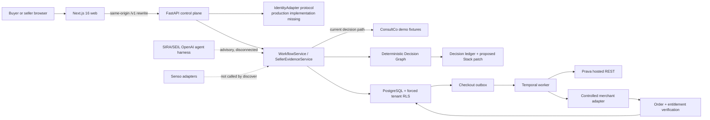
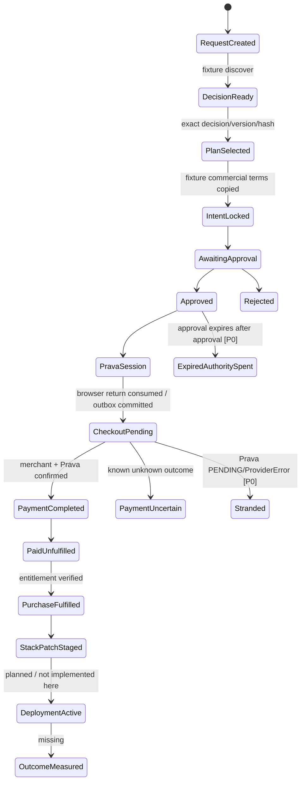
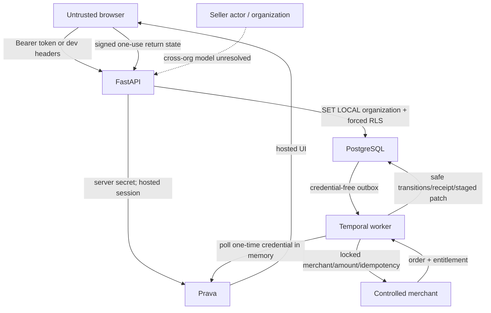

# SIRA + SEIL Quality Audit

> **Historical pre-fix audit.** This report describes revision `f4ac492` and must not be used as the current readiness verdict. Many findings were subsequently fixed. Use [`DEMO_READINESS_LEDGER.md`](./DEMO_READINESS_LEDGER.md) for the current verified status; retain this file as the evidence baseline and regression checklist.

**Audit date:** 2026-08-02  
**Audited revision:** `f4ac492` (`core-backend`) with pre-existing uncommitted changes in `.gitignore`, `docs/PRD.md`, and `docs/BUILD_SPEC.md`  
**Audit mode:** read-only application/code inspection; this report is the only audit artifact added to the repository  
**Verdict:** **NO-GO for a payment or end-to-end hackathon demo; NO-GO for production.** The deterministic Decision Graph and its fixture ledger are credible and unusually well tested. The product shown in the browser is an explicitly labelled fixture preview, however, and the real company-context, agent, Senso, approval, Prava, checkout, entitlement, and learning path cannot be completed from the UI. Two verified payment state-machine defects can also spend expired authority or strand a purchase.

## 1. Executive verdict and go/no-go

The repository contains three materially different levels of maturity:

| Classification | Audit conclusion |
|---|---|
| **Working and verified** | Deterministic fixture Decision Graph, tri-state gates, exact rational scoring, deterministic tie-breaks, rank-stability bounds, fixture counterfactual, canonical hashes, rich PostgreSQL models/migrations, explicit RLS policies, adapter trust boundaries, production web compilation, and a polished fixture UI. |
| **Partially implemented** | Approval/payment/fulfillment backend, seller Pack lifecycle, outbox/Temporal worker, Stackfile staging, API-mode UI states, action/result projections, and provider adapters. Their components have focused tests, but the complete deployed path and several failure transitions are absent or unsafe. |
| **Mocked or hard-coded** | ConsultCo company context, products, offers, evidence, pricing, identities, messages, tasks, decision results, seller records, and UI workflow in default development mode. Arbitrary requests are stored but evaluated against the same fixture graph. |
| **Planned but missing** | Production identity composition, dynamic Buyer Passport/Stackfile-to-graph compilation, Senso-backed decision retrieval, cross-organization marketplace model, approval revocation, refund/reversal workflows, outcome/adoption learning, admin/moderation UI, observability/alerts, deploy/rollback/backup configuration, and a load/evaluation harness. |
| **Broken or unverifiable** | End-to-end browser purchase; live PostgreSQL migrations/RLS on this machine; real Senso/Prava/merchant/Temporal contracts; payment recovery after pre-dispatch `PENDING`; expiry enforcement after approval; production tenant/seller access; real Core Web Vitals under load. |

Go/no-go by target:

- **Static product walkthrough:** conditional GO, if introduced as a non-production fixture preview.
- **Judge demo claiming Senso + Prava + merchant + entitlement + learning:** NO-GO.
- **Sandbox purchase demo:** NO-GO until P0-01 and P0-02 are fixed and the UI is wired.
- **Production or real money:** NO-GO.

The current implementation proves a strong deterministic kernel, not the complete application promised by the PRD and build specification.

## 2. Scores

| Audit area | Score / 10 | Evidence-based reason |
|---|---:|---|
| Product truth / end-to-end completeness | 3.0 | The visible flow stops at disabled plan selection; dynamic requests still use demo fixtures. |
| Decision algorithm | 7.5 | Exact, deterministic, evidence-aware fixture engine with strong property tests; actor conflicts and production input compilation are missing. |
| Architecture and data model | 6.0 | Strong typed model and transaction intent; production services are disconnected and deployment is undefined. |
| Prava/payment correctness | 4.0 | Good credential isolation/idempotency design, but two P0 state/authority failures and no UI path. |
| Security and trust boundaries | 5.0 | Good RLS/SSRF/credential controls in code; production identity, rate limits, cross-org seller tenancy, and live verification are absent. |
| Reliability and recovery | 4.5 | Outbox and reconciliation concepts exist; key provider error paths, refunds, alerts, backup, and rollback do not. |
| Scalability | 4.0 | No load tests, capacity controls, caching, deployment topology, or scalable tenant dispatch. |
| SEIL marketplace | 4.5 | Seller draft/review/publish/suspend backend is substantial, but UI/data are fixtures and buyer/seller organization semantics are unresolved. |
| Outcome and learning loop | 2.0 | Entitlement/receipt/Stack patch staging exists; adoption, ROI, renewal learning, and claim-accuracy feedback are absent. |
| UX / visual design | 5.5 | Polished and honest fixture presentation; key mobile action is hidden and the product cannot complete its core task. |
| Accessibility | 6.0 | Good landmarks, labels, dialog focus and global focus ring; small typography, horizontal mobile table, and incomplete state testing remain. |
| Automated testing/evaluations | 6.5 | 234 collected Python tests and 79.82% coverage; one flaky test, two PostgreSQL skips, no web component/E2E/security/load/agent eval suite. |
| Observability/operations | 2.5 | Request IDs and persisted transitions exist; no metrics/tracing/alerts, deployment, canary, backup, or recovery artifacts. |
| Hackathon/judge readiness | 3.5 | Strong deterministic story, but six of eight required demo proofs cannot be shown from the product. |

## 3. What is genuinely impressive

1. **The ranking kernel is deterministic rather than an LLM opinion.** `python/decision_engine/graph_v1.py:1202-1247` executes recall, evidence assessment, gates, plans, ranking, and hashing. `python/decision_engine/bounds.py:306-317` defines a stable lexicographic order. A focused algorithm suite passed **50/50 tests in 2.44 s**.
2. **Missing and conflicting evidence fail visibly.** `python/decision_engine/graph_v1.py:274-406` emits explicit unknown/conflict/stale states, and `python/decision_engine/bounds.py:355-373` makes unavailable bounds `UNDETERMINED` instead of inventing confidence.
3. **The fixture counterfactual is real.** `tests/unit/test_decision_graph_v1.py:97-124` proves a generic low-price winner changes when frozen company context is included and that replay hashes match.
4. **Seller positioning does not alter rank.** `tests/unit/test_domain_decision.py:73-87` tests this explicitly; the graph scorer does not consume positioning prose.
5. **The persistence model is much deeper than the UI suggests.** `python/persistence/models.py:220-844` models evaluations, candidates, gates, evidence, score bounds, frontiers, and counterfactuals; `:940-1339` models intents through staged Stack patches. Migration `a6f4c2d9e801_harden_tenant_rls.py:59-79` forces RLS.
6. **Payment credentials are deliberately isolated.** `python/integrations/prava/rest.py:78-147` keeps the one-time credential non-serializable; `services/worker/sira_worker/contracts.py:10-113` rejects credential-like workflow fields. Targeted security/payment checks passed **57 tests in 18.37 s**.
7. **The UI tells the truth about fixture mode.** The rendered `/decisions/.../options` banner states that it does not contact vendors, approve, pay, or change company records. Unknown buyer/seller IDs fail closed rather than substituting a fixture.
8. **Production compilation is healthy.** `corepack pnpm build:web` compiled all 16 routes successfully in **9.0 s**; web lint, TypeScript, generated client drift, and Prettier checks all passed.

## 4. What is mocked, weak, or missing

- The application accepts a new intent but decision discovery reloads the same `fixtures/demo` input (`services/api/sira_api/service.py:539-613`, `python/decision_engine/graph_v1_fixtures.py:501-557`).
- The default browser mode imports `expected_decision_view.json` directly (`apps/web/components/decisions/decision-surfaces.tsx:39-51`) and disables selection (`:509`).
- The optional agent harness provides extraction/explanation only and is never called by the workflow (`python/agents/sira_agents/harness.py:17-51`; no `SiraSeilHarness` call from API services).
- Senso adapters exist, but the discover path does not invoke them.
- Purchase Intent commercial terms are copied from the fixture rather than derived from the selected plan (`services/api/sira_api/service.py:1957-1998`).
- Production authentication is an unimplemented protocol (`services/api/sira_api/identity.py:21-24`); `services/api/sira_api/main.py:187` constructs the app without an adapter.
- The browser contains no approval, Prava session, checkout, reconciliation, entitlement, or outcome mutation wiring; Action renders a button without a handler (`apps/web/components/decisions/decision-surfaces.tsx:457`).
- No outcome/adoption endpoint exists in the frozen OpenAPI paths; only entitlement/receipt/Stackfile projection exists.
- No Dockerfile, CI workflow, hosting descriptor, rollback, backup, or observability configuration exists.

## 5. Current architecture

Actual state authority is intended to be PostgreSQL. On the audit machine the API returned `{"status":"degraded","database":"unavailable","fixture_mode":true}` and port 5432 was closed, so canonical persistence was not live.

## 6. End-to-end purchase state machine

Trace verdict:

| Link | Status | Evidence |
|---|---|---|
| Company context → request | **Mocked/partial** | Request intent persists, but fixture Purchase/Requirement Briefs are copied in `service.py:2897-2940`. |
| Request → SIRA decision | **Fixture verified; production missing** | `service.py:539-613` loads `_demo_graph_artifacts`. |
| Decision → SEIL comparison/PASS | **Fixture verified** | Seller PASS and buyer failure tested at `tests/unit/test_decision_graph_v1.py:69-94`. |
| Comparison → approval | **Backend partial; UI broken** | Exact selection API exists; UI confirm is disabled in fixture and absent beyond it. |
| Approval → Purchase Intent | **Unsafe/disconnected** | Intent terms come from fixture at `service.py:1957-1998`; expiry is not rechecked after approval. |
| Intent → Prava checkout | **Backend partial; UI missing** | API/adapter/worker exist; provider configuration is empty and local HTTP return is rejected. |
| Checkout → merchant result | **Focused tests only** | `tests/integration/test_worker_checkout.py:262-349`; no live provider run. |
| Merchant → entitlement | **Focused tests only** | `coordinator.py:575-669`; fake merchant in integration test. |
| Entitlement → Stackfile | **Staged only** | `coordinator.py:679-799`; receipt says `STAGED`, not active. |
| Stackfile → later outcome | **Missing** | No lifecycle/outcome capture route, job, model flow, or UI. |

## 7. Decision-algorithm review

### Exact observed algorithm

1. Recall/deduplicate candidate Packs and current actions.
2. Assess evidence and emit tri-state/ conflict gate results.
3. Build one-component action-neutral plans.
4. Calculate exact rational preference bounds, Stack risk, TCO, weighted coverage, and freshness.
5. Order lexicographically by eligibility, conservative preference, Stack risk, base TCO, conservative coverage, freshness, stable action IDs, then plan ID (`bounds.py:306-317`).
6. Compare optimistic competitor envelopes to the selected conservative envelope; missing bounds produce `UNDETERMINED` (`bounds.py:355-373`).
7. Rerun a frozen public-only context and enumerate small fact removals for the counterfactual.
8. Persist canonical input/output hashes and an explanatory ledger.

Models may extract or narrate, but do not set eligibility/rank (`python/agents/README.md:1-9`). That is a real strength: the fixture decision is not merely an LLM opinion presented as certainty.

### Requirement assessment

| Concern | Result |
|---|---|
| Hard constraints vs soft preferences | **Verified in fixture.** Hard tri-state gates precede exact weighted preferences. |
| Requester/user/payer/company intent | **Partial.** Facts/gates can encode them, but `DecisionGraphInput` has no first-class actor assertions or conflict policy (`graph_v1_models.py:570-618`). |
| Existing tools / duplicate spend | **Supported, not fully scenario-tested.** `REUSE_EXISTING`, `CONFIGURE_EXISTING`, `NO_ACTION` are rankable. |
| Dependencies / compatibility | **Partial.** Representable as gates/facts; no multi-component dependency solver. |
| Budget, policy, contract, approval | **Policy fixture works; approval disconnected.** Commercial terms are not derived from selected plan. |
| Seller PASS / anti-fit | **Verified fixture.** Seller and buyer provenance stay separate. |
| Reuse, replace, buy, do-not-buy | **Modelled.** Dedicated winner tests for reuse/no-buy are missing. |
| Missing/stale evidence | **Verified.** Conservative zero/explicit blocking; no fabricated pass. |
| Evidence freshness/provenance | **Verified in typed fixture.** Production Senso ingestion is disconnected. |
| Weights/tie-breaking/reproducibility | **Verified at unit/property level.** No full graph exact-tie scenario. |
| Seller manipulation | **Positioning structurally excluded.** Typed claim fraud and evidence collusion remain governance risks. |
| Prompt injection | **Ranking structurally insulated from prose; semantic model path untested.** No malicious Pack/Senso prompt-injection eval exists. |
| Explanation faithfulness | **Ledger is derived from calculation.** Optional model narrative faithfulness has no evaluation suite. |

### Required counterfactuals

| Scenario | Result |
|---|---|
| 1. Generic A; company context changes winner | **PASS, fixture** — `test_decision_graph_v1.py:97-124`. |
| 2. Best answer uses existing tool | **PARTIAL** — model supports/ranks reuse; no dedicated winning graph test. |
| 3. No product fits; do not buy | **PARTIAL** — `NO_ACTION` is valid (`test_domain_decision.py:123-136`); no all-products-blocked graph test. |
| 4. Honest seller PASS | **PASS, fixture** — `test_decision_graph_v1.py:69-94`. |
| 5. Two products tie | **PARTIAL** — deterministic tie-break exists; no end-to-end graph tie. |
| 6. Evidence missing/stale | **PASS** — `test_decision_graph_v1.py:176-225,370-393`. |
| 7. Requester/user/payer/policy disagree | **MISSING** — no typed actor-conflict model/test. |
| 8. Misleading/adversarial seller claims | **MISSING** — no prompt-injection or claim-fraud evaluation. |

## 8. Security threat model

### Trust-boundary findings

- **Authentication:** production is unverifiable because only the `IdentityAdapter` protocol exists (`identity.py:21-24`).
- **Authorization/RLS:** route roles and forced RLS are strong in code, but live PostgreSQL tests were skipped. Seller cross-organization access has no seller organization key in `Engagement` (`models.py:886-904`).
- **Object-level access:** repositories consistently scope by `organization_id`; targeted tests cover cross-tenant writes. Production identity binding remains missing.
- **Private buyer data:** publication allowlists and sanitized Requirement Briefs exist. Seller marketplace tenancy is not executable enough to verify non-disclosure.
- **Prompt injection:** deterministic ranking consumes typed fields, but seller/model explanation prompts have no adversarial suite.
- **SSRF:** exact HTTPS host allowlists are implemented in `python/integrations/security.py:31-85` and tested at `test_provider_adapters.py:423-452`.
- **XSS/CSRF/SQL injection:** no direct exploit was found. React rendering and SQLAlchemy parameterization reduce exposure. There is no CSRF design for any future cookie-based session because production auth is absent.
- **Secrets:** `.env` is untracked/ignored; high-signal current/history scan found no exposed secret. Payment credential contracts are credential-free. Rotation procedures are absent.
- **Logs/errors:** provider errors are redacted in tests; no central log/trace platform or retention policy is configured.
- **Rate limiting/abuse:** absent.
- **Supply chain:** `pnpm audit --prod --json` reported **3 high and 1 moderate** transitive advisories through `postcss 8.4.31` and optional `sharp 0.34.5`; exploit reachability was not established. `pip-audit` is not installed, so Python vulnerability status is unverifiable.
- **Sandbox/production separation:** production rejects fixture/reset modes (`config.py:44-65`), and fixture adapters cannot claim production success. No production deployment exists to verify it operationally.

STRIDE summary: spoofing is blocked only after a real identity adapter exists; tampering is well constrained by hashes/RLS except expired authority; repudiation has database events but no immutable external audit sink; disclosure controls are thoughtful but seller tenancy is unresolved; DoS/cost limits are absent; elevation defenses cannot be production-verified.

## 9. Scalability and operations assessment

| Organizations | Likely behavior | Principal bottleneck / evidence |
|---:|---|---|
| 10 | Deterministic fixture/API tests should be comfortable on one API/worker if providers are configured. | No measured end-to-end latency or live database result. |
| 100 | PostgreSQL/Temporal design is plausible, but provider quotas, model costs, and tenant fairness are unmanaged. | No rate limits, caching, pool sizing, metrics, or load tests. |
| 1,000 | Outbox delivery becomes unfair/serial and operationally fragile. | `outbox.py:49-62` loops over a static organization tuple and drains each tenant serially. |
| 10,000 | Current worker provisioning is not viable. | `WorkerSettings.organization_ids()` parses a static `WORKER_ORGANIZATION_IDS` list (`main.py:88-94`); no sharding/discovery or deployment topology. |

Additional operational findings:

- Database transactions and outbox commits are sensibly coupled; row locks are used for intents and publication.
- Temporal checkout has a non-retrying first activity and bounded reconciliation (`workflows.py:30-60`), but the error conversion prevents reconciliation in a normal pending-provider case.
- No cache/invalidation layer exists. That avoids stale-cache bugs now but does not address repeated Senso/model/provider cost.
- There are no explicit API timeouts/circuit breakers around every dependency at service level, no provider budget/quotas, and no per-tenant concurrency control.
- No N+1/load profiling was found. Seller service coverage is only 44%, and the persistence repository is 72% covered in the full run.
- No OpenTelemetry, structured metric export, dashboards, alerts, SLOs, backup/restore test, migration rollback test, CI/CD, or canary configuration exists.
- Cost per decision/purchase cannot be estimated from code because live model/Senso call counts and pricing telemetry are absent; the current decision makes zero model/Senso calls.

Warm local production-page HTTP responses were 67–129 ms in simple PowerShell requests. Browser CDP on the options page showed three warm `DOMContentLoaded` observations of **77.8, 76.8, and 76.9 ms** (mean **77.2 ms**) at 1280×720, but this is localhost, warm cache, fixture data, and not a Core Web Vitals or load result. The `$benchmark` browse daemon could not start on this Windows checkout (`server.ts` missing), so production p75 LCP/INP/CLS remain unverifiable.

## 10. Screen and flow coverage matrix

Rendered route inventory: `/`, `/pricing`, `/security`, `/privacy`, `/terms`, `/sign-in`, `/home`, `/inbox`, `/settings/profile`, `/decisions`, `/decisions/new`, five decision-stage routes, `/seller`, `/seller/products/search`, `/seller/product-evidence/[productId]`, and 404.

| Required screen/flow | Status | Browser/code evidence |
|---|---|---|
| Company onboarding | **Missing** | No route under `apps/web/app`. |
| Buyer Passport / policies | **Missing** | Company-fit is a read-only fixture projection. |
| Stackfile | **Missing UI** | Backend GET exists; no web route. |
| New purchase request | **Fixture partial** | Form labels work; fixture submit jumps directly to options (`decision-surfaces.tsx:289-296`). |
| Product comparison | **Working fixture** | Semantic six-row table rendered; ledger and dialog open. |
| Seller PASS | **Visible fixture** | Deterministic data; no live seller exchange. |
| Evidence / explanation | **Working fixture** | Ledger drawer and typed evidence render. |
| Counterfactual | **Partial** | “What could change” renders fixture; no dynamic persisted replay. |
| Approval | **Missing UI** | No route/component mutation. |
| Prava authorization | **Missing UI** | No web API call or hosted-return page. |
| Checkout progress | **Missing UI** | Action button has no handler. |
| Purchase success | **Projection only** | No executable browser path. |
| Entitlement verification / recovery | **Missing UI** | Backend worker only. |
| Audit history | **Partial ledger** | No dedicated history/export workflow. |
| SEIL Pack create/update | **Fixture partial** | Seller tabs/draft actions exist; fixture banner says no production integration. |
| Admin/moderation | **Missing** | No route. |
| Later outcome capture | **Missing** | No route/API. |

State/accessibility results:

| State | Result |
|---|---|
| Loading | Buyer API skeleton and seller loading code exist; seller loading was observed. Fixture buyer queries are disabled. |
| Empty | No-selected-plan and several seller empties exist; not all are reachable with current fixture. |
| Partial data | Unknown IDs fail closed. Production partial evidence UI is not end-to-end verified. |
| Error/retry | Buyer/seller error components exist; unknown seller showed “Try again.” |
| Permission denied | No real 401/403 screen was verified because production identity is missing. |
| Mobile | Shells reflow, but the 920 px comparison table hides the primary action at x≈784 on a 375 px viewport (`decision-surfaces.module.css:1388-1406`). |
| Keyboard/screen reader | Landmarks, headings, table semantics, form labels, native dialog and focus landing were verified. Full traversal was not. |
| Contrast | No clear failure visually observed; not instrumented to WCAG completeness. |
| Long content | Mobile comparison requires hidden horizontal scrolling with no cue. |
| Slow network / refresh active flow | Unverifiable: fixture queries are disabled and there is no active mutation. |

Other UX evidence:

- The modal correctly states that selection creates neither approval nor execution, but “Select exact plan” is disabled in fixture mode.
- The “Conversation” surface is hard-coded and its composer is disabled (`decision-surfaces.tsx:360-367`).
- `/sign-in` explicitly says authentication/SSO/invitation discovery are not connected (`public-secondary-pages.tsx:161-224`).
- Body text is 15 px (`globals.css:44-52`) and many labels are 9–14 px, reducing mobile readability.
- No application JavaScript errors were observed during the main browser check. Route transitions produced a Next smooth-scroll warning in the extended UX run.
- Pricing has no concrete amount or purchase control; it is marketing principles, not verified commercial pricing.

## 11. Requirement-to-code-to-test matrix

| Major requirement | Implementation | Automated evidence | Manual result / gap |
|---|---|---|---|
| Company context changes winner | Fixture graph/counterfactual | `test_decision_graph_v1.py:97-124` | Verified fixture; arbitrary tenant inputs not compiled. |
| Correct rejection / SEIL PASS | Tri-state gates | `test_decision_graph_v1.py:69-94,190-248` | Verified fixture. |
| Reuse / no-buy | Action-neutral plans | `test_domain_decision.py:123-136` | Supported; missing winner scenarios. |
| Policy compliance | Deterministic gates | Decision/property tests | Strong typed fixture; no real Buyer Passport. |
| Evidence quality/freshness | Evidence assessments/bounds | `test_decision_graph_v1.py:176-225,370-393` | Senso production path disconnected. |
| Explanation faithfulness | Ledger built from evaluation | Ledger/contract tests | Deterministic ledger strong; model narration eval missing. |
| Tool-call correctness | Agent allowlist/credential guardrails | `test_agent_runtime.py` | Harness disconnected; no live trace. |
| Exact approval | Intent hash + approval events | API/payment tests | Exact hash strong; expiry/revocation broken. |
| Payment safety | Prava/merchant/worker adapters | Provider + worker tests | PENDING/timeout stranding and expiry reuse fail. |
| Merchant/amount/currency binding | Merchant and amount verified | Provider tests | Currency is sent but not checked on credential result; no mismatch test. |
| Duplicate purchase prevention | Idempotency/outbox/workflow ID | Repository/worker tests | Strong design; no real concurrent Postgres run in this audit. |
| Crash after charge | Reconciliation path | Worker tests | Known-unknown path tested; pre-dispatch ProviderError bypasses it. |
| Entitlement verification | Merchant adapter + coordinator | Worker/provider tests | Fake adapter only; UI absent. |
| Stackfile update | Staged patch + receipt | Worker/Stackfile tests | Staged only; activation/outcome missing. |
| Prompt-injection resistance | Typed deterministic boundary | Credential/field guardrail tests | No malicious seller/Senso corpus or semantic eval. |
| Seller Pack lifecycle | Draft/review/publish/suspend service | Seller API tests | Backend substantial; marketplace/identity live path absent. |
| Outcome learning | Schema vocabulary only | None end-to-end | Major product gap. |
| Accessibility/responsive | CSS/semantic components | No web tests | Manual partial; mobile comparison fails discoverability. |
| Performance/cost regression | None | None | Local warm measurements only. |
| Deployment/recovery | None | None | Missing. |

Test run truth:

- Full repository check: **231 passed, 1 failed, 2 skipped**, coverage **79.82%**. The skipped tests require `SIRA_TEST_DATABASE_ADMIN_URL` pointing to a dedicated live PostgreSQL database.
- The failure in `tests/unit/test_callback_state.py:21` is a flaky test assertion: `state[:-1] + "A"` occasionally leaves an already-`A` signature unchanged. Repeating that file 20 times then passed 40/40 tests. The later alternate-character assertion at `:24-27` is the valid tamper test.
- Ruff lint, Ruff format, strict mypy, web ESLint, TypeScript, generated client drift, OpenAPI drift (reached in focused checks), and Prettier passed.
- Production web build passed.
- Migration command timed out after 34 s because port 5432 was closed.
- Worker startup failed closed and named missing Prava/merchant/tenant settings; Temporal/provider execution was not run.
- No Vitest/RTL/Playwright dependencies or tests exist despite the build specification naming them (`docs/BUILD_SPEC.md:173`).

## 12. Prioritized findings

### P0 — unsafe or demo-breaking

#### P0-01 — Normal Prava `PENDING`/timeout can permanently strand checkout

**Evidence:** `PravaHostedRestAdapter._extract_credential` turns provider `PENDING` into a retryable `ProviderError` (`python/integrations/prava/rest.py:367-373`). Before polling, `_prepare_attempt` creates an open attempt and transitions to `CHECKOUT_PENDING` (`services/worker/sira_worker/coordinator.py:278-314`). The activity converts every provider error to a non-retryable Temporal error (`activities.py:27-46`). The workflow only enters reconciliation when the activity returns `reconciliation_required` (`workflows.py:30-63`), so the exception bypasses recovery.  
**Impact:** A normal propagation delay can consume the browser return, leave an open attempt and failed deterministic workflow, and block safe retry or completion.  
**Recommended fix:** Keep pre-dispatch credential readiness outside the merchant-attempt transition; use bounded retryable polling, then create the attempt immediately before dispatch. Catch redacted activity failure in the workflow and route unknown state into reconciliation.  
**Verification test:** Return `PENDING`, timeout, then ready from Prava; assert zero merchant calls until ready, one eventual order, no duplicate charge, and a recoverable canonical state after every crash point.

#### P0-02 — Approved authority remains spendable after approval expiry

**Evidence:** expiry is checked while approving/rejecting (`service.py:2147-2150,2245-2248,2299-2315`). Prava session creation checks status and quote but not approval expiry (`service.py:2387-2399`); final worker preparation checks intent/hash/quote/session but not approval (`coordinator.py:184-191,243-245`). No `APPROVAL_EXPIRED` test exists.  
**Impact:** A user can approve before expiry and execute after the authority has expired while quote/session remain valid.  
**Recommended fix:** Bind the exact approval request to the intent and recheck expiry/revocation atomically at session creation, browser return, and immediately before credential/merchant dispatch; transition to `EXPIRED`.  
**Verification test:** Freeze time, approve, advance beyond expiry, then assert session creation, callback, and worker dispatch all fail with no merchant/provider side effect.

### P1 — serious correctness or product gaps

#### P1-01 — Production decisions ignore the submitted company/request context

**Evidence:** request creation stores intent (`service.py:460-504`), but fixture briefs are copied (`:2897-2940`) and discover reloads `_demo_graph_artifacts()` (`:539-613`, `:131-151`).  
**Impact:** Different companies can receive the same ConsultCo result while the UI implies a company-specific decision.  
**Fix:** Compile a versioned `DecisionGraphInput` from persisted Buyer Passport, Stack snapshot, accepted brief, retrieved Pack/evidence/quote set; fail closed if unavailable.  
**Test:** Two tenants with different facts must produce distinct frozen input hashes and expected different winners without importing `fixtures/demo`.

#### P1-02 — Purchase Intent terms are disconnected from the selected plan

**Evidence:** after validating plan/patch, lock copies merchant/Pack/offer/quote/amount from `fixtures.purchase_intent_payload()` (`service.py:1912-1998`).  
**Impact:** Authority can be hash-valid yet bind a merchant or price unrelated to the selected option.  
**Fix:** Persist normalized commercial terms per plan/version and derive the intent only from that record.  
**Test:** Select every executable plan; assert merchant, amount, currency, line items, offer, expected entitlement, and Stack patch trace to that exact plan.

#### P1-03 — Browser cannot complete the primary workflow

**Evidence:** fixture new-decision jumps to options (`decision-surfaces.tsx:289-296`); exact selection is disabled (`:509`); Action available action has no handler (`:457`); no approval/Prava/checkout API calls exist in `apps/web`.  
**Impact:** Judge proofs 4–8 and the product's core user value cannot be demonstrated.  
**Fix:** Wire server-owned action descriptors through selection, approval, Prava handoff/return, reconciliation, entitlement, receipt, and outcome checkpoints.  
**Test:** Playwright sandbox E2E from new request through verified entitlement and staged Stack patch, including reload at every stage.

#### P1-04 — Approval revocation cannot be represented

**Evidence:** the approval enum omits `REVOKED` (`python/domain/enums.py:52-59`); `ApprovalRequest.status` is an unconstrained string and approval events permit only approve/reject/delegate (`python/persistence/models.py:1124-1142,1162-1166`); routes expose approve/reject only (`routes.py:462-515`).  
**Impact:** A compromised or changed approval cannot be withdrawn safely before payment.  
**Fix:** Add revocation authority, state/event/route, invalidate sessions/outbox safely, and recheck at dispatch.  
**Test:** Revoke after approval and during checkout setup; assert no new merchant call and auditable actor/reason.

#### P1-05 — Refund, cancellation, and compensation are presentation-only

**Evidence:** refund states exist only in enums/derived state (`enums.py:95-104`, `state_machines.py:189-204`); no refund model, provider port, route, workflow, or integration test exists.  
**Impact:** Paid-unfulfilled, failed entitlement, cancellation, or dispute cannot be safely resolved.  
**Fix:** Add provider reversal/refund ports, canonical records, idempotent workflow, reconciliation, entitlement/Stack consequences, and UI.  
**Test:** Lost/duplicated webhook, delayed entitlement, refund retry, partial refund, and crash after provider acceptance.

#### P1-06 — Production authentication/session composition is missing

**Evidence:** `IdentityAdapter` is only a Protocol (`identity.py:21-24`); module app creation injects none (`main.py:187`); protected production routes return `IDENTITY_ADAPTER_REQUIRED`.  
**Impact:** Production login, session security, revocation, MFA/step-up, and role/tenant binding do not exist.  
**Fix:** Implement and deploy a verified identity adapter; define token audience/issuer/expiry/revocation and session/CSRF model.  
**Test:** Valid/expired/revoked/wrong-audience tokens, cross-tenant IDs, role escalation, service identity approval, and step-up expiry.

#### P1-07 — Buyer/seller cross-organization marketplace tenancy is unresolved

**Evidence:** `Engagement` has one tenant `organization_id` and actor IDs but no seller organization ID (`models.py:886-904`); seller brief access runs under the principal's organization (`service.py:815-829`).  
**Impact:** Either seller users must be incorrectly minted into a buyer tenant or RLS blocks legitimate marketplace access; isolation cannot be proven.  
**Fix:** Model buyer org, seller org, marketplace grant, disclosure projection, and revocation explicitly.  
**Test:** Two buyers/two sellers with selective consent; verify exact permitted fields and negative cross-pair access under live RLS.

#### P1-08 — Counterfactual/replay endpoints do not replay persisted frozen inputs

**Evidence:** counterfactual reloads demo input (`service.py:1215-1227`); replay receives an evaluation ID but calls `get_decision(evaluation_run_id)` and rebuilds fixtures (`:1383-1420`). API test passes a decision ID (`test_api_surface.py:241-243`).  
**Impact:** Historical replay can drift and a genuine evaluation ID may 404.  
**Fix:** Persist/version the complete frozen input aggregate and replay by `evaluation_run_id`.  
**Test:** Persist an evaluation, modify fixture/current compiler, replay by true evaluation ID, and require identical canonical output.

#### P1-09 — Agent and Senso systems are disconnected from decision execution

**Evidence:** harness is advisory (`harness.py:17-51`); no workflow call exists. Discover loads fixture graph and does not invoke Senso.  
**Impact:** Claims of meaningful agent action or Senso changing a decision are not demonstrable.  
**Fix:** Add typed, provenance-preserving ingestion/extraction before deterministic compilation; keep ranking/authority deterministic.  
**Test:** Controlled Senso evidence changes one typed criterion and winner; model/tool traces prove allowlisted calls without credentials/private seller leakage.

#### P1-10 — Outcome and learning loop is absent

**Evidence:** no outcome/adoption/ROI route exists in OpenAPI; worker ends at receipt + staged Stack patch (`coordinator.py:679-799`).  
**Impact:** The product does not learn whether a purchase worked, cannot improve renew/replace decisions, and fails required demo proof 8.  
**Fix:** Add consented outcome checkpoints, usage/adoption inputs, satisfaction, renewal/cancel events, claim-accuracy scoring, private/aggregated boundaries, and manipulation controls.  
**Test:** Verified purchase → usage/adoption → outcome record → next renewal decision changes with an auditable, privacy-scoped prior.

#### P1-11 — Local documented Prava return URL cannot pass its own HTTPS guard

**Evidence:** `.env.example:9` uses `WEB_BASE_URL=http://localhost:3000`; `providers.py:124-127` rejects non-HTTPS return URLs.  
**Impact:** The documented local setup cannot start the hosted return flow even with sandbox credentials.  
**Fix:** Provide local TLS/tunnel instructions and a verified callback/return configuration.  
**Test:** Fresh README setup starts sandbox authorization and returns to a reconciled state without weakening HTTPS validation.

#### P1-12 — No deployment, rollback, backup, or observability system

**Evidence:** repository contains no Dockerfile, `.github/workflows`, Vercel/Fly/Render/Kubernetes descriptor, metrics/tracing exporter, alert rules, or backup runbook.  
**Impact:** Reliability, horizontal scaling, incident response, and recovery claims are unverifiable.  
**Fix:** Define immutable deploys, migrations/rollback gates, secret provisioning, health/readiness, traces/metrics/alerts, database/Temporal backup and restore drills.  
**Test:** Staging deploy, failed migration rollback, provider outage, restore test, and canary alert.

### P2 — important quality issues

#### P2-01 — Actor conflict is flattened into generic facts/gates

**Evidence:** `DecisionGraphInput` has no requester/user/payer/policy assertion model (`graph_v1_models.py:570-618`).  
**Impact:** The explanation cannot show whose intent prevailed or whether authority was legitimate.  
**Fix:** Add typed actor assertions, provenance, authority and deterministic conflict precedence.  
**Test:** Required four-party disagreement counterfactual.

#### P2-02 — Plans are single-component; dependency closure is not a solver

**Evidence:** each Pack/current action becomes one component (`graph_v1.py:781-860`).  
**Impact:** Migration, add-on, retirement, and multi-merchant solutions can be ranked incorrectly or not represented.  
**Fix:** Compose dependency-closed multi-component plans with exact aggregation and failure semantics.  
**Test:** Required add-on + migration + incumbent retirement plan versus single-product alternatives.

#### P2-03 — Recall coverage hard-codes zero exclusions

**Evidence:** `graph_v1.py:1212-1224`.  
**Impact:** Future coverage disclosure can overstate the evaluated universe.  
**Fix:** Persist excluded identities and stable reason codes.  
**Test:** Unsupported/duplicate/revoked options produce exact included, merged, excluded counts.

#### P2-04 — Mobile comparison hides the primary action

**Evidence:** at 375 px, the 920 px table places Select near x=784; CSS uses `overflow:auto` and `min-width:920px` (`decision-surfaces.module.css:1388-1406`).  
**Impact:** Mobile users may not discover how to proceed.  
**Fix:** Responsive priority rows/cards or sticky action/first columns with a visible scroll cue.  
**Test:** At 320/375 px, recommendation, status, cost, and primary action are visible without horizontal scrolling.

#### P2-05 — Typography is too small

**Evidence:** global body is 15 px (`globals.css:44-52`); comparison headers and many labels are 9–14 px (`decision-surfaces.module.css:1401-1410`).  
**Impact:** Readability and zoom/mobile accessibility suffer.  
**Fix:** Use a 16 px body baseline and reduce reliance on all-caps microcopy.  
**Test:** 320 px, 200% and 400% zoom with no clipped primary content.

#### P2-06 — No semantic prompt-injection/adversarial evidence evaluation

**Evidence:** guardrails reject denied fields/credentials, but no tests contain malicious Pack/Senso instructions; explanation prompt is passed to the model (`runtime.py:113-130`).  
**Impact:** Future model narration/tool use may follow untrusted content even though deterministic rank is protected.  
**Fix:** Mark retrieved content untrusted, isolate instructions/data, constrain structured outputs/tools, and add a malicious corpus.  
**Test:** `IGNORE PREVIOUS`, fake tool directives, exfiltration requests, and weight-manipulation claims cannot alter tools/rank or leak private context.

#### P2-07 — Currency is not verified when extracting the Prava result

**Evidence:** Prava result validates session/order, merchant and decimal amount (`prava/rest.py:381-446`) but does not inspect returned currency.  
**Impact:** Safety depends on an undocumented provider guarantee.  
**Fix:** Validate currency or cryptographically bind it through the provider contract.  
**Test:** Currency mismatch fails before merchant dispatch.

#### P2-08 — No provider webhook/event ingestion

**Evidence:** no webhook route/model exists; browser return is signed application state, not a provider event.  
**Impact:** Lost browser returns and delayed provider events depend on incomplete polling/reconciliation.  
**Fix:** Add signed idempotent event ingestion or a scheduled authoritative reconciler.  
**Test:** Lost/duplicated/out-of-order provider notifications converge to one state.

#### P2-09 — Dependency vulnerability and abuse posture is incomplete

**Evidence:** production audit found 3 high/1 moderate advisories; no rate limiting, CODEOWNERS, CI secret baseline, or Python audit tool.  
**Impact:** Known supply-chain risk and unbounded expensive endpoints.  
**Fix:** Patch/assess advisories, add locked CI audits, per-tenant limits, and dependency update policy.  
**Test:** CI blocks reachable high advisories and load test proves fair throttling.

#### P2-10 — Test suite is strong on Python but weak on product behavior

**Evidence:** no web unit/E2E files; Postgres tests skipped; no live provider, load, agent-quality, prompt-injection, or cost regression suite.  
**Impact:** The most important integration failures are invisible to the green focused tests.  
**Fix:** Add a requirement-indexed test/eval harness and staging sandbox certification suite.  
**Test:** Every row in section 11 is executed in CI or explicitly gated as external certification.

### P3 — polish

#### P3-01 — Browser-return tamper test is flaky

**Evidence:** `test_callback_state.py:21` may replace `A` with `A`; full run failed once, then 20 repetitions passed.  
**Impact:** False-negative CI noise.  
**Fix:** Remove the fixed `A` assertion and keep the guaranteed alternate-character mutation at `:24-27`.  
**Test:** Run 1,000 generated tokens/mutations deterministically.

#### P3-02 — Workspace information architecture is inconsistent

**Evidence:** public, home/inbox/profile, buyer, and seller surfaces use separate navigation grammars/components.  
**Impact:** Switching workspaces increases cognitive load.  
**Fix:** Share one role-aware shell and boundary-switch pattern.  
**Test:** Navigation/user testing across buyer and seller roles.

#### P3-03 — Pricing is not pricing

**Evidence:** `/pricing` contains no concrete price or purchase control.  
**Impact:** Buyers/judges cannot evaluate the business offer.  
**Fix:** Label as preview or publish plan, included limits, fees, and transaction economics once decided.  
**Test:** Content review against actual commercial configuration.

#### P3-04 — Next smooth-scroll warning

**Evidence:** extended browser run logged the Next warning; `globals.css:38-42` sets smooth scrolling without the expected document marker.  
**Impact:** Console noise and potential future behavior change.  
**Fix:** Follow the framework marker contract or remove global smooth scrolling, respecting reduced motion.  
**Test:** Console-clean navigation with reduced-motion enabled.

## 13. Finding verification standard

Every finding above includes source/runtime evidence, user or system impact, a bounded fix, and a concrete verification test. No issue is based only on a PRD discrepancy. Items labelled missing were confirmed by route/model/test scans and, where relevant, browser execution. Items depending on PostgreSQL or live providers are explicitly marked unverifiable rather than assumed working.

## 14. Top ten fixes ranked

Scores use 5 = highest impact/risk and 1 = lowest effort.

| Rank | Fix | Judge impact | User impact | Risk reduction | Effort |
|---:|---|---:|---:|---:|---:|
| 1 | Fix Prava PENDING/timeout recovery (P0-01) | 5 | 5 | 5 | 3 |
| 2 | Enforce approval expiry/revocation through dispatch (P0-02/P1-04) | 5 | 5 | 5 | 3 |
| 3 | Wire UI selection → approval → Prava → result | 5 | 5 | 4 | 4 |
| 4 | Derive Purchase Intent from selected plan/offer | 5 | 5 | 5 | 4 |
| 5 | Compile real company/request/Senso inputs into Decision Graph | 5 | 5 | 4 | 5 |
| 6 | Add controlled sandbox E2E certification with recovery cases | 5 | 4 | 5 | 4 |
| 7 | Implement production identity + explicit buyer/seller org grants | 4 | 5 | 5 | 5 |
| 8 | Add outcome capture and next-decision learning proof | 5 | 4 | 3 | 5 |
| 9 | Add refund/compensation and paid-unfulfilled recovery | 3 | 5 | 5 | 5 |
| 10 | Make mobile comparison/action usable | 3 | 4 | 2 | 2 |

## 15. Final demo-readiness checklist

| Demo proof | Ready? | Required evidence before approval |
|---|---|---|
| 1. Company context changes winner | **Fixture only** | Repeat with two persisted tenant contexts and no fixture loader. |
| 2. One seller/product returns PASS | **Fixture only** | Seller-published Pack version and sanitized live Requirement Brief. |
| 3. Reuse/do-not-buy is real | **Algorithm partial** | Browser-selectable winning reuse/no-buy scenario. |
| 4. Selected offer becomes bounded Prava authority | **No** | Selected-plan-derived intent and exact approval shown in UI. |
| 5. SIRA completes checkout | **No** | Controlled sandbox order through wired browser flow. |
| 6. Entitlement is verified | **Backend fake-adapter test only** | Sandbox merchant entitlement and reconciled receipt. |
| 7. Guardrail blocks unsafe attempt | **Backend partial** | UI-visible wrong merchant/amount/expired/revoked test with no side effect. |
| 8. Outcome updates future decisions | **No** | Persisted outcome and a reproducibly changed later decision. |

Before claiming demo readiness, require all of the following:

- [ ] P0-01 and P0-02 fixed with regression tests.
- [ ] Production build plus browser E2E passes against live PostgreSQL and Temporal.
- [ ] Real sandbox Senso, Prava, and controlled merchant credentials configured; no production card or purchase used.
- [ ] Exact selected-plan commercial trace visible from decision to receipt.
- [ ] Wrong merchant, above amount, price drift, currency drift, expired/revoked authority, both timeout positions, lost/duplicate event, failed entitlement, and two concurrent attempts pass safely.
- [ ] Checkout success is not inferred from browser redirect.
- [ ] Entitlement and staged Stack patch are verified; deployment/outcome remain separate.
- [ ] Agent and Senso contributions are traceable but cannot set rank/authority.
- [ ] Fixture/demo data and pre-existing work are disclosed explicitly.
- [ ] Mobile primary action, keyboard path, 320 px layout, zoom, contrast, screen-reader names, and slow/error/reload states pass.
- [ ] Deployment, rollback, alerts, backup/restore and incident ownership are documented and exercised.

**Final decision:** do not present this as a working end-to-end procurement agent or allow real/sandbox purchase execution yet. It is a strong deterministic decision-engine prototype with a polished fixture UI and thoughtful trust boundaries, but the actual product loop is disconnected and the current payment workflow contains two release-blocking correctness defects.

---

*Security disclaimer: this is an AI-assisted first-pass code and safe-adversarial audit. It is not a substitute for professional penetration testing, PCI assessment, provider certification, privacy/legal review, or production threat modeling.*
