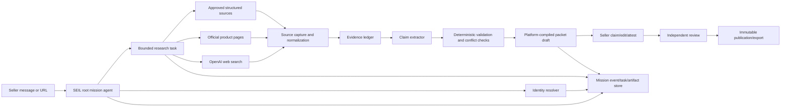
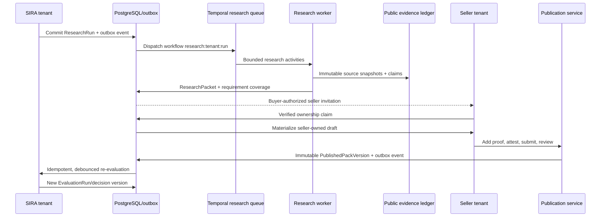

# SEIL runtime quality and demand-to-evidence plan

Status: draft under gstack review
Scope: SIRA runtime recovery, SEIL interaction/runtime quality, demand-conditioned public-web discovery, Product Evidence packet creation
Branch: `Ui` (planning only; no implementation in this change)

## Product premise

SIRA and SEIL are two role-specific projections of one Commerce Agent OS:

- SIRA starts with a buying outcome and produces a defensible decision, approval, and bounded purchase action.
- SEIL starts with a seller outcome or product identity and produces an evidence-backed, reviewable, publishable Product Evidence packet.
- Chat is the command surface. Persistent mission state, tools, evidence, artifacts, and authority gates are the product.
- The model may research, reason, propose, and prepare. Deterministic services own identity, permissions, validation, publishing, payment, and other protected effects.

The primary cold-start promise is: **when SIRA cannot evaluate a relevant product for a real Requirement Brief, the system builds a sourced research-only packet, identifies exactly what prevents qualification, and lets the seller claim and strengthen it.** Direct URL import remains a secondary SEIL entry point.

SIRA and SEIL share runtime quality, evidence integrity, security, and artifact interactions; they are intentionally asymmetric products. SIRA remains the primary buyer surface. SEIL is the focused seller surface for claim, correction, proof, review, and publication.

### Golden product loop

`SIRA unmet need → bounded public research → research-only packet → seller invitation/claim → missing proof remediation → independent review/publication → automatic SIRA re-evaluation`

The first vertical is meeting-intelligence software. V1 research is limited to official product, pricing, documentation, security, privacy, and integration pages plus seller-provided documents.

## Audit: what works and what does not

### Shared foundation already present

- Firebase Google, email/password, and anonymous sessions; workspace data is user-scoped.
- A shared three-pane agent-first shell with contextual inspector closed by default.
- Persistent missions, events, tasks, artifacts, checkpoints, handoffs, and bounded agent continuations.
- Capability-scoped SIRA and SEIL tools; mutating operations are proposals rather than direct external effects.
- Senso buyer/seller evidence connectors.
- A mature SEIL seller service for claiming an existing product, editing a draft, attaching evidence, review, publication, suspension, and export.
- SIRA purchase boundary work for Prava and Temporal.

### Confirmed blockers and gaps

1. Both agents currently return HTTP 503 before calling any tool. `MissionTurnOutput` contains arbitrary maps/`Any`, while the Agents SDK attempts strict JSON-schema output and rejects `additionalProperties`.
2. The API converts that root exception to a generic `AGENT_PROVIDER_UNAVAILABLE` response without a useful structured diagnostic.
3. The local Temporal worker is not running. Its fail-closed startup also requires `CONTROLLED_MERCHANT_BASE_URL`, `CONTROLLED_MERCHANT_API_KEY`, and `CONTROLLED_MERCHANT_ID`, which are not configured.
4. OpenAI, Senso, Prava, Temporal, and Firebase variables are present locally, but presence is not equivalent to an end-to-end verified capability.
5. SEIL has backend domain depth but incomplete workspace wiring:
   - its Products inspector reuses buyer catalogue language and asks the user to “Ask SIRA”;
   - it is not bound to the seller product search/pack endpoints;
   - `PACK_CLAIM`, `FIT_RULE`, `ANTI_FIT_RULE`, and `PACK_REVIEW_REQUEST` proposals render but cannot be confirmed;
   - shared context routes require `can_view_context`, but Firebase SEIL roles only include seller editor/reviewer roles.
6. No tool discovers a product on the public internet or creates a new product/packet from public evidence. Existing claim flow requires a pre-existing catalogue record.

## Target experience

### First-run SEIL

1. User says “Build the Product Evidence packet for Linear” or pastes `linear.app`.
2. SEIL recognizes the entity, proposes the likely canonical product/company identity, and starts a bounded research task without interrogating the user.
3. The chat shows concise progress: discovering sources, extracting claims, checking conflicts, preparing draft.
4. The right inspector opens only when the user selects the progress artifact, a cited claim, or the response info button.
5. SEIL returns:
   - a useful draft summary;
   - confidence and source coverage;
   - missing/high-risk claims;
   - one next action: claim/edit, add private proof, or submit for review.
6. The seller claims ownership and edits the draft. Publicly discovered material remains visibly platform-compiled until seller attestation and reviewer approval.
7. Publication is an explicit protected effect with validation, permissions, idempotency, and immutable versioning.

### Existing-product SEIL

SEIL searches seller-owned and public packets first, restores the correct mission/product context, and uses the same chat + inspector workflow for updating, reviewing, and exporting a packet.

## Architecture

### Control-plane rules

- The root agent owns the mission plan and decides which bounded tool or worker to invoke.
- A research task receives a product hypothesis, source budget, time budget, allowed tools, and no publish capability.
- Research results are observations, not truth. Every extracted claim must point to captured source evidence.
- The packet compiler is deterministic: it maps validated research outputs into the existing Product Evidence draft schema.
- Protected effects—claim ownership, seller attestation, review decision, and publication—stay outside model authority.
- Mission state is append-only/evented; UI projections can be rebuilt and resumed.

### Aggregate and tenancy boundaries

- `ProductIdentity` and deduplicated public `SourceSnapshot` metadata/content are platform-controlled. Domain identity, not name/category alone, drives deduplication; merges retain history.
- `ResearchRun`, Requirement Brief linkage, buyer identity, budget, and rationale remain private to the initiating tenant.
- An unowned `ResearchPacket` is a research-only aggregate; it is not a `SellerPackDraft` and has no editor/owner.
- Verified ownership approval materializes a new seller-tenant `SellerProduct` and `SellerPackDraft` from the research packet while retaining immutable provenance. No buyer-owned aggregate changes tenant.
- Only a safe immutable `PublishedPackProjection` is buyer-readable. Private seller evidence and buyer demand context never cross tenants.
- Canonical lineage is explicit: `RequirementBriefVersion → ResearchRun → ProductIdentity → PublishedPackVersion → EvaluationRun`.
- SEIL display states such as Researching/Research-only/Needs proof are projection states; existing seller domain enums are changed only through explicit additive migrations.

## New capabilities

### 1. Restore the shared agent runtime

- Change the runtime boundary to accept `AgentOutputSchema`; wrap `MissionTurnOutput` with `AgentOutputSchema(..., strict_json_schema=False)` as the immediate compatibility fix.
- Add a follow-up typed-boundary refactor: replace unconstrained top-level maps with a bounded JSON-value type or tagged artifact/task payloads.
- Preserve strict schemas for function tools.
- Reject unknown Pydantic fields, enforce recursive payload depth/key/size limits, pin the Agents SDK, and contract-test that version.
- Log provider stage, exception class, request/mission correlation ID, and safe schema diagnostics; never log prompts, tokens, secrets, or private evidence by default.
- Add one contract test proving both SIRA and SEIL can complete a turn and invoke a read-only tool.

#### Agent-turn concurrency contract

- Persist an `AgentTurn` with tenant, actor, mission, unique request ID, expected mission version, status, and cached response.
- Reserve a turn atomically before model execution. Request replay returns the cached result and never reruns the model/tools or consumes budget twice.
- Commit plan/world-model changes only against the expected mission version; stale turns rebase/retry or surface a typed conflict instead of overwriting newer state.
- Tool events record call ID, tool/schema version, safe input hash, result artifact/reference, latency, outcome, and safe error. Tool success never means evidence is verified.
- Persist continuation failures as typed resumable events; never swallow them.

### 2. Capability readiness registry

Replace scattered environment assumptions with a server-derived capability registry:

| Capability | Required configuration | Runtime proof | User-visible state |
|---|---|---|---|
| Agent reasoning | OpenAI key/model | minimal structured response | Ready / unavailable |
| Public research | OpenAI key/model + feature flag | web-search canary | Ready / restricted |
| Senso buyer/seller | scoped key, key ID, folder | scoped query canary | Connected / action needed |
| Product Evidence | database/migrations | seller search + draft read | Ready |
| Purchase orchestration | Temporal address/namespace/queue + live worker | worker heartbeat | Ready / offline |
| Prava checkout | Prava credentials/callback/allowlist | session-create canary | Ready / action needed |
| Controlled merchant | merchant URL/key/id | authenticated status canary | Ready / blocked |

Return capability availability to the agent so it plans around missing tools instead of failing late. Show configuration detail only in the Connectors inspector.

### Developer/operator contract

There is no silent fallback between these explicit modes:

| Mode | Services | Purpose |
|---|---|---|
| Fixture | web + recorded data | deterministic CI/component checks only |
| Agent | PostgreSQL + API + web + OpenAI | live SIRA/SEIL chat and read-only tools |
| Research | Agent mode + Temporal + research worker + source storage | public research and packet compilation |
| Purchase | Agent mode + Temporal + checkout worker + Prava + controlled merchant | real purchase execution |

- Add `scripts/doctor.ps1` for safe configuration/readiness probes and `scripts/dev.ps1 -Mode Agent|Research|Purchase` to launch one declared mode, print URLs, and name blocked capabilities.
- `/v1/capabilities` is the authenticated, mode-aware server roster used by both UI and root agent. States are `disabled`, `misconfigured`, `starting`, `ready`, `degraded`, or `offline`, with last check, safe reason code, remediation, and worker-heartbeat age.
- Separate settings/queues: `TEMPORAL_RESEARCH_TASK_QUEUE` and `TEMPORAL_CHECKOUT_TASK_QUEUE`. Research never imports or validates Prava/merchant configuration.
- Add `PUBLIC_RESEARCH_ENABLED`, per-run/day budgets, timeouts, source-domain policy, blob storage, encryption/access class, and retention settings.
- Live mode fails visibly when live dependencies are absent; recorded fixtures never masquerade as live agent/research results.

### 3. Public product discovery

Expose only three capability-scoped tools to the root agent:

- `start_product_research(product_hint, requirement_brief_id, budget)`
- `get_research_status(research_run_id)`
- `cancel_product_research(research_run_id)`

The no-side-effect research worker owns internal operations:

- `resolve_product_identity(query_or_url)`
- `search_public_product_sources(product_identity, questions, source_budget)`
- `capture_public_source(url)`
- `extract_product_claims(source_ids, claim_schema_version)`
- `compile_product_evidence_draft(identity_id, claim_ids)`

HTTP contracts are explicit and regenerate OpenAPI/client in the same slice:

- idempotent `POST /v1/research-runs` returns 202 and status URL;
- `GET /v1/research-runs/{id}` returns persisted progress/artifacts;
- cancel/resume endpoints preserve the original budget/idempotency contract;
- packet read, ownership claim, seller materialization, and permitted-action endpoints are server-authoritative;
- progress delivery may stream, but reload always reconstructs state from PostgreSQL.

Stable errors include capability disabled/misconfigured/offline, provider unavailable, source denied/unavailable, budget exhausted, ambiguous/duplicate identity, stale revision, and cross-tenant denial. Every error carries retryability, one safe next action, and a trace ID.

Use OpenAI Responses web search for discovery because the existing OpenAI integration can provide URL sources and domain filters without adding a new vendor. Fetching/capture remains a server tool with SSRF protection, content/type/size/time limits, robots/terms awareness, and a domain policy. Do not give the model an unrestricted HTTP client.

#### Untrusted-source boundary

- Re-resolve DNS at every redirect; reject private, loopback, link-local, metadata, and disallowed addresses, schemes, and ports.
- Enforce redirect, timeout, MIME, compressed/decompressed byte, and document-processing limits; strip URL credentials and query secrets from logs/storage.
- Define robots/terms, malware, retention, deletion, encryption, and access-class policy before capture is enabled.
- Search snippets are discovery hints, never evidence. The capture service stores immutable content by hash and exact excerpt locators.
- Treat all fetched content as hostile. Extraction runs without tools, ignores embedded instructions, uses a bounded schema, and cannot publish or mutate seller state.

Prefer sources in this order:

1. official product/security/pricing/docs pages;
2. public technical or compliance documents from the vendor;
3. authoritative directories/review sources allowed by policy;
4. secondary sources only for discovery or contradiction, never as sole proof for sensitive claims.

### 4. Evidence ledger and provenance

Add versioned records:

- `product_identity`: canonical name, vendor, canonical domains, aliases, resolution confidence, merge history.
- `research_run`: mission, query, budgets, tool/model versions, status, timestamps.
- `source_snapshot`: canonical URL, final URL, domain, title, media type, retrieved time, content hash, extractor version, excerpt/chunk pointers, access status.
- `evidence_claim`: typed predicate/value, source snapshot + exact excerpt locator, extraction confidence, observed/published dates, contradiction group, verification state.
- `packet_draft_origin`: platform-compiled/seller-authored/imported, research run, schema version.

Never overwrite source evidence. Re-crawls produce new snapshots. Claims can be superseded or disputed while retaining lineage.

### 5. Product Evidence compilation

- Map source-backed claims into the existing claims, fit rules, anti-fit rules, and evidence attachment structures.
- Keep unknown fields unknown; do not infer pricing, compliance, integrations, or fit from absence.
- Deduplicate semantically equivalent claims and surface conflicting values.
- Compute coverage and freshness deterministically.
- Require seller confirmation for identity/ownership and private assertions.
- Require reviewer approval before publication.

Evidence eligibility is claim-type specific. Pricing needs a fresh official pricing source or seller proof; integrations need official docs or live connector proof; security/compliance needs current official artifacts; marketing and fit claims remain explicitly attributed. Independent review validates policy application—it does not magically convert unsupported evidence into truth.

### 6. SEIL runtime and interaction quality

- Replace the shared buyer `CatalogPanel` in SEIL mode with a seller Products inspector bound to `/v1/seller/products/search`.
- Use explicit states: no products, research in progress, unclaimed draft, seller-owned draft, in review, published, suspended.
- Keep all work inside chat + contextual inspector. Existing dedicated seller routes may deep-link into the same workspace state; they must not become a separate app.
- Make proposal confirmation generic and server-described. Persist every model-originated mutation as a `PROPOSED` effect bound to tenant, actor, mission, target aggregate, expected revision/hash, expiry, payload hash, and idempotency key. The client confirms only `effect_id + confirmation + idempotency key`; the server reloads state/permission and invokes a bounded local handler. Model-provided URLs, labels, actors, or organization IDs are never executed.
- Add cited-claim interactions: selecting a citation opens evidence, source snapshot, freshness, confidence, and limitations.
- Keep run telemetry behind the response info affordance; never open it automatically for ordinary messages.
- Use seller language everywhere in SEIL; remove SIRA/buyer catalogue copy.

SEIL does not inherit every buyer feature. Its primary jobs are claim, correct, prove, review, publish, and see which live requirement blockers the packet can resolve.

#### SEIL interaction contract

- Canonical inspector hierarchy: `Products → Product → Packet → Claim → Source`. Back navigation preserves chat and the parent inspector state; inspector state is deep-linkable in the `/seil` URL.
- Packet states: `Researching → Research-only → Unclaimed → Claimed draft → Needs proof → In review → Published`, with `Suspended` as an exceptional state. The server returns the permitted actions for the current actor/state.
- Primary action is mutually exclusive by state: `Claim packet`, `Add proof`, or `Submit for review`. The client renders server-described actions through a bounded local action registry; model-supplied labels or routes are never executed.
- Research progress is one compact inline artifact with pause/cancel/resume. Selecting it opens details. Ordinary messages never auto-open the inspector.
- Ambiguous identity uses a compact name/domain/logo/confidence picker instead of repeated conversational questions.
- Default response reveals only what was found, evidence coverage/confidence, the largest blocker, and one next action. Claim values, provenance, contradictions, freshness, and run telemetry progressively disclose in the inspector.
- Publicly found, seller-confirmed, independently reviewed, and published evidence use distinct durable text/icon states, not color alone.
- Dedicated seller pages redirect or recompose into `/seil` inspector state rather than forming a second application.
- User-facing language uses packet, claim, source, proof, and review. Internal proposal names, hashes, task IDs, and schema versions stay in run details.
- Keyboard/focus contract: explicit open moves focus into the inspector, close/Escape returns focus to the trigger, mobile drawer traps focus, navigation uses `aria-current`, progress uses a polite live region, and controls retain 44px touch targets at 320px width.

### 7. Close the buyer–seller loop

- Compile `requirement_coverage` and `qualification_blockers` against the active SIRA Requirement Brief, not a generic completeness rubric.
- A platform-compiled packet is research-only: it cannot create `SEIL_PASS`, enter executable ranking, produce purchase intent, or trigger seller outreach without buyer permission.
- Require verified company-domain/email ownership before seller-private editing or attestation.
- Publishing a materially changed packet emits an immutable re-evaluation event for affected SIRA decisions.
- Show which new evidence changed eligibility, ranking, or uncertainty.
- Preserve buyer-paid economics; seller payment can never affect qualification or ranking.

### 8. Permissions and tenancy

- Define shared workspace read permission separately from buyer and seller mutation capabilities, or grant the correct shared read capability to authenticated SEIL roles.
- Replace hard-coded dual Firebase seller roles with workspace membership and mutually exclusive operational roles. The editor/submitter cannot independently review the same packet; anonymous users cannot claim, attest, review, or publish.
- Ownership remains unassigned while a claim is pending and is attached only after verified adjudication.
- Scope every mission, product, research run, source attachment, and packet to tenant + actor.
- Anonymous users receive isolated short-lived tenant/session identities with quotas and cannot publish.
- Seller ownership claims, reviewer actions, and publication require non-anonymous verified identity and step-up where appropriate.
- Apply per-user, per-tenant, per-IP, and per-capability budgets; public research gets strict daily and per-mission limits.
- Resolve workspace membership and role server-side from verified Firebase UID and database membership; client headers/custom claims do not grant authorization.
- Anonymous research-only work can link into Google/email without changing UID or orphaning data. Provide a two-identity demo/admin assignment path for editor/reviewer separation without weakening production rules.

## Migration and release contract

- Use additive Alembic expand → backfill → switch → contract migrations with RLS policy verification and old API/worker compatibility during rollout.
- Run `alembic upgrade head` as a one-writer Railway predeploy/migration job, never inside API/worker startup. Document roll-forward and rollback boundaries.
- Deploy three independent Railway services from the same source/image: API, research worker, checkout worker. Each has its own command, env subset, restart/scaling policy, readiness, heartbeat, and Temporal worker-versioning policy.
- API exposes `/health/live` and `/health/ready`; worker readiness is heartbeat-backed. Database-only health is insufficient.
- Vercel builds from `apps/web` with declared pnpm settings, Firebase public build variables, server-only Railway API base URL, and an explicit production/preview origin policy.
- Baseline observability ships with research: structured logs and counters for queue/outbox lag, run state, fetch outcomes, model/tool cost, budget exhaustion, worker heartbeat, and trace chain `request → agent turn → research run → workflow/activity → packet/evaluation`.

## Failure and rescue design

| Failure | System behavior | User experience |
|---|---|---|
| Ambiguous product identity | retain candidates; do not ingest | ask one high-information confirmation with domains/logos |
| Search unavailable | preserve mission/task and retry policy | explain that public research is unavailable; allow URL/manual evidence |
| Source blocked or dynamic | store access failure, try another approved source | show coverage gap, not a fabricated claim |
| Conflicting sources | create contradiction group | show conflict and request seller proof if material |
| Stale pricing/security claim | mark stale by claim-specific policy | exclude from publishable verified coverage |
| Research task timeout | checkpoint partial ledger | return partial draft and a resume action |
| Duplicate product | resolve/merge candidates before creation | attach draft to existing canonical identity |
| Agent provider error | structured diagnostic + retryable mission state | concise retry message; inspector contains trace ID |
| Publish race/retry | idempotency key and optimistic version check | show existing result rather than duplicate publication |

## Delivery slices

### P0 — restore trustworthy agent and seller foundations

1. Fix Agents SDK output schema boundary.
2. Add structured safe diagnostics and capability readiness endpoint.
3. Repair SEIL shared-read permission mismatch.
4. Add one focused smoke flow for each agent; verify a real tool call event is persisted.
5. Replace the buyer catalogue in SEIL with the seller-native Products inspector.
6. Implement the bounded generic proposal action registry and all current SEIL proposal handlers.
7. Add request-level AgentTurn idempotency/version checks and typed tool/continuation events.
8. Replace dual Firebase seller roles with verified membership, editor/reviewer separation, and anonymous denial.
9. Add live/ready health, `/v1/capabilities`, explicit run modes/preflight, and guest account-linking contract.

### P1 — build the ingestion substrate

1. Add platform identity/public source, tenant-private research, unowned ResearchPacket, seller materialization, and published projection aggregates with RLS.
2. Add database-backed published Product Evidence catalogue; remove the fixture-only SIRA catalogue path.
3. Add OpenAI web discovery, hardened source capture, hostile-content extraction, evidence policy, and deterministic compiler.
4. Dispatch research durably through an outbox to a dedicated Temporal research task queue with deterministic workflow IDs, heartbeats, cancellation, and idempotent activities. Missing Prava/merchant configuration cannot prevent this worker from starting.
5. Ship research HTTP/status/cancel/resume contracts, source storage/retention, local Temporal profile, and baseline trace/metrics.

### P2 — one closed-loop meeting-intelligence vertical

1. SIRA detects one evidence-blocked relevant candidate.
2. Research official sources and compile a demand-conditioned research-only packet.
3. Buyer authorizes outreach; seller claims via verified ownership, supplies missing proof, and submits.
4. Reviewer publishes through the persisted effect contract.

### P3 — close evaluation feedback

1. Emit an outbox event for the published version.
2. Debounce/bound fan-out and idempotently create a new immutable EvaluationRun/decision version; never mutate history.
3. Explain exactly which evidence changed eligibility, ranking, or uncertainty.

### P4 — consolidate UX and broaden safely

1. Consolidate seller routes into `/seil` deep-linked inspector states and finish source/claim drill-down.
2. Expand source types/categories only after the meeting-intelligence loop meets claim-yield and quality gates.
3. Deploy/monitor the purchase worker separately and configure controlled merchant only for real purchase execution.
4. Add cost, latency, source quality, contradiction, unsupported-claim, queue, publication-funnel, and re-evaluation fan-out observability.
5. Roll out per tenant: shadow research → research-only drafts → seller claiming → re-evaluation, with a research kill switch.

## Focused verification plan

No broad test theatre. Gate each slice with short, high-signal checks:

- “hi” produces a brief orienting response and no unnecessary tools.
- A SIRA buying request invokes at least one evidence/catalog tool and persists tool/result events.
- A SEIL product URL invokes identity resolution, web search, source capture, and draft compilation; every draft claim has a source or is explicitly unknown.
- A blocked source produces a visible gap, not a claim.
- Duplicate product identity reuses the existing product.
- SEIL seller proposals can be confirmed and update the correct draft.
- Anonymous users cannot read another session, claim ownership, review, or publish.
- Reviewer rejection preserves the draft/evidence history.
- Retrying publication or payment does not duplicate the effect.
- Temporal worker readiness is independently observable from API health.
- Keyboard-only inspector navigation restores focus correctly; mobile works at 320px; status updates are announced without noisy repetition.
- A research task survives reload and can be resumed or cancelled.
- Concurrent/replayed chat turns do not lose mission state, rerun tools, or double-spend budget.
- Stale proposal confirmations and ownership-claim races fail safely.
- Cross-tenant negative tests cover research context, seller drafts, and public projections.
- Redirect/DNS-rebinding SSRF, decompression bombs, MIME spoofing, and hostile page instructions are rejected or contained.
- A newly published real pack is visible to SIRA and creates only one new evaluation under duplicate events.
- A fresh clone reaches a live agent reply and a known-URL research packet through documented commands.
- Restarting the research worker mid-run resumes safely; disabled purchase capability does not affect research.
- A migration deploy is compatible while the old API is still live.
- Anonymous research survives Firebase account linking.
- A trace ID locates the full run without exposing prompts, secrets, or private evidence.

## Success measures

- First useful SEIL draft in under 90 seconds for a well-known SaaS product.
- At least 80% of displayed factual claims carry a direct source; 100% of publishable claims meet the configured evidence policy.
- Zero cross-tenant mission/product leakage.
- Zero duplicate publication/payment effects under retries.
- Median user questions before first useful artifact: zero for a clear product URL, at most one for ambiguous identity.
- Agent/tool failure can be diagnosed from a trace ID without exposing private content or credentials.
- Percentage of demand-conditioned drafts claimed and median claim-to-publish time.
- Percentage of new seller evidence that changes buyer eligibility.
- Unrepresented candidates recovered and promoted from research-only to executable.

## Decisions to preserve

- This is one Commerce Agent OS, not two unrelated chatbots, but its buyer and seller surfaces are intentionally asymmetric.
- SEIL cold start creates a sourced platform-compiled draft, not seller truth and not a published packet.
- Internet access is a bounded research capability, never unrestricted browsing from the root agent.
- The existing Product Evidence lifecycle remains the canonical review/publication boundary.
- The three-pane workspace remains the only primary application surface.
- Configuration is capability-based and observable; missing optional integrations degrade locally rather than disabling the whole agent.
- V1 is the meeting-intelligence vertical and official-source evidence, not a general crawler or universal product graph.
- Seller spend never changes SIRA ranking.

## Review decision audit

| Review | Decision adopted | Reason |
|---|---|---|
| CEO | Replace generic SEIL parity with an asymmetric, demand-conditioned buyer→seller loop | URL-to-profile alone is commodity and does not close marketplace value |
| Design | Move minimum seller UI/proposal contract into P0 and define one inspector/state model | Sophisticated research behind a broken seller workflow is not usable |
| Engineering | Split global/public identity from tenant-private research and seller-owned drafts; add durable effects/turns | Current tenant aggregates cannot safely cross from buyer discovery to seller claim |
| Engineering | Move durable research substrate before the vertical and separate it from checkout | P2 cannot resume/cancel work using infrastructure deferred until later |
| DX | Add explicit modes, readiness, deploy/migration contracts, and no fixture fallback | Operators must know which capabilities are truly live |
